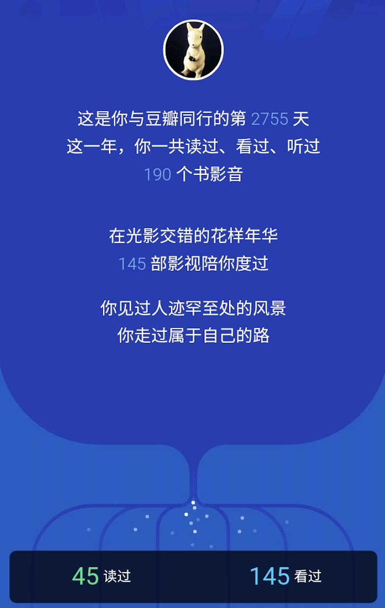
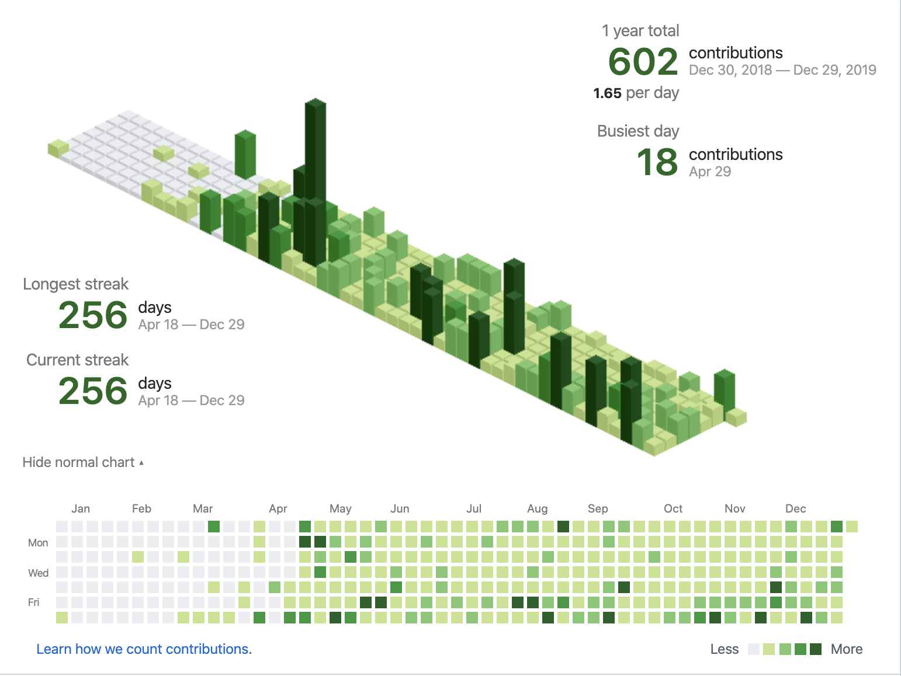
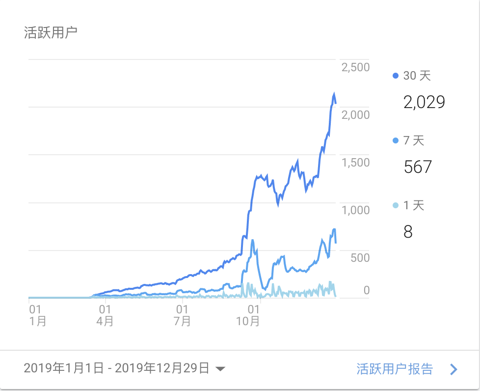
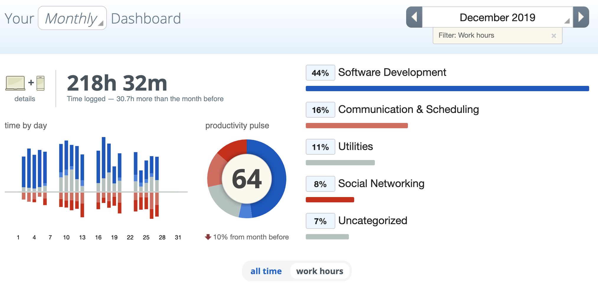
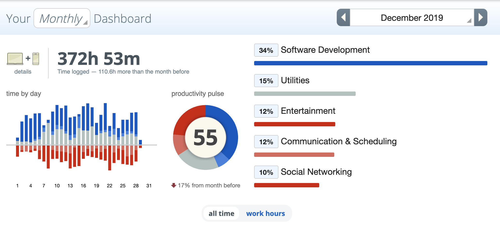

## 2019

2019 年就要结束了，今年用数据记录了很多，可以很好的支撑我做一个年终总结碎碎念。

## 读书观影

一整年都是两点一线：家里和公司，没有什么特别大的变化，周末的时间也都给了书和电影。

读书记录之前已经发过了，上半年看的比较多，下半年忙起来时间上少了很多，加上看的书的质量也比上半年高，所以看的比较细，用了很多时间去查相关资料。因为年后有些计划，所以集中把自己刚刚工作的时候买的纸质书（一直没看）清理了一下，愈发觉得刚工作的自己真是个愣头青，买的书都是水书，还是应该多看些经典书籍，需要更多思考的书。

电影看的多，至少豆瓣上标记的数量很吓人，周末基本上都会看几部。今年看的种类都比较阴暗，自己本意是放松一下的，看着看着心情更加沉重了。电影是另外一种了解世界的方式，我们可以看到不同的人，不同的风景，同时也会代入思考如果是自己会怎么做。在现实世界很多观点无法表述的现在，还是很有趣的。

书籍推荐：

* 《操作系统导论》
* 《图解密码技术（第3版）》
* 《编码的奥秘》

电影推荐：

* 《平衡》
* 《电话亭》
* 《婚姻故事》

## 习惯

2019 年算是养成了 2 个好习惯：刷题和写博客。

因为自己一直习惯早起（6点钟左右），以前都是当天要做什么工作，早上起来做一些准备之类的事情，有两点不好：一是把自己的时间都给了工作，导致自己会有种抵触；二是不规律，我喜欢规律。

所以从 4 月份开始，每天早上会做一道 LeetCode 题，目前一直坚持到现在。要说刷题有带给我什么质的变化么，那显然是没有的，但是我上面提到的两点不好，在刷题这里都消失了。刷题让我去认真的学习数据结构和算法，去了解一道题的不同种解法（往往会冒出“这tm的真是个人才”的感叹），而且会让我的生活更加规律，能从工作中抽出来，强烈推荐大家去试试。像我从 Easy 开始分类的做，最开始不会花费太长时间，做不出来就看看其他人怎么做，后续就会有些自己的想法。但是最近我做 Medium 的题耗时就比之前长好多了，有些题及时看着答案也要想很久，导致我又起的更早了。。

2019 年自己定了每周更新一篇博客的目标，目标完成。一开始写博客是为了记录下自己的踩坑经历和一些经验分享，随后是自己发现一些新东西的时候自己学习了解的过程。要锻炼自己对外输出的能力，保证自己能够有逻辑的输出自己的观点，哪怕不能有逻辑的说出来，至少要有逻辑的写出来。

## 开销

没有买什么新玩具，也没有什么特别大的开支，当然也没有存到什么钱。

### 真实物品

主要的开销在吃饭和房租，年初买了一个 iPad 用来看 PDF，毕竟无论是 Kindle 还是手机都不能很好的阅读，iPad 看 PDF 的效果是很好的，我也用它来看了一些书，但是有个问题是完整在 iPad 看完的书不到 10本，也是一个 `买前生产力，买后bilibili` 的例子了。

### 虚拟物品

自己平时需要跑一些 crontab 做事情，所以有一个祖传搬瓦工一直在供着，但是今年上网格外的困难，搬瓦工 IP 被封，所以又在 Azure 上搞了一个 VPS，目前看上去这套东西运转的还算顺利。

趁着年底活动，买了 RescueTime 的会员，估计明年会买 Pocket，毕竟重度用户。

P.S. 从带给自己生活感受的提升上，VPS 性价比可太高了。

## 时间管理

平时总是感觉自己时间不够用，就用了 RescueTime 记录自己的时间开销，12月份是一个比较完整的记录：家里的电脑，公司的电脑以及自己的手机。

真实情况是自己一个月在公司的时间 218 小时，真正写代码的时间 96 小时，平均下来一天有 5小时的高产出时间，跟自己预想的偏差很小，没什么意外。

抛开工作时间不提，手机占用了比较多的时间，而具体占用时间的大头部分在微信、Twitter 和浏览器。这部分是有很大程度优化的空间的。除了必要的社交，平时用浏览器阅读的习惯大概是这样：看到不错的文章如果不长，就在手机上看完，如果稍长或者没时间，就会收藏到 Pocket 中，等到每周五晚上再集中处理。这样会面临一个问题是我的 Pocket 有时候变成了一个收藏夹，什么东西都往里面放，而且我的很多时间也都通过 Pocket 来绑定，那些博客有读的必要么，有收藏的必要么，要仔细想想了。

## 2020

都用数据记录下来的好处就是可以量化的改进：

1. 保持看书状态，把部分观影时间也用来看书，并形成读书笔记
2. 刷题不能停，把解题思路完整的记录下来，或文字，或图片
3. 宁可不写也不要水博客，多记录些自己平时忽略的地方
4. 合理利用软件，不依赖软件，尝试 GTD
