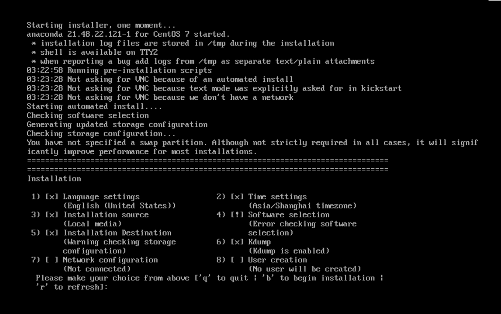
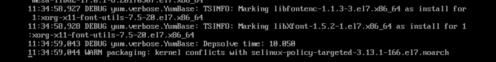

## 背景

我一直在维护一个公司内部的 OS 发行版，是基于 CentOS 的，最近接到了一个需求，是需要更新 Kernel 及一些软件包，但是遇到了无法安装 OS 的问题，记录一下解决方式。

## 定制 OS

关于定制 OS，在之前的博客中已经提到过几次了，CentOS 是比较容易改动的一个发行版，因为有着 RHEL 红（爸）帽（爸），有着完善的文档可以参考。

主要需要注意的是两点：
1. 分区方式
2. 软件包选择

今天遇到的问题是第二点。

先说下前提，由于是 2B 产品，所以对于每次的 BaseOS 版本升级都非常谨慎，每次 BaseOS 版本都会进行各种测试。但是如果仅仅是升级部分所需要的软件包，就不用这么麻烦了，我们可以定制自己所需要的软件组（group），来进行安装/升级。

## 问题

这次接到的需要是升级 Kernel、libiscsi、qemu 三个软件，后两个是虚拟化相关的，相关依赖较少；kernel 是跟 BaseOS 版本关联性很大的。

比如 CentOS 7.6 中，kernel 版本为：kernel-3.10.0-957.el7.x86_64.rpm，这个版本对 selinux 等相关软件是有依赖要求的，我在这里翻车了。

## 解决
像往常一样，将对应的 rpm 放置到了对应的 yum 源中，更新 yum 源，制作 ISO，在安装过程中报错：

报错显示是软件源出了问题，但是没有更多的信息了，这时候我们可以通过 console 连接到其他的 pty 中，查看对应的日志，比如 CentOS 默认的日志在： `/tmp/packaging.log` 中：

我们可以看到日志中提示 kernel 与当前软件源中的 selinux-policy-targeted 冲突，因为安装 OS 所用的软件源就是 ISO ，所以这里肯定是我们打包 ISO 时遗漏了依赖关系导致的，我们将对应的 Kernel 所需依赖更新，重新构建 ISO 就可以了。