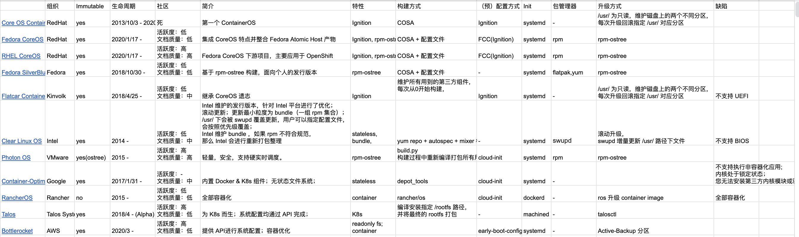

## 背景

之前简单调研过一些 Container Optimized OS，进行了一些简单的对比，最近又被同事问到了，整理一下发出来。

## COS

## 结论

如果让我来选择一个 COS 作为 BaseOS 来进行定制，那我会根据以下几个条件来进行选择：
* 是否支持 OSTree
* 是否有明星公司做背后支持，如 RedHat、VMware
* 社区活跃度

根据以上几个条件，如果是我自己使用的话，我会选择 Fedora CoreOS，或者 VMware Photo（OSTree） 。

