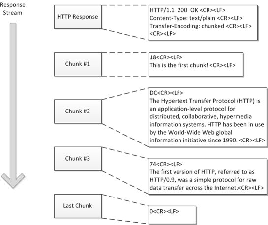

## 背景

之前提供了一个用于下载文件的 API，使用到了 `Content-Length` 字段并踩了个坑： `Content-Length` 与实际的数据大小不一致。今天来学习下这个字段相关的知识。

## Content-Length

> Content-Length 是一个实体消息首部，用来指明发送给接收方的消息主体的大小，即用十进制数字表示的八位元组的数目。

当客户端向服务器发送一个请求时，服务器可以很清楚的知道内容大小，然后通过Content-length消息首部字段告诉客户端需要接收多少数据。除了使用 `Transfer-Encoding`，当`Content-Length` 存在是必须与实际传输的数据大小一致，如果前者大，则会导致请求一直等待直至超时；如果后者大，则会导致数据被截断，在最近版本的 Chrome 中，会直接提示 `net::ERR_CONTENT_LENGTH_MISMATCH` 报错导致加载失败。

```go
package main

import (
	"net/http"
)

func main() {

	http.HandleFunc("/", func(w http.ResponseWriter, r *http.Request) {

		w.Header().Set("Content-Length", "20")
		//w.Header().Set("Content-Length", "12")
		w.WriteHeader(200)
		w.Write([]byte("hello world\n"))

	})

	http.ListenAndServe(":8080", nil)
}
```


```
Request URL: http://127.0.0.1:8080/
Request Method: GET
Status Code: 200 OK
Remote Address: 127.0.0.1:8080
Referrer Policy: no-referrer-when-downgrade
Content-Length: 12
Content-Type: text/plain; charset=utf-8
Date: Fri, 07 Feb 2020 14:36:40 GMT
X-DNS-Prefetch-Control: off
```


## Transfer-Encoding



> Transfer-Encoding 消息首部指明了将 entity 安全传递给用户所采用的编码形式。Transfer-Encoding 是一个逐跳传输消息首部，即仅应用于两个节点之间的消息传递，而不是所请求的资源本身。一个多节点连接中的每一段都可以应用不同的Transfer-Encoding 值。

如果在传输前不知道消息大小，那么就可以使用 `Transfer-Encoding` 。当设置了 `Transfer-Encoding` ， `Content-Length` 会被忽略，两者无法共存。


```go
package main

import (
        "io"
        "log"
        "net/http"
)

// hello world, the web server
func HelloServer(w http.ResponseWriter, req *http.Request) {
        w.WriteHeader(200)
        for i := 0; i < 5; i++ {
                io.WriteString(w, "hello, world!\n")
                w.(http.Flusher).Flush()
        }
}

func main() {
        http.HandleFunc("/", HelloServer)
        err := http.ListenAndServe(":8080", nil)
        if err != nil {
                log.Fatal("ListenAndServe: ", err)
        }
}
```

```
Request URL: http://127.0.0.1:8080/
Request Method: GET
Status Code: 200 OK
Remote Address: 127.0.0.1:8080
Referrer Policy: no-referrer-when-downgrade
Content-Type: text/plain; charset=utf-8
Date: Fri, 07 Feb 2020 13:56:54 GMT
Transfer-Encoding: chunked
X-DNS-Prefetch-Control: off
```


## 参考链接
* https://developer.mozilla.org/zh-CN/docs/Web/HTTP/Headers/Content-Length
* https://blog.piaoruiqing.com/2019/09/08/do-you-know-content-length/#Content-Length-3