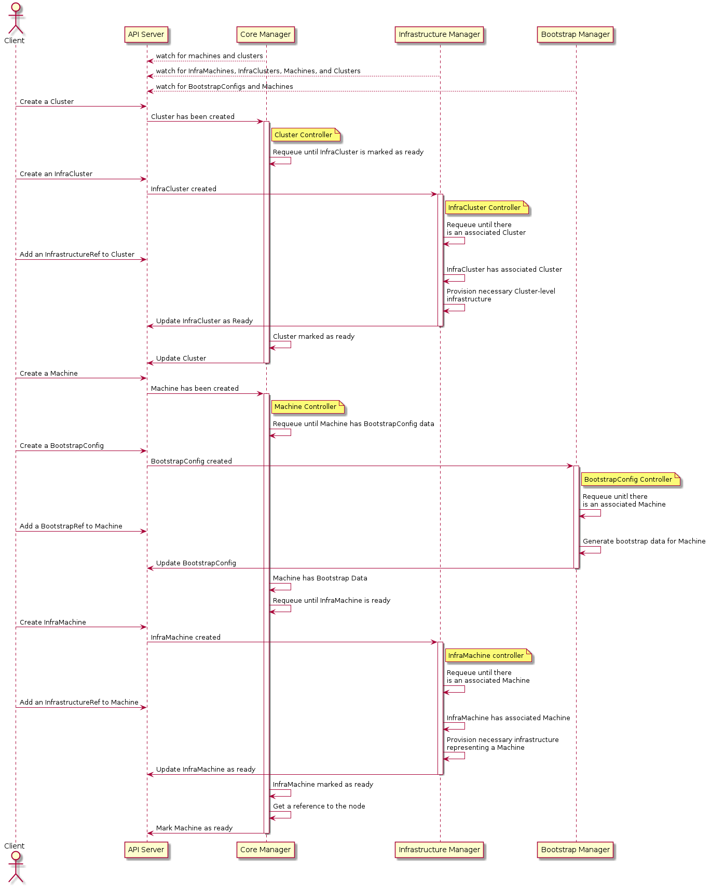

## 背景

今天继续来聊一聊 cluster-api，在上周看 cluster-api-provider-vsphere 代码的时候吐槽过，cluster-api 最近因为 v1alpha2 版本的开发，变化太快，几乎每天都在变，那么我们就来看看 v1alpha2 具体做了什么。

## Cluster-API v1alpha2

虽然目前 v1alpha2 还没有正式的 release，但是已经趋于稳定，且两个主要的 provider：aws 和 vsphere 都在进行 v1alpha2 版本的适配（最近每天都有 pr 更新）。我们先来了解下为啥要进行 v1alpha2 改动，改动的目的是啥。

在 v1alpha1 版本中，cluster-api 要求 provider 实现从节点置备到 k8s 部署的全套流程，cluster-api 自身只负责具体的 API 定义及相关控制，在 provider 实现上也不是一个标准的 Operator，（至少）我从概念的理解上比较吃力，每个 provider 需要实现对应 cluster  与 machine 的 actuator ，开发起来要求对 cluster-api 项目本身很熟悉。

其次，每个 provider 都包含了 k8s 集群部署的流程，虽然大部分实现最终都是使用 kubeadm 工具，但是使用方式千差万别，有 cloud-init、有 ssh 配合密钥、有 ssh 配合密码等等。这部分 provider 中的代码完全都是重复的，可以复用的。

上面提到的一些缺点，在 v1alpha2 版本中进行了改进，对各个组件进行了拆分，现在使用 cluster-api 需要 3 个控制器：
1. Core(cluster-api)
2. Bootstrap(kubeadm)
3. Infrastructure(aws, gcp, azure, vsphere, etc)



下面来说说各个控制器负责什么。


## Core(cluster-api)

核心控制器，也就是 cluster-api 项目自身，相比于 v1alpha1 版本 v1alpha2 各个方面简直可爱，来看看具体的改动：
### clusterctl

在 v1alpha1 中，clusterctl 因为耦合了最终的 provider 项目，命令行是由对应的 provider 提供，在 v1alpha2 中完全由 cluster-api 维护。具体代码在 [cmd/clusterctl](https://github.com/kubernetes-sigs/cluster-api/blob/master/cmd/clusterctl/README.md) 下，整体结构感觉跟 kubeadm 很像。

### API

仍然包含两个主要的 CRD：cluster 和 machine，针对两个资源进行了阶段定义，根据注释就很好 cluster 和 machine 会处于哪些状态：


```go
const (
	// MachinePhasePending is the first state a Machine is assigned by
	// Cluster API Machine controller after being created.
	MachinePhasePending = MachinePhase("pending")

	// MachinePhaseProvisioning is the state when the
	// Machine infrastructure is being created.
	MachinePhaseProvisioning = MachinePhase("provisioning")

	// MachinePhaseProvisioned is the state when its
	// infrastructure has been created and configured.
	MachinePhaseProvisioned = MachinePhase("provisioned")

	// MachinePhaseRunning is the Machine state when it has
	// become a Kubernetes Node in a Ready state.
	MachinePhaseRunning = MachinePhase("running")

	// MachinePhaseDeleting is the Machine state when a delete
	// request has been sent to the API Server,
	// but its infrastructure has not yet been fully deleted.
	MachinePhaseDeleting = MachinePhase("deleting")

	// MachinePhaseDeleted is the Machine state when the object
	// and the related infrastructure is deleted and
	// ready to be garbage collected by the API Server.
	MachinePhaseDeleted = MachinePhase("deleted")

	// MachinePhaseFailed is the Machine state when the system
	// might require user intervention.
	MachinePhaseFailed = MachinePhase("failed")

	// MachinePhaseUnknown is returned if the Machine state cannot be determined.
	MachinePhaseUnknown = MachinePhase("")
)
```

### Controller

cluster-api 不再负责具体的 API 所有资源的定义，而是通过设置资源的 owner 来达到最终 cluster 包含 machine 的效果。

用 AWS 官方示例展示：

cluster.yaml
```yaml
---
apiVersion: cluster.x-k8s.io/v1alpha2
kind: Cluster
metadata:
  name: ${CLUSTER_NAME}
spec:
  clusterNetwork:
    pods:
      cidrBlocks: ["192.168.0.0/16"]
  infrastructureRef:
    apiVersion: infrastructure.cluster.x-k8s.io/v1alpha2
    kind: AWSCluster
    name: ${CLUSTER_NAME}
---
apiVersion: infrastructure.cluster.x-k8s.io/v1alpha2
kind: AWSCluster
metadata:
  name: ${CLUSTER_NAME}
spec:
  region: ${AWS_REGION}
  sshKeyName: ${SSH_KEY_NAME}
```

在执行完 `kubectl apply -f cluster.yaml` 后， aws cluster 控制器会等待 cluster-api 控制器将 `AWSCluster` 与 `Cluster` 资源进行关联后进行下一步操作，这样最终能够达到 `Cluster` 资源是所有资源的 owner，也可以获得到所有资源的具体的 Spec 和 Status 信息。

（等版本 release 之后好好了解下其中的关系。


## Boostrap(kubeadm)

相比 cluster-api 的复杂，目前 Bootstrap 的唯一实现 [CABPK](https://github.com/kubernetes-sigs/cluster-api-bootstrap-provider-kubeadm) 是一个分拆出来的独立项目，这个项目的主要目的是通过 `Cluster` 和 `Machine` 及对应的 Infrastructure `Cluster` 和 `Machine` 信息，来生成 cloud-init 配置（Userdata）。

目前 v1alpha2 统一部署 k8s 集群的方式为 cloud-init ，通过 CABPK 项目生成对应 Machine 的 cloud-init 配置，在部署虚拟机的时候传递 Userdata，达到自动配置的效果。也就是说如果你的 Hypervisor 不支持 cloud-init，就没办法使用 cluster-api v1alpha2 进行部署，只能通过 v1alpha1 的方式，在 Infrastructure 控制器做所有事情。

需要注意的是，在 Infrastructure 控制器工作前，需要保证 Bootstrap 控制器正常工作，生成用于最终创建虚拟机的 cloud-init 配置。

## Infrastructure

前面说的两个控制器都是社区官方维护的，下面来说下各个厂家（provider）维护的 Infrastructure 控制器（最近几天都在搞这个）。

v1alpha2 版本要求各个 provider 实现一个标准且完整的 Operator。包含对应的 `Cluster`,`Machine`。以下还是使用 cluster-api-provider-vsphere 具体，截止到 20190823 ，[对应 PR](https://github.com/kubernetes-sigs/cluster-api-provider-vsphere/pulls) 还处于未完成状态。

### API

```go

// VSphereClusterSpec defines the desired state of VSphereCluster
type VSphereClusterSpec struct {
	Server string `json:"server,omitempty"`
	Username string `json:"username,omitempty"`
	Password string `json:"password,omitempty"`
	Insecure *bool `json:"insecure,omitempty"`
	SSHAuthorizedKeys []string `json:"sshAuthorizedKeys,omitempty"`
	CloudProviderConfiguration cloud.Config `json:"cloudProviderConfiguration,omitempty"`
}

// VSphereClusterStatus defines the observed state of VSphereClusterSpec
type VSphereClusterStatus struct {
	Ready bool `json:"ready"`
	APIEndpoints []APIEndpoint `json:"apiEndpoints,omitempty"`
}

```


```go
// VSphereMachineSpec defines the desired state of VSphereMachine
type VSphereMachineSpec struct {
	MachineRef string `json:"machineRef,omitempty"`
	Template string `json:"template"`
	Datacenter string `json:"datacenter"`
	Network NetworkSpec `json:"network"`
	NumCPUs int32 `json:"numCPUs,omitempty"`
	NumCoresPerSocket int32 `json:"numCoresPerSocket,omitempty"`
	MemoryMiB int64 `json:"memoryMiB,omitempty"`
	DiskGiB int32 `json:"diskGiB,omitempty"`
	TrustedCerts [][]byte `json:"trustedCerts,omitempty"`
	NTPServers []string `json:"ntpServers,omitempty"`
}

// VSphereMachineStatus defines the observed state of VSphereMachine
type VSphereMachineStatus struct {
	Ready bool `json:"ready"`
	Addresses []v1.NodeAddress `json:"addresses,omitempty"`
	TaskRef string `json:"taskRef,omitempty"`
	Network []NetworkStatus `json:"networkStatus,omitempty"`
	ErrorReason *errors.MachineStatusError `json:"errorReason,omitempty"`
	ErrorMessage *string `json:"errorMessage,omitempty"`
}
```

定义 VSphereCluster 与 VSphereMachine CRD，这里根据自己需要定义相关参数就好，比如如果不想支持自定义目标虚拟机配置，那么就不用提供 CPU、Memory 等配置。

### Controller

来分别看看 cluster controller 与 machine controller 做了啥。

#### Cluster Controller

在 `Reconcile` 的实现中，先获取 VSphereCluster 信息：
```go
	vsphereCluster := &infrav1.VSphereCluster{}
	err := r.Get(parentContext, req.NamespacedName, vsphereCluster)
	if err != nil {
		if apierrors.IsNotFound(err) {
			return reconcile.Result{}, nil
		}
		return reconcile.Result{}, err
    }
```

然后获取 VSphereCluster 关联的 Cluster 信息：

```go
	// util 由 cluster-api 提供
	cluster, err := util.GetOwnerCluster(parentContext, r.Client, vsphereCluster.ObjectMeta)
	if err != nil {
		return reconcile.Result{}, err
	}
	if cluster == nil {
		logger.Info("Waiting for Cluster Controller to set OwnerRef on VSphereCluster")
		return reconcile.Result{RequeueAfter: 10 * time.Second}, nil
    }
```

在获取了足够的信息之后，针对这些信息，创建了 context（这里 aws 是叫 scope，是一个东西），判断是否包含 `DeletionTimestamp` 来决定进行什么调度，是 `reconcileDelete` 还是 `reconcileNormal` 。

```go
func reconcileDelete(ctx *context.ClusterContext) (reconcile.Result, error) {
	ctx.Logger.Info("Reconciling VSphereCluster delete")

	// Cluster is deleted so remove the finalizer.
	ctx.VSphereCluster.Finalizers = util.Filter(ctx.VSphereCluster.Finalizers, infrav1.ClusterFinalizer)

	return reconcile.Result{}, nil
}
```

在所有的 provider 中，都对相应资源进行了 Finalizer 配置，方便后续在资源删除前进行一些额外的操作，这里 vsphere 还没有具体的实现。

```go
func reconcileNormal(ctx *context.ClusterContext) (reconcile.Result, error) {
	ctx.Logger.Info("Reconciling VSphereCluster")

	vsphereCluster := ctx.VSphereCluster

	// If the VSphereCluster doesn't have our finalizer, add it.
	if !util.Contains(vsphereCluster.Finalizers, infrav1.ClusterFinalizer) {
		vsphereCluster.Finalizers = append(vsphereCluster.Finalizers, infrav1.ClusterFinalizer)
	}

	// Set APIEndpoints so the Cluster API Cluster Controller can pull them
	vsphereCluster.Status.APIEndpoints = []infrav1.APIEndpoint{
		{
			Host: "", // vsphereCluster.Status.Network.APIServerELB.DNSName,
			Port: 0,
		},
	}

	// No errors, so mark us ready so the Cluster API Cluster Controller can pull it
	vsphereCluster.Status.Ready = true

	return reconcile.Result{}, nil
}
```

在 `reconcileNormal` 中对集群进行 Finalizer 判断，然后这里直接更新了 `vsphereCluster.Status` 具体字段，应该是还没实现完成。

#### Machine Controller

与 Cluster 相比，Machine 包含了具体的虚拟机创建动作，相应需要的信息也会多一些，除了通过 `VSphereMachine`获取关联 `Machine` 以外，还通过 `Machine` 获取了 `Cluster` 信息：

```go
// Fetch the Machine.
	machine, err := util.GetOwnerMachine(parentContext, r.Client, vsphereMachine.ObjectMeta)
	if err != nil {
		return reconcile.Result{}, err
	}
	if machine == nil {
		logger.Info("Waiting for Machine Controller to set OwnerRef on VSphereMachine")
		return reconcile.Result{RequeueAfter: 10 * time.Second}, nil
	}

	logger = logger.WithName(fmt.Sprintf("machine=%s", machine.Name))

	// Fetch the Cluster.
	cluster, err := util.GetClusterFromMetadata(parentContext, r.Client, machine.ObjectMeta)
	if err != nil {
		logger.Info("Machine is missing cluster label or cluster does not exist")
		return reconcile.Result{}, nil
    }
```

与 Cluster 一样，也会进行 `DeletionTimestamp` 判断，来看下 `reconcileNormal` 的实现：

```go
func (r *VSphereMachineReconciler) reconcileNormal(ctx *context.MachineContext) (reconcile.Result, error) {
	// 如果 VSphereMachine 的状态一场，则直接返回
	if ctx.VSphereMachine.Status.ErrorReason != nil || ctx.VSphereMachine.Status.ErrorMessage != nil {
		ctx.Logger.Info("Error state detected, skipping reconciliation")
		return reconcile.Result{}, nil
	}

	// 如果 VSphereMachine 没有 Finalizer，则添加
	if !util.Contains(ctx.VSphereMachine.Finalizers, infrav1.MachineFinalizer) {
		ctx.VSphereMachine.Finalizers = append(ctx.VSphereMachine.Finalizers, infrav1.MachineFinalizer)
	}

	if !ctx.Cluster.Status.InfrastructureReady {
		ctx.Logger.Info("Cluster infrastructure is not ready yet, requeuing machine")
		return reconcile.Result{RequeueAfter: waitForClusterInfrastructureReadyDuration}, nil
	}

	// 在真正创建虚拟机之前，需要确保 cloud-init 配置已经生成
	if ctx.Machine.Spec.Bootstrap.Data == nil {
		ctx.Logger.Info("Waiting for bootstrap data to be available")
		return reconcile.Result{RequeueAfter: 10 * time.Second}, nil
	}

    // 这里缺少真正创建虚拟机的实现
	return reconcile.Result{}, nil
}
```

vsphere 所有关于虚拟机的操作都在[这里](https://github.com/kubernetes-sigs/cluster-api-provider-vsphere/tree/master/pkg/cloud/vsphere/services/govmomi)，感兴趣的可以看看。

### main.go

看完了具体实现逻辑，那么去看下控制器入口： main.go

```go
func init() {
	_ = clientgoscheme.AddToScheme(scheme)
	_ = infrav1.AddToScheme(scheme)
	// +kubebuilder:scaffold:scheme

	if v, err := time.ParseDuration(os.Getenv(syncPeriodEnvVar)); err == nil {
		defaultSyncPeriod = v
	}
	if v, err := time.ParseDuration(os.Getenv(requeuePeriodEnvVar)); err == nil {
		defaultRequeuePeriod = v
	}
}

```

需要注意的是 init 函数，这里应该加上 `_ = clusterv1.AddToScheme(scheme)` ，否则在真正创建对应资源的时候，会报 `no kind is registered for the type` 的错误。（对 Operator 还不太熟，这里具体原因未了解）


## 总结

相对来说 v1alpha2 版本改动范围较大，但是真香。各个逻辑部分比之前容易理解的多，且provider 实现也比之前简单许多（虽然还是比较麻烦）。

但是恰恰因为是 alpha 版本，再次吐槽，改动真的是太频繁了，按照项目中 Milestone 规划，在 20190831 就要 release v1alpha2 了，但是目前完成度还只有 [58%](https://github.com/kubernetes-sigs/cluster-api/milestone/6) 。而且目前看到除了 aws 和 vmware 对这个项目参与的比较积极，其他项目都处于假死状态，不知道后续是否会有其他厂家参与进来共同完善。


## P.S.

* cluster-api 相关项目使用 kubebuilder 辅助构建的，随着 kubebuilder v2 正式发布，相关代码结构改动较大，最好花费些时间了解下 kubebuilder v2。
* 目前 provider 中 aws 完善度是最高的，但是 aws 中的概念是真的复杂，**概念劝退**。