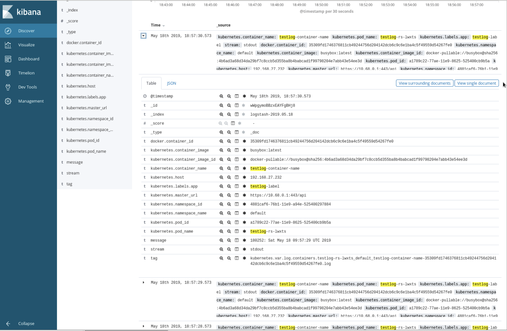

## 基础日志处理

在 Kubernetes（简称 k8s）中，所有应用在 Pod（k8s 管理容器最小单位）中运行，标准处理方式为将日志打印到标准日志输出和标准错误输出，这样我们可以通过 `kuberctl logs` 关键字获取容器运行时日志，根据容器运行时的类型不同，日志保存路径也不同，以 Docker 为例，所有真实日志均在 `/var/lib/docker/` 路径下，下面我们来看一个例子：

在 k8s 中创建一个 Pod，Pod 中指定打印当前时间到标准输出中：

```yaml
apiVersion: v1
kind: Pod
metadata:
  name: counter
spec:
  containers:
  - name: count
    image: busybox
    args: [/bin/sh, -c,
            'i=0; while true; do echo "$i: $(date)"; i=$((i+1)); sleep 1; done']
```

运行该 Pod，通过 `kubectl logs` 获取当前 Pod 日志：

```bash
[root@node1 blog]# kubectl get pod |grep counter
counter            1/1     Running   0          9s
[root@node1 blog]# kubectl logs counter
0: Fri May 17 00:34:01 UTC 2019
1: Fri May 17 00:34:02 UTC 2019
2: Fri May 17 00:34:03 UTC 2019
3: Fri May 17 00:34:04 UTC 2019
4: Fri May 17 00:34:05 UTC 2019
5: Fri May 17 00:34:06 UTC 2019
6: Fri May 17 00:34:07 UTC 2019
7: Fri May 17 00:34:08 UTC 2019
8: Fri May 17 00:34:09 UTC 2019
9: Fri May 17 00:34:10 UTC 2019
10: Fri May 17 00:34:11 UTC 2019
11: Fri May 17 00:34:12 UTC 2019
12: Fri May 17 00:34:13 UTC 2019
```

这里如果使用 `-f` 选项，可以持续输出该 Pod 日志。

那么我们如何找到该容器对应的实际日志文件呢？

我们可以现在 Docker 中找到该容器信息：

```bash
[root@node1 blog]# docker ps |grep count
012e0352b193        busybox                                             "/bin/sh -c 'i=0; wh…"   2 minutes ago       Up 2 minutes                            k8s_count_counter_default_75792a2a-783b-11e9-a3d9-525400aea01a_0
```

可以看到在 Docker 中该容器名称为    `k8s_count_counter_default_75792a2a-783b-11e9-a3d9-525400aea01a_0`  ，我们先不去管最后的 UUID 是什么含义，先看前几个字段，跟集群信息关联可以看到，分别是：k8s，容器名称，Pod 名称，namespaces 名称。那么我们来看下这个容器在 Docker 中的配置文件：

```bash
[root@node1 containers]# pwd
/var/lib/docker/containers
[root@node1 containers]# ls
012e0352b19387170b903aff7c73c02fcd023c2f53cbe5b908392ff4e1a126e2
...
5c9e765f68a15d5510870179160c59d45d0287b9f92265687d6c37a3557a1017  c563c36b0d3d28ea611b270bc1609ae9c0e720c1c1f85ba669cdab5f7099b77b
```

在 Docker 容器路径下，我们看到了很多以不知道什么 ID 明明的子目录，最开始以为是我们 `docker ps` 中看到的最后 uuid，但是发现对不上，那么我们可以查看下 Pod 的详细信息来试图获取:


```bash
[root@node1 containers]# kubectl describe pod counter
Name:         counter
Namespace:    default
Node:         192.168.27.231/192.168.27.231
Start Time:   Fri, 17 May 2019 08:33:58 +0800
Labels:       <none>
Annotations:  <none>
Status:       Running
IP:           172.20.2.13
Containers:
  count:
    Container ID:  docker://012e0352b19387170b903aff7c73c02fcd023c2f53cbe5b908392ff4e1a126e2
    Image:         busybox
    Image ID:      docker-pullable://busybox@sha256:4b6ad3a68d34da29bf7c8ccb5d355ba8b4babcad1f99798204e7abb43e54ee3d
```

忽略掉无关信息，我们可以看到 `Container ID` 字段，这里对应的 ID 就是在 `/var/lib/docker/containers/` 下的 ID，找到了 ID，我们可以来看看具体的配置：

```
[root@node1 012e0352b19387170b903aff7c73c02fcd023c2f53cbe5b908392ff4e1a126e2]# tree .
.
├── 012e0352b19387170b903aff7c73c02fcd023c2f53cbe5b908392ff4e1a126e2-json.log
├── checkpoints
├── config.v2.json
├── hostconfig.json
└── mounts

2 directories, 3 files
```

可以看到有配置文件和日志文件，我们今天只来讨论日志，那么我们看下这个日志文件的内容：

```bash
[root@node1 012e0352b19387170b903aff7c73c02fcd023c2f53cbe5b908392ff4e1a126e2]# tail 012e0352b19387170b903aff7c73c02fcd023c2f53cbe5b908392ff4e1a126e2-json.log
{"log":"706: Fri May 17 00:45:48 UTC 2019\n","stream":"stdout","time":"2019-05-17T00:45:48.913451073Z"}
{"log":"707: Fri May 17 00:45:49 UTC 2019\n","stream":"stdout","time":"2019-05-17T00:45:49.915605471Z"}
{"log":"708: Fri May 17 00:45:50 UTC 2019\n","stream":"stdout","time":"2019-05-17T00:45:50.917823388Z"},
{"log":"713: Fri May 17 00:45:55 UTC 2019\n","stream":"stdout","time":"2019-05-17T00:45:55.928645971Z"}
{"log":"714: Fri May 17 00:45:56 UTC 2019\n","stream":"stdout","time":"2019-05-17T00:45:56.930660054Z"}
{"log":"715: Fri May 17 00:45:57 UTC 2019\n","stream":"stdout","time":"2019-05-17T00:45:57.932763561Z"}
```

可以看到这里日志输出是 JSON 格式的，这里跟 `kubectl logs` 输出不一致啊，为啥这里是 JSON 呢？ 其实这跟你的 Docker 配置有关，具体的配置可以在 Docker 配置中看到，比如：

```bash
[root@node1 docker]# pwd
/etc/docker
[root@node1 docker]# cat daemon.json
{
  "registry-mirrors": [
    "https://dockerhub.azk8s.cn",
    "https://docker.mirrors.ustc.edu.cn",
    "http://hub-mirror.c.163.com"
  ],
  "max-concurrent-downloads": 10,
  "log-driver": "json-file",
  "log-level": "warn",
  "log-opts": {
    "max-size": "10m",
    "max-file": "3"
    },
  "data-root": "/var/lib/docker"
  }
  ```

  Docker 默认的日志格式是 JSON，这里我猜测是 k8s 通过 Docker 接口获取日志类型，然后进行相应的解析输出（希望之后对 k8s 更深入的了解来验证猜想）。

  在了解了标准日志处理，那么我们来看下节点级别的日志处理是怎样的。

## 节点级别日志

### 标准处理
我们现在知道了 Pod 的日志其实是存放在容器真正运行所在节点上的，那么如果 Pod 一直运行，日志会不断增大，占用很多的日志空间，这个在节点上是怎么控制的呢？

因为这种方式不是 k8s 推荐的方式，这里并没有采用集群级别的控制方式，而是以节点为粒度的，各个节点通过 logrotate 自己处理日志轮询，logrotate 相信大部分同学都使用过，这里不详细说了。

### 特殊处理
如果我们不想将应用日志都输出到标准输出，想将日志打印到 `/var/log/` 下的自定义路径下怎么办？我们可以在 Pod 启动时挂载一个 Volume，这个 Volume 就是Pod 所在的节点真实路径，这样我们在容器中就可以直接将日志打印到该路径下，哪怕 Pod 被销毁，日志也会一直存在。

我们创建一个 Deployment 类型的资源，在创建之前，我们需要先创建出指定的挂载路径: `/var/log/yiran/`，资源配置如下：

```yaml
[root@node1 blog]# cat log.yaml
apiVersion: apps/v1beta1
kind: Deployment
metadata:
  name: counter
spec:
  replicas: 1
  template:
    metadata:
      labels:
        run: helloworldanilhostpath
    spec:
      containers:
      - name: count
        image: busybox
        args: [/bin/sh, -c,
              'i=0; while true; do echo "$i: $(date)" >> /var/log/yiran/test.log; i=$((i+1)); sleep 1; done']
        volumeMounts:
        - name: yiran-test-log
          mountPath: /var/log/yiran
      volumes:
      - name: yiran-test-log
        hostPath:
          path: /var/log/yiran
          type: Directory
```

创建完成后，我们来查看下该 Pod 的日志：

```bash
[root@node1 blog]# kubectl get pod
NAME                       READY   STATUS    RESTARTS   AGE
counter-76b584fd8f-7fq99   1/1     Running   0          2m30s
testlog-rs-lwxts           1/1     Running   0          2d1h
[root@node1 blog]# kubectl logs counter-76b584fd8f-7fq99
```

可以看到没有标准日志输出，我们按照上面描述，去看下容器对应的 Docker 日志是否为空：

```bash
[root@node2 166103275a89df918b3240ede911192357f7256c1f23b4311b6db44c0f800cc2]# pwd
/var/lib/docker/containers/166103275a89df918b3240ede911192357f7256c1f23b4311b6db44c0f800cc2
[root@node2 166103275a89df918b3240ede911192357f7256c1f23b4311b6db44c0f800cc2]# ll
total 12
-rw-r-----. 1 root root    0 May 18 17:39 166103275a89df918b3240ede911192357f7256c1f23b4311b6db44c0f800cc2-json.log
drwx------. 2 root root    6 May 18 17:39 checkpoints
-rw-------. 1 root root 5173 May 18 17:39 config.v2.json
-rw-r--r--. 1 root root 2064 May 18 17:39 hostconfig.json
drwx------. 2 root root    6 May 18 17:39 mounts
```

这里是符合预期的，因为我们将所有的日志输出到指定日志： `/var/log/yiran/test.log` 中了，我们去看看节点日志是否存在：

```bash
[root@node2 yiran]# pwd
/var/log/yiran
[root@node2 yiran]# tailf test.log
327: Sat May 18 09:45:23 UTC 2019
328: Sat May 18 09:45:24 UTC 2019
329: Sat May 18 09:45:25 UTC 2019
330: Sat May 18 09:45:26 UTC 2019
```

可以看到这里已经按照预期打印在 Pod 所在节点上了，满足我们的需求。


接下来是重头戏，集群级别的日志控制。

## 集群级别日志
我们为什么需要日志？对于开发者，可以通过日志进行快速的错误排查；对于运维同学可以根据日志来了解程序运行状态。一句话就是日志非常重要。

那么既然日志这么重要，那么在 k8s 上如何处理日志，尤其是 k8s 提供了 ReplicaSet/DeploymentSet 这类可以自动缩扩容，自动 ha 的资源，我们如果仅仅通过节点级别的日志管理，集群规模小还好，当集群规模变大之后，对于使用日志的同学简直是灾难。


在看过了标准日志处理和节点日志处理后，我们来看看一个标准的 k8s 集群是如何处理服务日志和应用日志的。

这里的前提是，我们有一个日志中心（如 ES)去处理日志，有几种配置方式可以选择：

### 节点级别日志代理

在 k8s 集群中运行一个 DaemonSet，启动的容器运行日志转发器，用于将节点上的日志转发到日志中心，日志转发器可以根据各自资源情况和需求自由选择，如 Logstash,Fluentd,Fluent-bit 等等。

k8s 标准配置中推荐该方案，无论是从资源使用还是从配置管理上都是最佳方案。

对应配置在 `kubernetes/cluster/addons/fluentd-elasticsearch` 路径下，我们可以直接创建部署，部署后状态如下：

```bash
[root@node1 fluentd-elasticsearch]# kubectl -n kube-system get rs |grep kibana
kibana-logging-f4d99b69f          1         1         1       2d6h
[root@node1 fluentd-elasticsearch]# kubectl -n kube-system get ds |grep fluent
fluentd-es-v2.4.0       3         3         3       3            3           <none>                          2d6h
[root@node1 fluentd-elasticsearch]# kubectl -n kube-system get statefulset
NAME                    READY   AGE
elasticsearch-logging   2/2     2d6h
```

可以看到 Fluentd 是以 DaemonSet 方式运行的；ElasticSearch 是以 StatefulSet 方式运行的；Kibana 是以 ReplicaSet 方式运行的。

其中 Fluentd 配置文件中监控的是 `/var/log/container` 路径下的所有日志，所以我们理论上可以在 ES 中看到所有应用的日志，那么看到日志之后，我们如何与实际的应用对应呢？这里可以看下具体示例：

创建 ReplicaSet 类型资源，指定 replica 为 1：

```yaml
[root@node1 ~]# cat log.yaml
apiVersion: apps/v1beta2
kind: ReplicaSet
metadata:
  name: testlog-rs
spec:
  replicas: 1
  selector:
    matchLabels:
      app: testlog-label
  template:
    metadata:
      labels:
        app: testlog-label
    spec:
      containers:
        - name: testlog-container-name
          image: busybox
          args: [/bin/sh, -c,
                 'i=0; while true; do echo "$i: $(date)"; i=$((i+1)); sleep 1; done']
```

我们将涉及到名称的字段均加上对应 key，便于在 ES 中查看对应关系，那么接下来看看在 ES 中该容器对应的日志是什么形式的：



根据上述对应关系，哪怕 Pod 重建了，我们仍可以通过 container_name 字段来查看对应应用日志，便于调试。

### 节点级别日志代理配合伴生容器

我们知道，标准容器日志应该输出到 stdout 和 stderr 中，那么如果我们一个 Pod 中输出多份日志怎么办？虽然这种情况是我们应该极度避免的，我们应该始终保证一个 Pod 只做一件事情。但是我们有时候迫于代码结构或者其他因素，导致我们会遇到这种情况，那么此时我们需要伴生容器配合使用。

示例如下：

```yaml
admin/logging/two-files-counter-pod-streaming-sidecar.yaml

apiVersion: v1
kind: Pod
metadata:
  name: counter
spec:
  containers:
  - name: count
    image: busybox
    args:
    - /bin/sh
    - -c
    - >
      i=0;
      while true;
      do
        echo "$i: $(date)" >> /var/log/1.log;
        echo "$(date) INFO $i" >> /var/log/2.log;
        i=$((i+1));
        sleep 1;
      done
    volumeMounts:
    - name: varlog
      mountPath: /var/log
  - name: count-log-1
    image: busybox
    args: [/bin/sh, -c, 'tail -n+1 -f /var/log/1.log']
    volumeMounts:
    - name: varlog
      mountPath: /var/log
  - name: count-log-2
    image: busybox
    args: [/bin/sh, -c, 'tail -n+1 -f /var/log/2.log']
    volumeMounts:
    - name: varlog
      mountPath: /var/log
  volumes:
  - name: varlog
    emptyDir: {}
```

这种方法是极度不推荐的，如果我们配置了 EFK，那么我们 1 份日志相当于写了 3 份，如果我们 ES 的后端存储是一个副本机制的分布式存储，那么我们 1 份日志相当于写了 3 * 2(或 3，存储副本数)份，这是极大的浪费了存储资源的，且会大大影响 SSD 磁盘寿命。

### Pod 级别日志代理

如果觉得节点级别日志代理粒度太粗，我们也可以选择 Pod 级别，在每个 Pod 中都启动一个伴生容器作为日志代理，将日志直接转发到日志中心。

若以该形式部署，则我们的应用程序配置不仅要配置应用自身，还要考虑日志处理策略；节点计算能力现在大幅提升，每个节点的 Pod 数量很大，浪费了大量的计算资源。


### 应用自处理日志代理

如标题，我们当然可以在应用中直接将日志转发到指定的日志中心，这种情况也是极度糟糕的， `Make each program do one thing well.`。


## 总结

到这里我们关于日志部分的介绍就到这里，总的来说我们需要集中式的日志中心，且推荐以节点级别日志代理方式配置，前提是我们能够预留足够的计算资源和存储资源。后续有机会我们可以了解下日志与事件审计关联使用。

下一篇我们来看下 Kubernetes 中镜像相关管理与使用。
