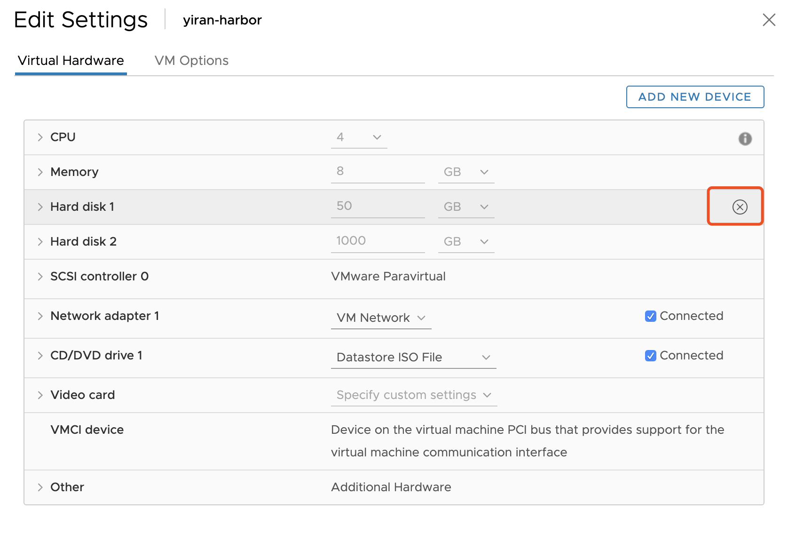

## 背景

在日常开发时，有时候需要保证自己代码的健壮性，需要模拟各种故障测试，比如：磁盘、网络、端口等，今天来汇总一下平时使用最多的几种故障模拟方法

## 磁盘

### 插入拔出

服务器的存储控制器如果是直通模式，那么在 OS 中能够直接获取到磁盘插入与拔出事件，有时候我们需要检测到相应的事件来自动化的做某些动作，具体的实现方式见之前的文章 [Linux 下磁盘设备自动发现方式](https://zdyxry.github.io/2019/08/02/Linux-%E4%B8%8B%E7%A3%81%E7%9B%98%E8%AE%BE%E5%A4%87%E8%87%AA%E5%8A%A8%E5%8F%91%E7%8E%B0%E6%96%B9%E5%BC%8F/) 。

那么我们写完了代码想要测试，不想去机房物理操作，怎么模拟呢？

#### Hypervisor

如果你的代码部署的机器是一台虚拟机，那么在 Hypervisor 层面一般都会有对应的接口来完成相应的操作。

比如 Vsphere ESXi 中可以直接编辑虚拟机，在磁盘选项中有一个“移除”按钮，可以直接移除磁盘：



再比如 KVM 下，可以通过 Libvirt 接口来 [detach 磁盘](https://access.redhat.com/documentation/en-us/red_hat_enterprise_linux/6/html/virtualization_administration_guide/sect-managing_guest_virtual_machines_with_virsh-attaching_and_updating_a_device_with_virsh)。

当然对于插入动作，Hypervisor 也会提供对应的功能。

#### 物理服务器

如果 OS 不是在 Hypervisor 上，而是直接安装在了物理服务器上，我们怎么做呢？

通常我们服务器上的磁盘都是 SCSI 设备，会实现完整的 SCSI（接口），可以通过修改相应设备的标置文件来达到目的。

示例：
节点存在设备 `/dev/sda` ，修改标置文件，在系统中会发现磁盘已经被移除了。

```bash
[root@yiran ~]# lsblk
NAME            MAJ:MIN RM  SIZE RO TYPE MOUNTPOINT
sda               8:0    0   10G  0 disk
sr0              11:0    1  4.3G  0 rom  /run/media/root/CentOS 7 x86_64
vda             252:0    0  100G  0 disk
├─vda1          252:1    0    1G  0 part /boot
└─vda2          252:2    0   99G  0 part
  ├─centos-root 253:0    0   50G  0 lvm  /
  ├─centos-swap 253:1    0  3.9G  0 lvm
  └─centos-home 253:2    0 45.1G  0 lvm  /home
[root@yiran ~]# ls /sys/block/sda/device/delete
/sys/block/sda/device/delete
[root@yiran ~]# echo 1 > /sys/block/sda/device/delete
[root@yiran ~]# lsblk
NAME            MAJ:MIN RM  SIZE RO TYPE MOUNTPOINT
sr0              11:0    1  4.3G  0 rom  /run/media/root/CentOS 7 x86_64
vda             252:0    0  100G  0 disk
├─vda1          252:1    0    1G  0 part /boot
└─vda2          252:2    0   99G  0 part
  ├─centos-root 253:0    0   50G  0 lvm  /
  ├─centos-swap 253:1    0  3.9G  0 lvm
  └─centos-home 253:2    0 45.1G  0 lvm  /home
```

如果我们新开一个终端，可以通过 `udevadm` 命令查看到设备移除过程：

```bash
[root@yiran ~]# udevadm monitor
monitor will print the received events for:
UDEV - the event which udev sends out after rule processing
KERNEL - the kernel uevent

KERNEL[1255.635671] remove   /devices/pci0000:00/0000:00:07.0/virtio3/host2/target2:0:0/2:0:0:0/bsg/2:0:0:0 (bsg)
KERNEL[1255.636247] remove   /devices/pci0000:00/0000:00:07.0/virtio3/host2/target2:0:0/2:0:0:0/scsi_generic/sg1 (scsi_generic)
KERNEL[1255.636265] remove   /devices/pci0000:00/0000:00:07.0/virtio3/host2/target2:0:0/2:0:0:0/scsi_device/2:0:0:0 (scsi_device)
KERNEL[1255.636357] remove   /devices/pci0000:00/0000:00:07.0/virtio3/host2/target2:0:0/2:0:0:0/scsi_disk/2:0:0:0 (scsi_disk)
UDEV  [1255.637109] remove   /devices/pci0000:00/0000:00:07.0/virtio3/host2/target2:0:0/2:0:0:0/bsg/2:0:0:0 (bsg)
KERNEL[1255.638351] remove   /devices/virtual/bdi/8:0 (bdi)
UDEV  [1255.638369] remove   /devices/pci0000:00/0000:00:07.0/virtio3/host2/target2:0:0/2:0:0:0/scsi_device/2:0:0:0 (scsi_device)
KERNEL[1255.638385] remove   /devices/pci0000:00/0000:00:07.0/virtio3/host2/target2:0:0/2:0:0:0/block/sda (block)
UDEV  [1255.638397] remove   /devices/pci0000:00/0000:00:07.0/virtio3/host2/target2:0:0/2:0:0:0/scsi_disk/2:0:0:0 (scsi_disk)
KERNEL[1255.638417] remove   /devices/pci0000:00/0000:00:07.0/virtio3/host2/target2:0:0/2:0:0:0 (scsi)
UDEV  [1255.639174] remove   /devices/pci0000:00/0000:00:07.0/virtio3/host2/target2:0:0/2:0:0:0/scsi_generic/sg1 (scsi_generic)
UDEV  [1255.639192] remove   /devices/virtual/bdi/8:0 (bdi)
UDEV  [1255.641850] remove   /devices/pci0000:00/0000:00:07.0/virtio3/host2/target2:0:0/2:0:0:0/block/sda (block)
UDEV  [1255.642914] remove   /devices/pci0000:00/0000:00:07.0/virtio3/host2/target2:0:0/2:0:0:0 (scsi)
KERNEL[1255.643143] remove   /devices/pci0000:00/0000:00:07.0/virtio3/host2/target2:0:0 (scsi)
UDEV  [1255.643608] remove   /devices/pci0000:00/0000:00:07.0/virtio3/host2/target2:0:0 (scsi)
```

说完了拔出磁盘，那么该如何插入呢？最简单的办法肯定是重启 OS，毕竟我们不是真正的拔出了设备，重启 OS 之后设备肯定会重新发现。我们也可以通过修改对应的标置文件来手动重新执行设备扫描动作：

```bash
[root@yiran ~]# lsblk
NAME            MAJ:MIN RM  SIZE RO TYPE MOUNTPOINT
sr0              11:0    1  4.3G  0 rom  /run/media/root/CentOS 7 x86_64
vda             252:0    0  100G  0 disk
├─vda1          252:1    0    1G  0 part /boot
└─vda2          252:2    0   99G  0 part
  ├─centos-root 253:0    0   50G  0 lvm  /
  ├─centos-swap 253:1    0  3.9G  0 lvm
  └─centos-home 253:2    0 45.1G  0 lvm  /home
[root@yiran ~]# for i in `ls /sys/class/scsi_host/`;do echo "- - -" > /sys/class/scsi_host/$i/scan;done
[root@yiran ~]# lsblk
NAME            MAJ:MIN RM  SIZE RO TYPE MOUNTPOINT
sda               8:0    0   10G  0 disk
sr0              11:0    1  4.3G  0 rom  /run/media/root/CentOS 7 x86_64
vda             252:0    0  100G  0 disk
├─vda1          252:1    0    1G  0 part /boot
└─vda2          252:2    0   99G  0 part
  ├─centos-root 253:0    0   50G  0 lvm  /
  ├─centos-swap 253:1    0  3.9G  0 lvm
  └─centos-home 253:2    0 45.1G  0 lvm  /home
```

同样，在另一个终端可以看到 udev 事件：

```bash
[root@yiran ~]# udevadm monitor
monitor will print the received events for:
UDEV - the event which udev sends out after rule processing
KERNEL - the kernel uevent

KERNEL[1506.675351] add      /devices/pci0000:00/0000:00:07.0/virtio3/host2/target2:0:0 (scsi)
KERNEL[1506.675416] add      /devices/pci0000:00/0000:00:07.0/virtio3/host2/target2:0:0/2:0:0:0 (scsi)
KERNEL[1506.675523] add      /devices/pci0000:00/0000:00:07.0/virtio3/host2/target2:0:0/2:0:0:0/scsi_disk/2:0:0:0 (scsi_disk)
KERNEL[1506.675562] add      /devices/pci0000:00/0000:00:07.0/virtio3/host2/target2:0:0/2:0:0:0/scsi_device/2:0:0:0 (scsi_device)
KERNEL[1506.676417] add      /devices/pci0000:00/0000:00:07.0/virtio3/host2/target2:0:0/2:0:0:0/scsi_generic/sg1 (scsi_generic)
KERNEL[1506.676555] add      /devices/pci0000:00/0000:00:07.0/virtio3/host2/target2:0:0/2:0:0:0/bsg/2:0:0:0 (bsg)
UDEV  [1506.677524] add      /devices/pci0000:00/0000:00:07.0/virtio3/host2/target2:0:0 (scsi)
KERNEL[1506.677662] add      /devices/virtual/bdi/8:0 (bdi)
UDEV  [1506.682939] add      /devices/virtual/bdi/8:0 (bdi)
KERNEL[1506.682968] add      /devices/pci0000:00/0000:00:07.0/virtio3/host2/target2:0:0/2:0:0:0/block/sda (block)
UDEV  [1506.683015] add      /devices/pci0000:00/0000:00:07.0/virtio3/host2/target2:0:0/2:0:0:0 (scsi)
UDEV  [1506.683036] add      /devices/pci0000:00/0000:00:07.0/virtio3/host2/target2:0:0/2:0:0:0/scsi_disk/2:0:0:0 (scsi_disk)
UDEV  [1506.683053] add      /devices/pci0000:00/0000:00:07.0/virtio3/host2/target2:0:0/2:0:0:0/scsi_device/2:0:0:0 (scsi_device)
UDEV  [1506.689442] add      /devices/pci0000:00/0000:00:07.0/virtio3/host2/target2:0:0/2:0:0:0/scsi_generic/sg1 (scsi_generic)
UDEV  [1506.690861] add      /devices/pci0000:00/0000:00:07.0/virtio3/host2/target2:0:0/2:0:0:0/bsg/2:0:0:0 (bsg)
UDEV  [1506.711146] add      /devices/pci0000:00/0000:00:07.0/virtio3/host2/target2:0:0/2:0:0:0/block/sda (block)
```


### 延迟


为了测试软件在高 IO 延迟下的表现，现在我们需要给一块磁盘设置指定的 IO 延迟（latency），可以使用 dm-delay 来实现：

dm-delay具体参数为：`<device> <offset> <delay> [<write_device> <write_offset> <write_delay>]`


```bash
[root@node90 10:45:54 ~]$modprobe brd rd_nr=1 rd_size=10485760 # 创建10G ram disk
[root@node90 10:46:23 ~]$blockdev --getsize /dev/ram0
20971520
[root@node90 10:46:23 ~]$size=$(blockdev --getsize /dev/ram0) # Size in 512-bytes sectors
[root@node90 10:46:23 ~]$echo "0 $size delay /dev/ram0 0 500" | dmsetup create delayed # 设置读延迟 500
```

```bash
[root@node90 10:45:54 ~]cat fio.conf
[random]
filename=/dev/dm-0
readwrite=randread
blocksize=4k
ioengine=sync
direct=1
time_based=1
runtime=10
[root@node90 10:45:54 ~]fio fio.conf
...
clat (usec): min=500769, max=502110, avg=501122.35, stdev=357.23 #写入延迟 500ms
     lat (usec): min=500770, max=502111, avg=501123.45, stdev=357.20
...
```

通过 dm-delay，我们可以来进行各种排列组合来模拟磁盘状态，如：读延迟高，写延迟正常；读延迟高，写延迟高；读延迟低，写延迟高等。

### IO 中断

dm-delay 支持设置 IO 中断，具体命令为：

```
$ sudo dmsetup suspend /dev/dm-0
$ sudo dmsetup resume  /dev/dm-0
```

若在执行 fio 过程中设置 IO 中断， 会看到 iops 为0 的现象：

```bash
[root@node90 10:45:54 ~]fio fio.conf
Starting 1 process
Jobs: 1 (f=1): [r(1)] [0.0% done] [0KB/0KB/0KB /s] [0/0/0 iops] [eta 34d:09h:15m:48s]
```

### IO Error

有时我们也要求验证磁盘突然出现 IO Error 情况，可以通过 [dm-flakey](https://www.kernel.org/doc/Documentation/device-mapper/dm-flakey.txt) 实现：

```bash
[root@node90 11:06:44 ~]$modprobe brd rd_nr=1 rd_size=10485760 #10G
[root@node90 11:06:58 ~]$size=$(blockdev --getsize /dev/ram0)
[root@node90 11:06:58 ~]$echo "0 $size flakey /dev/ram0 0 60 0" | dmsetup create flakey
[root@node90 11:06:59 ~]$size=$(blockdev --getsize /dev/ram0)
[root@node90 11:07:06 ~]$echo "0 $size flakey /dev/ram0 0 30 30"  | dmsetup reload flakey
[root@node90 11:07:06 ~]$dmsetup resume flakey
[root@node90 11:07:06 ~]$dmsetup table flakey
0 20971520 flakey 1:0 0 30 30 0
```

若在执行 fio 过程中设置 IO Error，则会看到以下错误：

```bash
[root@node90 10:45:54 ~]fio fio.conf
Starting 1 process
fio: io_u error on file /dev/dm-0: Input/output error: read offset=647606272, buflen=4096
fio: pid=24184, err=5/file:io_u.c:1708, func=io_u error, error=Input/output error

random: (groupid=0, jobs=1): err= 5 (file:io_u.c:1708, func=io_u error, error=Input/output error): pid=24184: Sat Aug 31 11:09:45 2019
  cpu          : usr=0.00%, sys=0.00%, ctx=0, majf=0, minf=69
...
```


## 网络
在故障场景中，最常见的应该就是网络故障，尤其是现在分布式应用的场景很多，另一点原因是网络相关的工具很多，可以很方便的使用。

### 故障

最简单的网络故障应该就是连接中断，也就是各个节点之间无法联通了，我们可以直接通过 `ifdown <nic name>` 来将网卡置为 down，或者如果不在意其他网卡状态的话，可以直接 `systemctl stop network` 停止网络服务，来模拟无法联通情况。

有时候我们不想模拟网卡故障，想要模拟固定节点之间的网络故障，那么可以通过 iptables 来实现：

```
iptables -I INPUT -s 172.11.30.14 -j DROP
iptables -I OUTPUT -d 172.11.30.14 -j DROP
```

将指定 IP 的所有连接都丢弃。

### 延迟

网络延迟模拟可以通过 `tc` 来实现，命令很简单，找到指定的网卡名称，并执行：

```bash
[root@yiran ~]# tc qdisc add dev eth0 root netem delay 8ms
```

新开终端，在其他节点 ping 设置了网络延迟的节点：

```bash
root@yiran-30-250:~
 $ ping 192.168.30.246
PING 192.168.30.246 (192.168.30.246) 56(84) bytes of data.
64 bytes from 192.168.30.246: icmp_seq=1 ttl=64 time=8.76 ms
64 bytes from 192.168.30.246: icmp_seq=2 ttl=64 time=8.40 ms
64 bytes from 192.168.30.246: icmp_seq=3 ttl=64 time=8.38 ms
64 bytes from 192.168.30.246: icmp_seq=4 ttl=64 time=8.38 ms
^C
--- 192.168.30.246 ping statistics ---
4 packets transmitted, 4 received, 0% packet loss, time 3005ms
rtt min/avg/max/mdev = 8.381/8.485/8.769/0.198 ms
```

可以看到延迟稳定在 8ms 左右。

除了 `tc` 工具外，前几天看到了一个 Golang 实现的 L4 网络代理[项目](https://github.com/fagongzi/netproxy)，可以模拟延迟和丢包，具体关于故障模拟的代码如下：

```go
func (t *TCPServer) doWrite(bytes []byte, conn goetty.IOSession, ctl *conf.CtlUnit) {
	if ctl.DelayMs > 0 {
		log.Infof("Delay <%d>ms write to <%s>", ctl.DelayMs, t.proxyUnit.Target)
		time.Sleep(time.Millisecond * time.Duration(ctl.DelayMs))
	}

	conn.WriteAndFlush(bytes)
}
```


```go
for {
		_, err = session.Read()
		if err != nil {
			log.Infof("Read from client<%s> failure.err=%+v", session.RemoteAddr(), err)
			break
		} else {
			// write to target
			ctl := t.proxyUnit.Ctl
			bytes := in.RawBuf()[in.GetReaderIndex():in.GetWriteIndex()]
			if 0 == ctl.Out.LossRate {
				log.Debugf("write %d bytes to <%s>", len(bytes), conn.RemoteAddr())
				t.doWrite(bytes, conn, ctl.Out)
			} else {
				if t.rnd.Intn(100) > ctl.Out.LossRate {
					log.Debugf("write %d bytes to <%s>", len(bytes), conn.RemoteAddr())
					t.doWrite(bytes, conn, ctl.Out)
				} else {
					log.Debugf("Loss write %d bytes to <%s>", len(bytes), conn.RemoteAddr())
				}
			}
		}

		in.SetReaderIndex(in.GetWriteIndex())
    }
```


## 端口

### 占用

在使用 Zookeeper 这类有状态应用时，除了通过 service 是否处于 running 来判断服务是否运行外，还需要判断节点的 zk 角色是否符合预期，如 leader 或 follower。

前几天又一个场景需要造出 Zookeeper 处于运行中，但是角色状态处于异常状态，我通过 `nc` 来实现的：

```
[root@yiran ~]# nc -kl 2181
```

现将端口占用，然后启动 Zookeeper，就可以了。

## 总结

故障模拟的主要使用场景是产品的自动化测试中，平时主要是辅助开发来自测，不需要记住具体参数，但是最好了解到什么场景下有什么工具可以使用，省时省力。

## 参考链接

* https://access.redhat.com/documentation/en-us/red_hat_enterprise_linux/6/html/virtualization_administration_guide/sect-managing_guest_virtual_machines_with_virsh-attaching_and_updating_a_device_with_virsh
* https://www.enodev.fr/posts/emulate-a-slow-block-device-with-dm-delay.html
* https://www.kernel.org/doc/Documentation/device-mapper/dm-flakey.txt
* https://github.com/fagongzi/netproxy