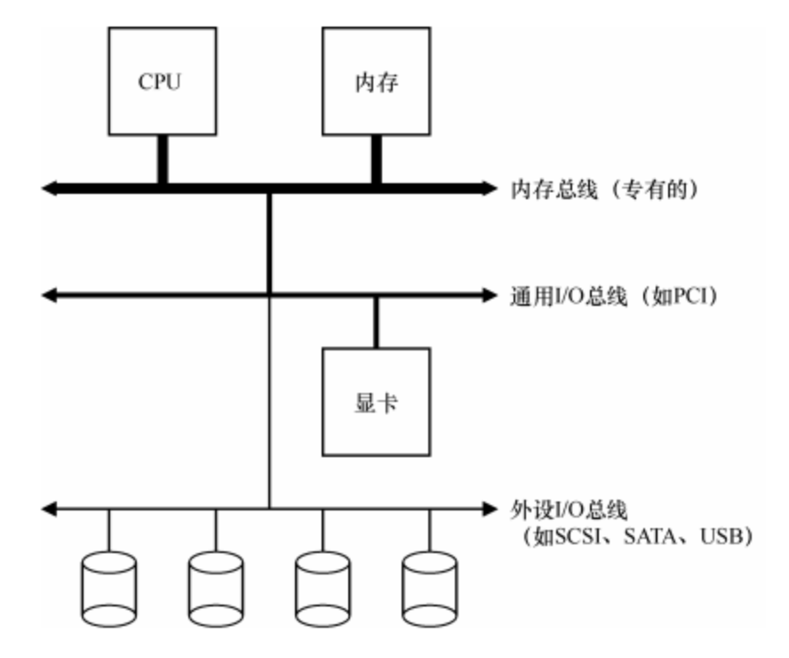
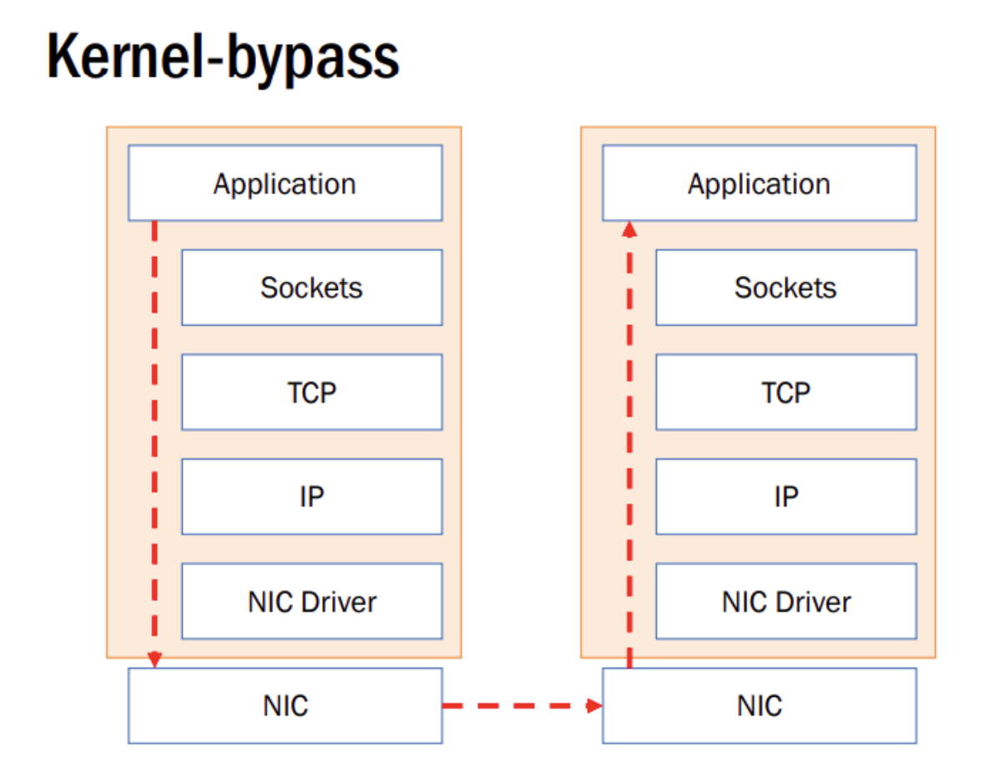

## 背景

最近公司的存储系统要支持 RDMA 了，但是我连 RDMA 具体是啥还不清楚，今天花点时间来学习下相关知识。

在了解 RDMA 之前，需要先知道 DMA 是什么，所以会一点点说。

P.S. 本文部分内容截取自 《OSTEP》。


## DMA

### 系统架构



先来看一个典型的系统架构，其中，CPU 通过某种内存总线（memory bus）或互连电缆连接到系统内存。图像或者其他高性能 I/O 设备通过常规的I/O 总线（I/O bus）连接到系统，在许多现代系统中会是 PCI 或它的衍生形式。最后，更下面是外围总（peripheral bus），比如 SCSI、SATA 或者 USB。它们将最慢的设备连接到系统，包括磁盘、鼠标及其他类似设备。

为什么会用这样的分层架构？因为物理布局及造价成本。越快的总线长度越短，因此高性能的内存总线没有足够的空间来接太多设备。另外，在工程上高性能总线的造价非常高。所以，系统的设计采用了这种分层的方式，这样可以让要求高性能的设备（比如显卡）离 CPU 更近一些，低性能的设备离 CPU 远一些。将磁盘和其他低速设备连到外围总线的好处很多，其中较为突出的好处就是你可以在外围总线上连接大量的设备。

### 标准设备


现在来看一个标准设备（不是真实存在的），通过它来帮助我们更好地理解设备交互的制。从图 中，可以看到一个包含两部分重要组件的设备。
第一部分是向系统其他部分展现的硬件接口（interface）。同软件一样，硬件也需要一些接口，让系统软件来控它的操作。因此，所有设备都有自己的特定接口以及典型交互的协议。
第二部分是它的内部结构（internal structure）。这部分包含设备相关的特定实现，负责具体实现设备展示给系统的抽象接口。非常简单的设备通常用一个或几个芯片来实现它们的功能。更复杂的设备会包含简单的 CPU、一些通用内存、设备相关的特定芯片，来完成它们的工作。例如，现代 RAID 控制器通常包含成百上千行固件（firmware，即硬件设备中的软件），以实现其功能。


### 标准协议

在图 36.2 中，一个（简化的）设备接口包含 3 个寄存器：一个状态（status）寄存器，可以读取并查看设备的当前状态；一个命令（command）寄存器，用于通知设备执行某个具体任务；一个数据（data）寄存器，将数据传给设备或从设备接收数据。通过读写这些寄存器，操作系统可以控制设备的行为。


我们现在来描述操作系统与该设备的典型交互，以便让设备为它做某事。协议如下：

```
While (STATUS == BUSY)
; // wait until device is not busy
Write data to DATA register
Write command to COMMAND register
(Doing so starts the device and executes the command)
While (STATUS == BUSY)
; // wait until device is done with your request
```

该协议包含 4 步：

1. 操作系统通过反复读取状态寄存器，等待设备进入可以接收命令的就绪状态。我们称之为轮询（polling）设备（基本上，就是问它正在做什么）。
2. 操作系统下发数据到数据寄存器。例如，你可以想象如果这是一个磁盘，需要多次写入操作，将一个磁盘块（比如 4KB）传递给设备。如果主 CPU 参与数据移动（就像这个示例协议一样），我们就称之为编程的 I/O（programmed I/O，PIO）。
3. 操作系统将命令写入命令寄存器；这样设备就知道数据已经准备好了，它应该开始执行命令。
4. 操作系统再次通过不断轮询设备，等待并判断设备是否执行完成命令（有可能得到一个指示成功或失败的错误码）。

这个简单的协议好处是足够简单并且有效。但是难免会有一些低效和不方便。我们注意到这个协议存在的第一个问题就是轮询过程比较低效，在等待设备执行完成命令时浪费大量 CPU 时间，如果此时操作系统可以切换执行下一个就绪进程，就可以大大提高 CPU 的利用率。


### 利用中断减少 CPU 开销


多年前，工程师们发明了我们目前已经很常见的中断（interrupt）来减少 CPU 开销。有了中断后，CPU 不再需要不断轮询设备，而是向设备发出一个请求，然后就可以让对应进程睡眠，切换执行其他任务。当设备完成了自身操作，会抛出一个硬件中断，引发 CPU 跳转执行操作系统预先定义好的中断服务例程（Interrupt Service Routine，ISR），或更为简单的中断处理程序（interrupt handler）。中断处理程序是一小段操作系统代码，它会结束之前的请求（比如从设备读取到了数据或者错误码）并且唤醒等待 I/O 的进程继续执行。因此，中断允许计算与 I/O 重叠（overlap），这是提高 CPU 利用率的关键。下面的时间线展示了这一点：


其中，进程 1 在 CPU 上运行一段时间（对应 CPU 那一行上重复的 1），然后发出一个读取数据的 I/O 请求给磁盘。如果没有中断，那么操作系统就会简单自旋，不断轮询设备状态，直到设备完成 I/O 操作（对应其中的 p）。当设备完成请求的操作后，进程 1 又可继续运行。

如果我们利用中断并允许重叠，操作系统就可以在等待磁盘操作时做其他事情：


在这个例子中，在磁盘处理进程 1 的请求时，操作系统在 CPU 上运行进程 2。磁盘处理完成后，触发一个中断，然后操作系统唤醒进程 1 继续运行。这样，在这段时间，无论CPU 还是磁盘都可以有效地利用。注意，使用中断并非总是最佳方案。假如有一个非常高性能的设备，它处理请求很快：通常在 CPU 第一次轮询时就可以返回结果。此时如果使用中断，反而会使系统变慢：切换到其他进程，处理中断，再切换回之前的进程代价不小。因此，如果设备非常快，那么最好的办法反而是轮询。如果设备比较慢，那么采用允许发生重叠的中断更好。如果设备的速度未知，或者时快时慢，可以考虑使用混合（hybrid）策略，先尝试轮询一小段时间，如果设备没有完成操作，此时再使用中断。这种两阶段（two-phased）的办法可以实现两种方法的好处。

另一个最好不要使用中断的场景是网络。网络端收到大量数据包，如果每一个包都发生一次中断，那么有可能导致操作系统发生活锁（livelock），即不断处理中断而无法处理用户层的请求。例如，假设一个 Web 服务器因为“点杠效应”而突然承受很重的负载。这种情况下，偶尔使用轮询的方式可以更好地控制系统的行为，并允许 Web 服务器先服务一些用户请求，再回去检查网卡设备是否有更多数据包到达。另一个基于中断的优化就是合并（coalescing）。设备在抛出中断之前往往会等待一小段时间，在此期间，其他请求可能很快完成，因此多次中断可以合并为一次中断抛出，从而降低处理中断的代价。当然，等待太长会增加请求的延迟，这是系统中常见的折中。


### 利用 DMA 进行更高效的数据传送

标准协议还有一点需要我们注意。具体来说，如果使用编程的 I/O 将一大块数据传给设备，CPU 又会因为琐碎的任务而变得负载很重，浪费了时间和算力，本来更好是用于运行其他进程。下面的时间线展示了这个问题：


进程 1 在运行过程中需要向磁盘写一些数据，所以它开始进行 I/O 操作，将数据从内存拷贝到磁盘（其中标示 c 的过程）。拷贝结束后，磁盘上的 I/O 操作开始执行，此时 CPU 才可以处理其他请求。

解决方案就是使用 DMA（Direct Memory Access）。DMA 引擎是系统中的一个特殊设备，它可以协调完成内存和设备间的数据传递，不需要 CPU 介入。DMA 工作过程如下。为了能够将数据传送给设备，操作系统会通过编程告诉 DMA 引擎数据在内存的位置，要拷贝的大小以及要拷贝到哪个设备。在此之后，操作系统就可以
处理其他请求了。当 DMA 的任务完成后，DMA 控制器会抛出一个中断来告诉操作系统自己已经完成数据传输。修改后的时间线如下：


从时间线中可以看到，数据的拷贝工作都是由 DMA 控制器来完成的。因为 CPU 在此时是空闲的，所以操作系统可以让它做一些其他事情，比如此处调度进程 2 到 CPU 来运行。因此进程 2 在进程 1 再次运行之前可以使用更多的 CPU。


## RDMA

### 基本概念

> 远程直接内存访问（英语：remote direct memory access，RDMA）是一种绕过远程主机操作系统内核访问其内存中数据的技术，由于不经过操作系统，不仅节省了大量CPU资源，同样也提高了系统吞吐量、降低了系统的网络通信延迟，尤其适合在大规模并行计算机集群中有广泛应用。在基于NVMe over Fabric的数据中心中，RDMA可以配合高性能的NVMe SSD构建高性能、低延迟的存储网络。

这类绕过操作系统内核的技术称为内核旁路（Kernel-Bypass）。Kernel-Bypass 框架/API 有：DPDK、ibverbs 。



### 优势
远程直接内存访问
在某些场景下类似于 DMA
低延迟
毫秒级别，无内核调用时间
零拷贝
无需拷贝 I/O buffers
硬件处理信息传输，节省 CPU

### 劣势
贵。我能想到的只有贵。
来自开发了大半年的 wenquan 同学总结：
编程，调优麻烦
与性能相关的点很多
对网络环境要求高
...
### 解决方案

#### InfiniBand
InfiniBand 是指两种完全不同的东西。一个是 InfiniBand 网络的物理链接层协议，另一个是高级编程 API，名为 InfiniBand Verbs API。InfiniBand Verbs API 是一种远程直接内存访问（RDMA）技术的实施。
InfiniBand 需要全套的网络设备才可以支持，成本高，性能好。
#### RoCE & iWARP
iWARP，以通过Internet协议网络进行有效的数据传输。由于iWARP 基于TCP 协议因此它对网络的要求不高，可以在各种环境中部署，成本低，性能也是最差的。
RoCE，基于融合以太网的RDMA（英语：RDMA over Converged Ethernet，缩写RoCE）是一个网络协议，允许在一个以太网网络上使用远程直接内存访问（RDMA）。RoCE有RoCE v1和RoCE v2两个版本。RoCE v1是一个以太网链路层协议，因此允许同一个以太网广播域中的任意两台主机间进行通信。RoCE v2是一个网络层协议，因而RoCE v2数据包可以被路由。虽然RoCE协议受益于融合以太网网络的特征，但该协议也可用于传统或非融合的以太网网络，成本中等，性能比 IB 略差。

## 参考链接

* http://pages.cs.wisc.edu/~remzi/OSTEP/
* https://www.junmajinlong.com/os/io_dma_rdma/
* https://www.cs.utah.edu/~stutsman/cs6450/public/20.pdf
* https://zh.wikipedia.org/wiki/%E8%BF%9C%E7%A8%8B%E7%9B%B4%E6%8E%A5%E5%86%85%E5%AD%98%E8%AE%BF%E9%97%AE
* https://www.cs.utah.edu/~stutsman/cs6450/public/20.pdf
* https://www.mellanox.com/pdf/whitepapers/IB_Intro_WP_190.pdf


