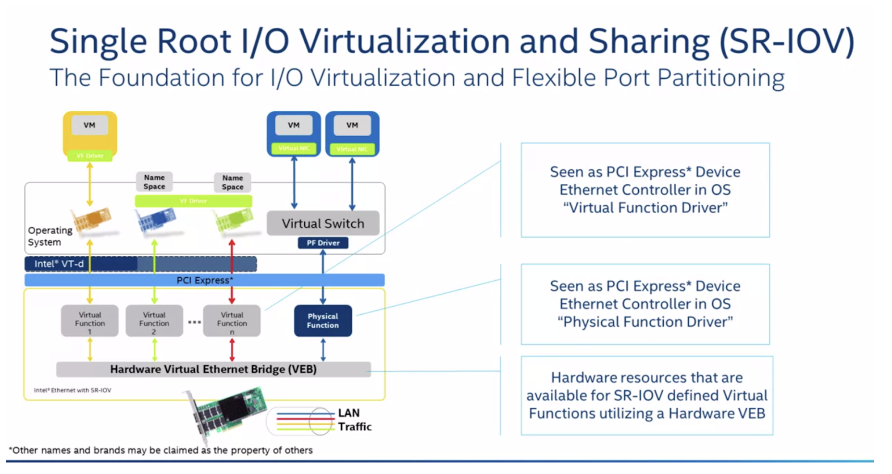
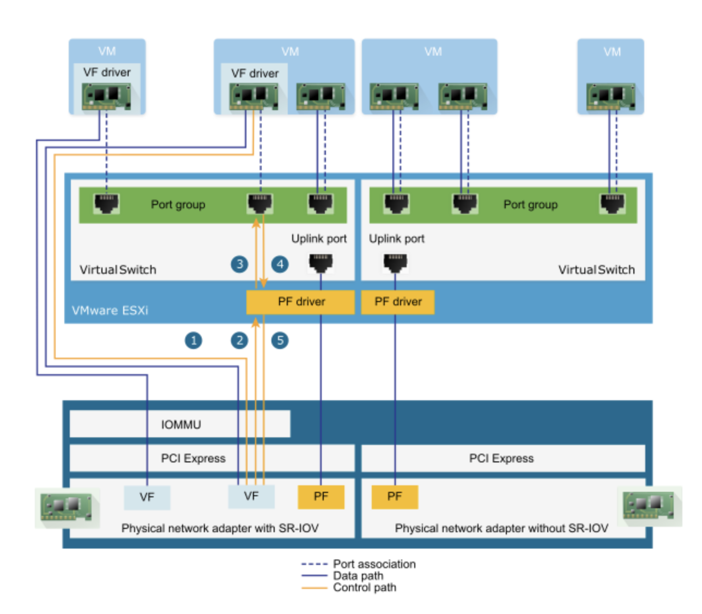
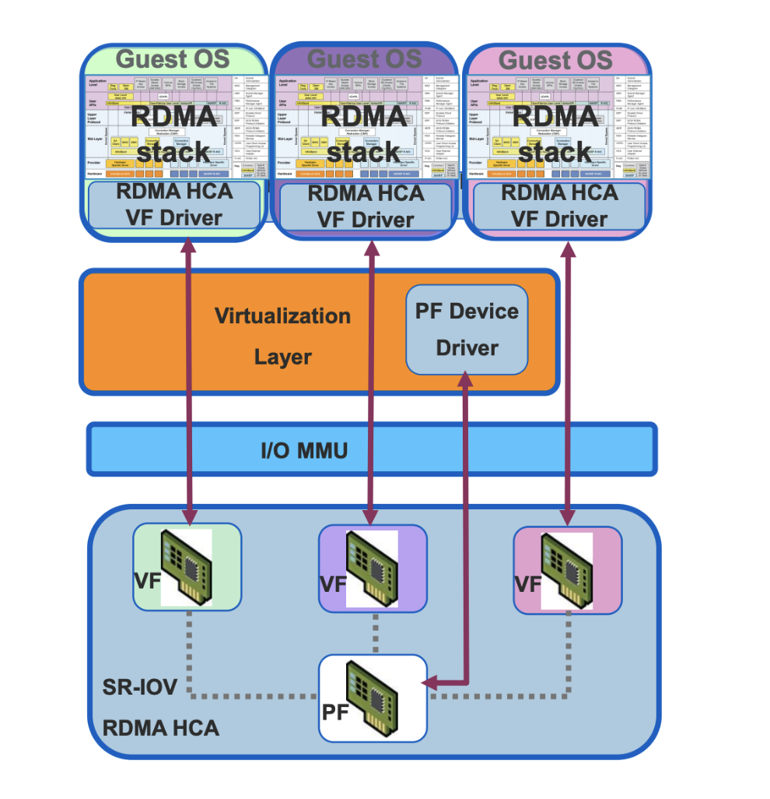
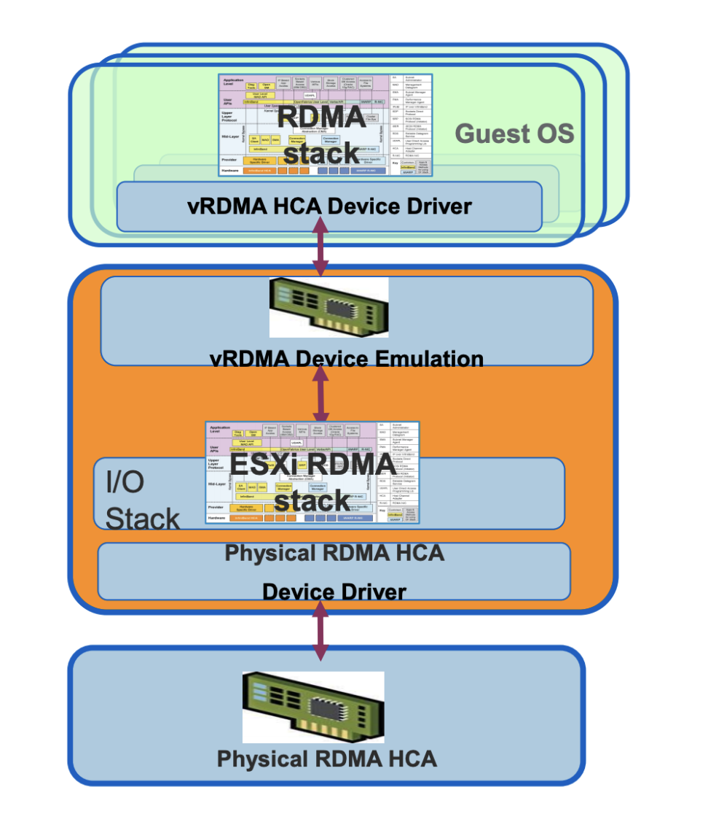
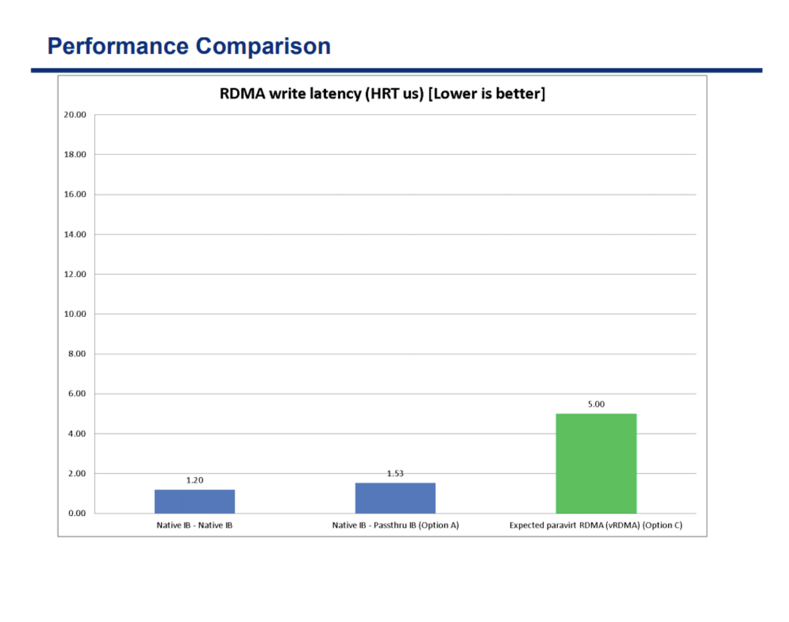

## 背景
上周了解了 RDMA 的基础概念之后，发现在 KVM 平台无需其他配置就可使用，但是在 vSphere 场景下，需要面临一个取舍，其中的一个选择就是 SR-IOV ，今天来了解下 SR-IOV 。

## SR-IOV

SR-IOV 全称 `Single Root I/O Virtualization`，是 Intel 在 2007年提出的一种基于硬件的虚拟化解决方案。

在虚拟化场景中，CPU 与内存是最先解决的，但是 I/O 设备一直没有很好的解决办法，Intel 有 VT-d（Virtualization Technology for Directed I/O）可以将物理服务器的 PCIe 设备直接提供给虚拟机使用，也就是我们常说的“直通”（passthrough），但是直通面临一个问题是 PCIe 设备只能给一个虚拟机使用，其他虚拟机就只能干瞪眼，这肯定是不行的，所以有了 SR-IOV，一个物理设备可以虚拟出多个虚拟设备给虚拟机使用。

SR-IOV 是一种规范，使得单根端口下的单个快速外围组件互连 (PCIe) 物理设备显示为管理程序或客户机操作系统的多个单独的物理设备，既有直通设备的性能优势，又可以支持多个虚拟机，一举两得。

SR-IOV 使用 physical functions (PF) 和 virtual functions (VF) 为 SR-IOV 设备管理全局功能。

* PF 包含SR-IOV 功能的完整PCIe设备，PF 作为普通的PCIe 设备被发现、管理和配置 。PF 通过分配VF 来配置和管理 SR-IOV 功能。禁用SR-IOV后，主机将在一个物理网卡上创建一个 PF。
* VF 是轻量级 PCIe 功能（I/O 处理）的 PCIe 设备，每个 VF 都是通过 PF 来生成管理的，VF 的具体数量限制受限于 PCIe 设备自身配置及驱动程序的支持，启用S​​R-IOV后，主机将在一个物理NIC上创建单个PF和多个VF。 VF的数量取决于配置和驱动程序支持。

> 每个 SR-IOV 设备都可有一个 PF(Physical Functions)，并且每个 PF 最多可有64,000个与其关联的 VF(Virtual Function)。PF 可以通过寄存器创建 VF，这些寄存器设计有专用于此目的的属性。一旦在 PF 中启用了 SR-IOV，就可以通过 PF 的总线、设备和功能编号（路由 ID）访问各个 VF 的 PCI 配置空间。
>
> 每个 VF 都具有一个 PCI 内存空间，用于映射其寄存器集。VF设备驱动程序对寄存器集进行操作以启用其功能，并且显示为实际存在的PCI设备。创建 VF 后，可以直接将其指定给虚拟机或各个应用程序。此功能使得虚拟功能可以共享物理设备，并在没有CPU和虚拟机管理程序软件开销的情况下执行 I/O。

### SR-IOV with RDMA

上面介绍了 SR-IOV 的基本概念，现在来说说什么时候会用到 SR-IOV，上周说我们产品中使用了 RDMA，那么在多种虚拟化平台下要想统一支持是比较困难的，KVM 是最轻松的，vSphere 就面临一个选择，SR-IOV 方式支持 vs vRDMA。

其中 SR-IOV 支持方式就如前面提到的概念一样，大概需要如下配置：

* 在 BIOS 中启用网卡的 SR-IOV 功能
* 在 ESXi 安装 MFT vib 工具，用于管理和配置网卡 FW
* 在网卡 FW 中开启 SR-IOV，设置最大的 VF 数量
* 在 ESXi 网卡驱动中，开启 SRIOV，设置 VF 数量，需要重启 ESXi
* 创建对应的 vSwitch 并将 PF 作为上联网卡接入
* 创建虚拟机，添加 VF 作为 SR-IOV 网络适配器，并选择 PF 所在的 vSwitch 即可

vRDMA 是 vSphere 提供的一种软件模拟 RDMA 的方式，但是他的性能受到很大影响，我们使用 RDMA 就是为了提高性能，所以这种就不会考虑了。
具体性能对比如下：

## 总结

### SR-IOV 优点

* 性能好
* 减少主机 CPU 消耗

### SR-IOV 缺点

* 虚拟机使用 VF 后无法进行内存超分、快照、热迁移等高级功能
* 配置管理复杂

不知道是不是接触的少，在日常中几乎没有遇到过使用 SR-IOV 的客户，只有少数客户会提出要有 SR-IOV 的需求，看到在 K8s 场景下有对应的 CNI 插件可以做到 SR-IOV 的管理，之后找时间看看是如何做到的。

## 参考链接
* https://octo.vmware.com/wp-content/uploads/2012/09/RDMAonvSphere.pdf
* https://docs.mellanox.com/pages/releaseview.action?pageId=15055422
* https://en.wikipedia.org/wiki/Single-root_input/output_virtualization
* https://github.com/intel/sriov-cni
* https://github.com/hustcat/sriov-cni
