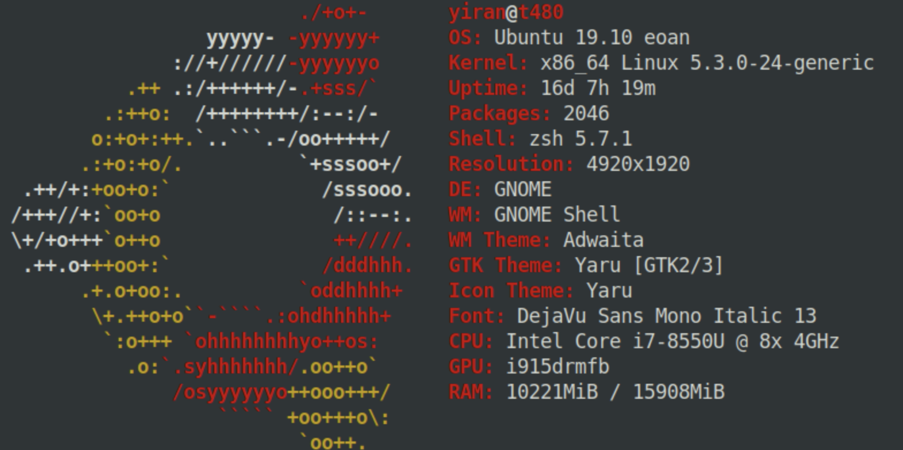
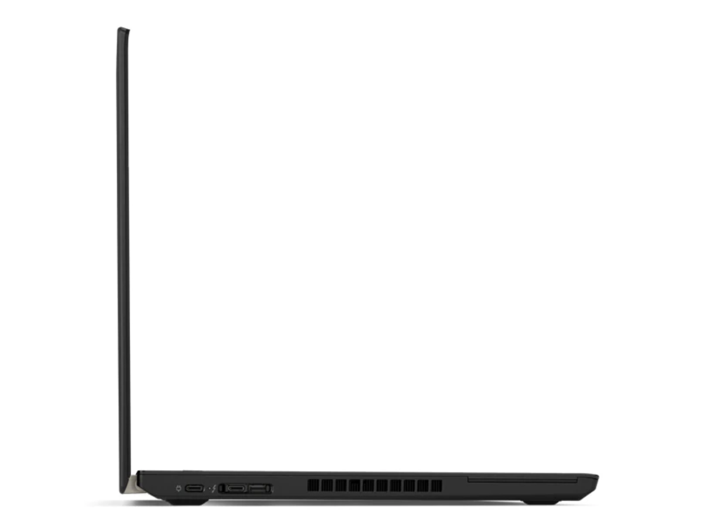
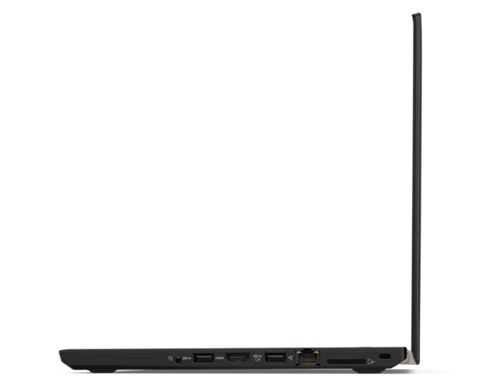
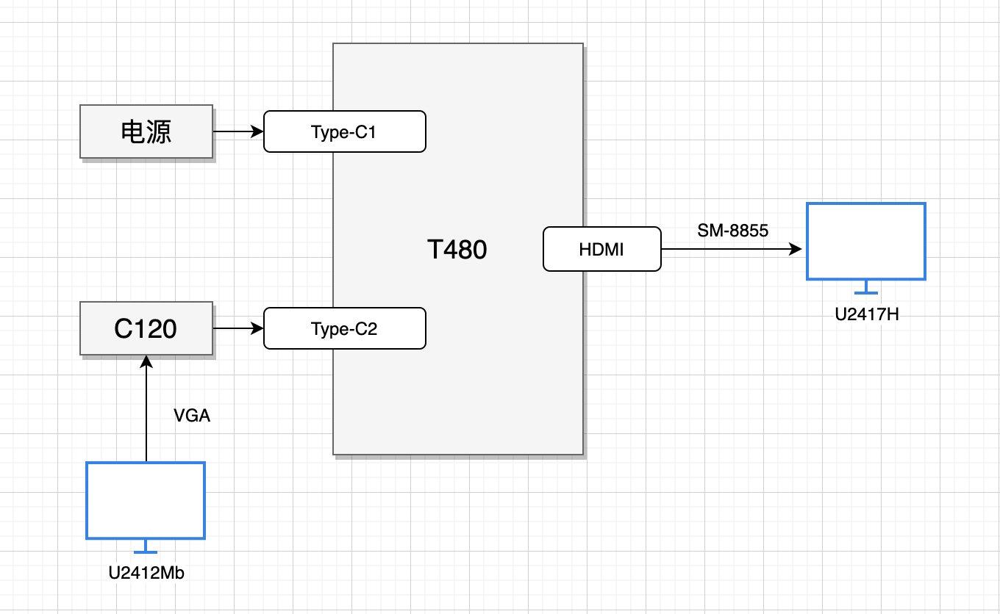

## 背景

平时工作使用的电脑是 ThinkPad T480，之前一直安装的 Win10，连接多显示器很正常，没有问题，后来重装为了 Ubuntu，发现连接多显示器很诡异，在我的这套设备之上，如果想要正常使用，需要按照一个奇怪的顺序，记录一下。

## 硬件设备

设备类型 | 设备 | 型号
--- | --- | ---
笔记本 |  ThinkPad | T480
拓展坞 | 联想/闪联 USB-C 集线器  | C120
连接线 | 山泽 HDMI 数字高清线 | SM-8855
连接线 |  VGA 高清视频线 |
显示器 | DELL 24 寸 | U2412Mb
显示器 | DELL 24 寸 | U2417H

（不要问我为啥 Type-C 遍地走的现在，还在用 VGA，现在这套还是东拼西凑出来的。。。

## 软件

## 设备接口

T480 作为 ThinkPad 的 T 系列产品，接口还是很丰富的：

* 2 x USB 3.1 Gen 1** (one Always On)
* 1 x USB 3.1 Gen 1** Type-C (Power Delivery, DisplayPort, Data transfer)
* * x USB 3.1 Gen 2** Type-C / Intel Thunderbolt 3 (Power Delivery, DisplayPort, Data transfer)
* Headphone and microphone combo jack
* 4-in-1 SD card reader (SD, MMC, SDHC, SDXC)
* HDMI
* RJ45 Gigabit Ethernet
* Optional Smart card reader

ThinkPad T480 左视图：

* 1 x USB 3.1 Gen 1** Type-C (Power Delivery, DisplayPort, Data transfer)
* 1 x USB 3.1 Gen 2** Type-C / Intel Thunderbolt 3 (Power Delivery, DisplayPort, Data transfer)

这里分别用 Type-C1 和 Type-C2 代指从左到右的两个接口。

ThinkPad T480 右视图：

右侧有一个 HDMI 接口。

## 连接方式

## 连接顺序

1. VGA 连接 U2412Mb
2. HDMI 连接 U2417H
3. VGA 连接 C120
4. 电源连接 C120
5. C120 连接 Type-C2
6. 电源断开 C120
7. 电源连接 Type-C1
8. HDMI 连接 T480 HDMI

## 总结

这个顺序在尝试过程中感觉跟 T480 供电正相关，但是没有找到直接问题，只能用这种连接顺序来保证这套东西正常工作了。