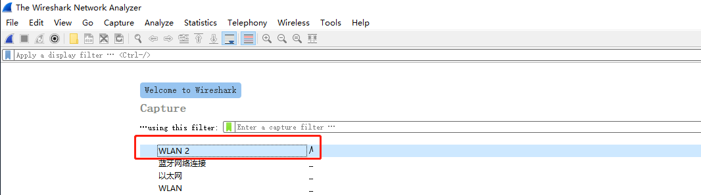
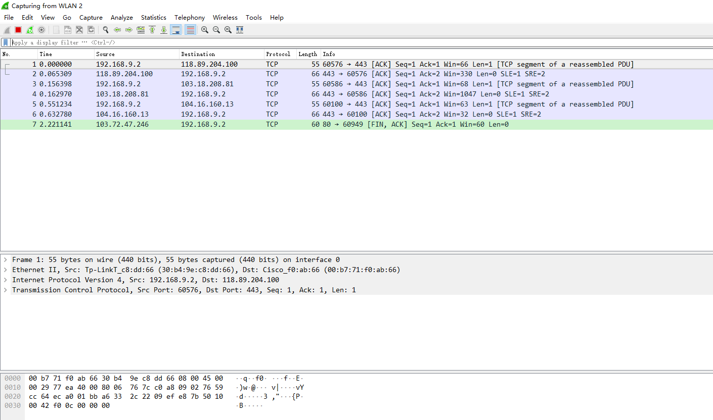
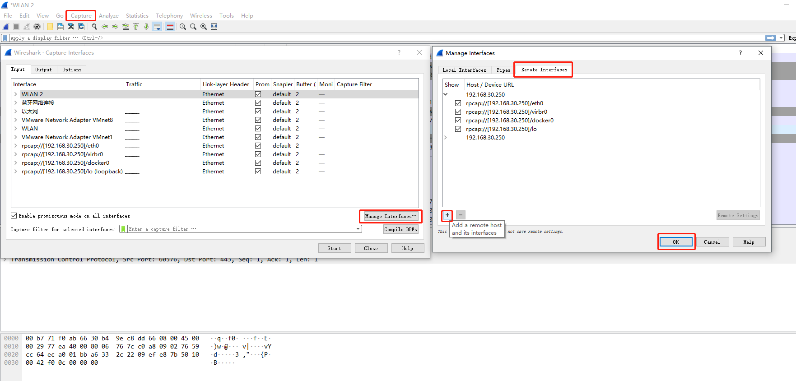

## 背景

最近在看 《Wireshark网络分析就这么简单》，目前读了 1/3，觉得作为一本工具介绍书籍还是不错的，至少可以让我更关注网络相关知识。
书中有大量的实例来讲解 Wireshark 的使用，及网络基础，在阅读的过程中，需要实际动手操作下，由于搜到的教程中没有正确操作的步骤，特此记录。

## 环境信息
* 个人 PC
  * Windows 10
* 服务器
  * CentOS 7

## 操作流程

### (1)个人 PC
1. 登陆 Wireshark 官网，下载最新版本软件包并安装
2. 打开 Wireshark ，选择本机的网卡，并进行抓取，验证软件是否正常工作





### (2)服务器
验证个人 PC 上软件正常后，我们需要在服务器安装 rpcapd，以便让 Wireshark 连接该服务器。
1. 访问 rpcapd [github](https://github.com/rpcapd-linux/rpcapd-linux)
2. 克隆相应代码 `cd /tmp; git clone https://github.com/rpcapd-linux/rpcapd-linux`
3. 安装相应依赖 `yum install glibc-static flex binutils`
4. 编译安装 libpcap `cd /tmp/rpcapd-linux/libpcap ; ./configure && make`
5. 编译安装 rpcapd ，注意 README 中的 `libcrypt.a in glibc-static is broken in ,remove -static in Makefile` ，需要先将 Makefile 中的 `-static` 删掉，执行 `make` 即可
6. 执行 `./rpcapd -n` 可以看到程序正在运行：

```bash
root@yiran-30-250:/tmp/rpcapd-linux
master ✗ $ ./rpcapd -n
Press CTRL + C to stop the server...
bind(): Address already in use (code 98)
```

### (3)个人 PC
3. 打开 Wireshark，点击 `Capture` --> `Options` --> `Manage Interfaces` --> `Remote interfaces` --> `+` --> 在 Host 输入对应服务器 IP 即可

4. 在 Wireshark 首页上我们可以看到服务器上的相应网卡列表，选择我们想要抓取的网卡，即可抓取。
