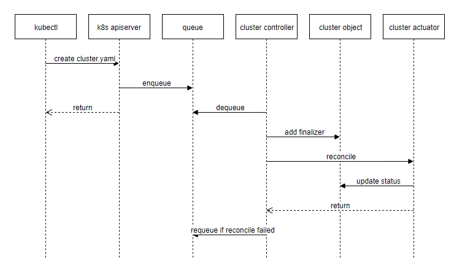
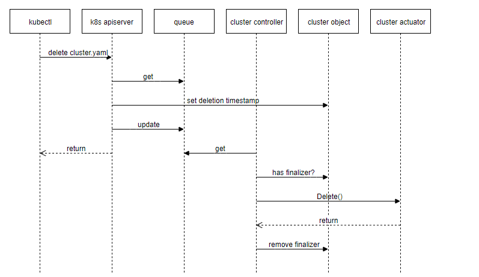
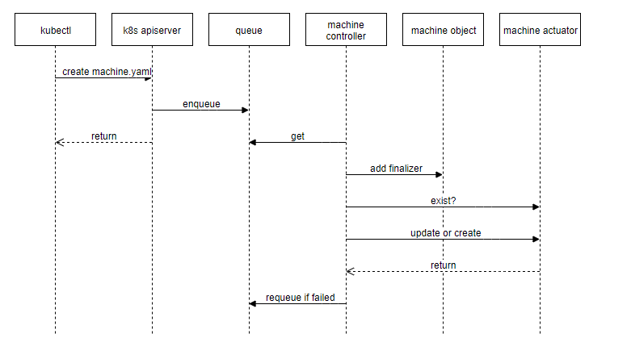
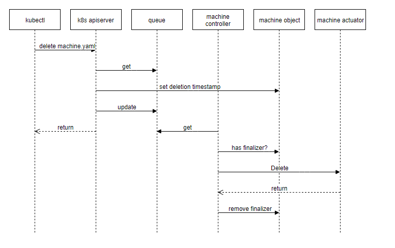

## 背景

上一篇博客讲了 Cluster-API 的相关概念，现在我们来找一个 provider 实现看看具体里面做了啥，因为对 vmware 产品中的概念比较熟悉，就找了 cluster-api-provider-vsphere 。

以下内容均对应 clusterapi v1alpha1 版本。

## clusterctl 命令

cluster-api provider 提供了命令行 `clusterctl` 用于给我们快速创建 bootstrap 集群用于创建目标 k8s 集群，我们来执行一下看看具体做了哪些工作：

```
root@yiran-workstation:~/go/src/github.com/kubernetes-sigs/cluster-api-provider-vsphere
master ✗ $ clusterctl create cluster \
  --provider vsphere \
  --bootstrap-type kind \
  --cluster ./out/management-cluster/cluster.yaml \
  --machines ./out/management-cluster/machines.yaml \
  --provider-components ./out/management-cluster/provider-components.yaml \
  --addon-components ./out/management-cluster/addons.yaml \
  --kubeconfig-out ./out/management-cluster/kubeconfig
I0816 17:28:05.815156   14562 createbootstrapcluster.go:27] Preparing bootstrap cluster
I0816 17:29:15.292547   14562 clusterdeployer.go:78] Applying Cluster API stack to bootstrap cluster
I0816 17:29:15.292619   14562 applyclusterapicomponents.go:26] Applying Cluster API Provider Components
I0816 17:29:16.492405   14562 clusterdeployer.go:83] Provisioning target cluster via bootstrap cluster
I0816 17:29:16.505317   14562 applycluster.go:36] Creating cluster object management-cluster in namespace "default"
I0816 17:29:16.518456   14562 clusterdeployer.go:92] Creating control plane machine in namespace "default"
I0816 17:29:16.548814   14562 applymachines.go:36] Creating machines in namespace "default" # 因为众所周知的“网络”问题，导致我的 Pod image 无法拉取，所以就卡在这里了。。。
...
```

可以看到这个命令一共做了如下的事情：
1. 创建 bootstrap 集群
2. 安装 Provider 组件
3. 创建目标 k8s 集群，创建 Cluster CR，Machine CR
4. ...


这里因为“网络”问题我无法继续下去了，那么我们来看下命令行的具体实现。

这个命令最终是由 provider 提供的，在 provider 中需要实现 2个接口来辅助信息的获取：

```go
type Deployer interface {
	// TODO: This requirement can be removed once after: https://github.com/kubernetes-sigs/cluster-api/issues/158
	GetIP(cluster *clusterv1.Cluster, machine *clusterv1.Machine) (string, error)
	// TODO: This requirement can be removed after: https://github.com/kubernetes-sigs/cluster-api/issues/160
	GetKubeConfig(cluster *clusterv1.Cluster, master *clusterv1.Machine) (string, error)
}
```

在 Bootstrap 集群中，会运行 2个 StatefulSet ，分别对应的是 Cluster-api-control-manager 和 provider-control-manager。其中跟 Hypervisor 打交道的逻辑全部在 provider-control-manager 中实现。


## Cluster

创建流程：


删除流程：



在 Cluster Controller 中，最终所有的调度任务都会通过 actuator 完成，actuator 需要实现以下接口：

```go
type Actuator interface {
	// Reconcile creates or applies updates to the cluster.
	Reconcile(*clusterv1.Cluster) error
	// Delete the cluster.
	Delete(*clusterv1.Cluster) error
}
```

来看下 vsphere 的实现：

```go
func (a *Actuator) Reconcile(cluster *clusterv1.Cluster) (opErr error) {
	ctx, err := context.NewClusterContext(&context.ClusterContextParams{
		Cluster:          cluster,
		Client:           a.client,
		CoreClient:       a.coreClient,
		ControllerClient: a.controllerClient,
		Logger:           klogr.New().WithName("[cluster-actuator]"),
	})
	if err != nil {
		return err
	}

	defer func() {
		opErr = actuators.PatchAndHandleError(ctx, "Reconcile", opErr)
	}()

	ctx.Logger.V(6).Info("reconciling cluster")

	if err := a.reconcilePKI(ctx); err != nil {
		return err
	}

	if err := a.reconcileCloudConfigSecret(ctx); err != nil {
		return err
	}

	if err := a.reconcileReadyState(ctx); err != nil {
		return err
	}

	return nil
}
```


如果在 actuator 中遇到需要等待或重新调度的情况，比如目标虚拟机未创建完成，目标集群未 ready 的情况，需要返回 `clusterErr.RequeueAfterError` ，从而重新调度。比如在配置 secret 时，如果无法获取目标集群的 k8s client，那么表示集群还未配置完成：

```go
func (a *Actuator) reconcileCloudConfigSecret(ctx *context.ClusterContext) error {
	client, err := kubeclient.New(ctx)
	if err != nil {
		ctx.Logger.Error(err, "target cluster is not ready")
		return &clusterErr.RequeueAfterError{RequeueAfter: config.DefaultRequeue}
	}
...
```


## machine

创建流程：



删除流程：




在 v1alpha1 版本中，machine actuator 负责 2件事情：
1. 虚拟机构建；
2. k8s 集群构建（cloud-init 或 ssh）

在 vsphere 中，创建虚拟机和 k8s 集群构建两件事情时一起完成的，大概流程如下：
1. 生成配置信息，如证书
2. 判断目标 k8s 集群是否需要初始化（kubeadm init）
3. 根据是否需要初始化及是否为 controlplane，生成对应 cloud-init 配置文件
4. 克隆虚拟机，并将 cloud-init 配置文件作为 `guestinfo.userdata` 放入虚拟机配置参数中
5. 虚拟机开机，通过 `vmtoolsd` 获取 `guestinfo.userdata` 信息，并作为 cloud-init 参数进行配置
6. k8s 集群构建完成（我在实际测试中，发现并没有自动创建 CNI 插件，不知道是不是 bug）
7. vsphere 克隆虚拟机为异步任务，提交克隆虚拟机任务后，得到 task id，后续判断虚拟机是否存在会用到；


## Cloud-init or SSH

### Cloud-init

在 vsphere provider 中，k8s 部署是通过 cloud-init 实现的，因为之前对 cloud-init 并不了解，这里大概看了下实现方式。

首先在克隆虚拟机时，给目标虚拟机添加了 `guestinfo.userdata` 字段作为虚拟机配置参数，这个参数是配置在 Hypervisor 层面的，理论上存在虚拟机隔离性，那么虚拟机内部应该无法感知这个参数，这时候就需要一个工具：vmtools。各个虚拟化平台都会提供一个 vmtools 或类似的工具，用于给虚拟机提供一些高级功能，如：获取 IP、设置主机名、配置 NTP/DNS Server、执行特定命令等等。这些都是根据 vmtools 的实现方式不同支持的功能也不同。

vmware vmtools 在安装后，vsphere 可以获取到虚拟机的 IP 等信息，同时，在虚拟机内部会安装一些命令，比如：

```bash
 $ which vmtoolsd
/usr/bin/vmtoolsd
root@yiran-workstation:~/project/cluster-api-provider-vsphere
7d21730f ✔ $ vmware-*
vmware-checkvm             vmware-hgfsclient          vmware-toolbox-cmd         vmware-vgauth-cmd
vmware-config-tools.pl     vmware-namespace-cmd       vmware-uninstall-tools.pl  vmware-vmblock-fuse
vmware-guestproxycerttool  vmware-rpctool             vmware-user-suid-wrapper   vmware-xferlogs
```

vsphere provider 代码中并没有很明确的给出参数是如何传递的，通过不断的寻找，我找到了这个项目： https://github.com/vmware/cloud-init-vmware-guestinfo ，在这里我们可以看到获取 Hypervisor 层面虚拟机的额外配置：

```python
def get_guestinfo_value(key):
    '''
    Returns a guestinfo value for the specified key.
    '''
    LOG.debug("Getting guestinfo value for key %s", key)
    try:
        (stdout, stderr) = util.subp(
            [VMTOOLSD, "--cmd", "info-get guestinfo." + key])
```

那么后续的步骤就可以想象的到了，全靠 cloud-init ，这里因为对 cloud-init 了解不多，之后有机会去学习下。


### SSH

SSH 是我们日常远程连接服务器最常用的方式了，通过用户名，密码（或密钥）来进行 SSH 连接，之后都是通过 Shell 脚本的方式实现 k8s 集群部署，当然 Shell 脚本最终调用的命令是 kubeadm。

## 总结

通过阅读 vsphere provider 代码，我们大概了解了实现一个 Cluster-API provider 需要做哪些事情，最主要的资源控制工作都是在 Cluster-API 实现的，而 provider 主要根据各个场景不同，通过 actuator 实现对应工作，代码量和实现方式上也是千差万别。比如 aws 全部代码可能要 2w 行，而 IBM 的加一起可能不到2k，全看各家的重视程度了。

在写这篇博客的间隙，Cluster-API 开始了 alpha2 的实质性工作： https://github.com/kubernetes-sigs/cluster-api/blob/master/docs/developer/v1alpha1-compared-to-v1alpha2.md ，还没有了解具体的改动，等 beta 之后再看吧。

---

吐槽：

因为 Cluster-API 处于 v1alpha1 阶段，master 分支代码改动非常大，前几天看的代码今天再看就跟记忆中对不上了，之后看代码的时候一定要注意去一个稳定分支上看，免得费时费力。
