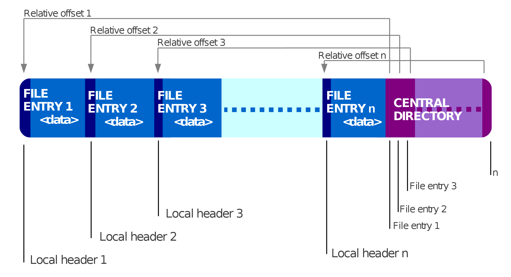
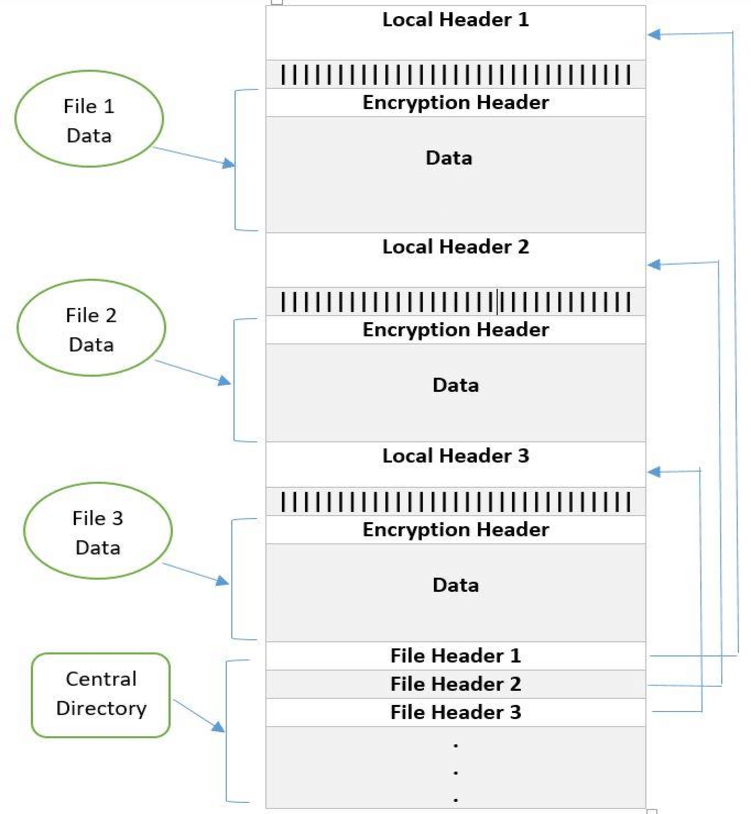

## 背景

在之前的一篇博客[《HTTP Content-Length 学习》](https://zdyxry.github.io/2020/02/07/HTTP-Content-Length-%E5%AD%A6%E4%B9%A0/) 中提到自己踩了一个坑，就是 `content-length` 与实际大小不匹配导致文件下载失败，在解决过程中用到了 zipstreamer ，今天来看看 zipstreamer 是如何工作的。

## zipfile

Python 标准库中提供了 zipfile 用来对 Zip 文件进行操作，可以进行 Zip 的创建、写入、读取、解压等动作，但是 zipfile 只能对文件进行操作，没办法传入 stream，所以能做的操作有限。

### 示例

```python

import zipfile

def test():

    for i in range(1, 4):
        f = open("file" + str(i) + ".txt", 'w')
        f.write(str(i))
        f.close()

    f = zipfile.ZipFile('filename.zip', 'w', zipfile.ZIP_DEFLATED)
    f.write('file1.txt')
    f.write('file2.txt')
    f.write('file3.txt')
    f.close()

    f = zipfile.ZipFile('filename.zip')
    f.extractall()
    f.close()

if __name__ == "__main__":
    test()
```

## zipstreamer

在提供文件下载接口时，有一个比较常见的需求是传过来一个 stream，然后我们要将 stream 作为 Zip 中的一个文件转发出去，实时下载，这时候就需要 zipstreamer 来实现了。

### 示例

```python
z = ZipStream(files=[
    ZipFile('file.txt', 4, lambda: StringIO('test'), None, None),
    ZipFile('emptydir/', None, None, None, None),
    ZipFile('dir/remote.txt', remote_file_size, get_remote_file, None, None),
])

size = z.size()

res = Response(z.generate(), mimetype='application/zip')
res.headers['Content-Length'] = str(size)
```

### 源码

在看代码之前，我们先看下 zip 文件的数据格式：






```shell
root@localhost:~/project/python-zipstreamer/zipstreamer
master ✔ $ tree .
.
├── compat.py # py2 py3 兼容
├── __init__.py # 主要逻辑
└── __version__.py # 版本信息
```

zipstreamer 的目录结构比较简单，所有逻辑都在 `__init__.py` 中，先来看看 `compat.py` 中做了什么，根据 Python 版本来决定 BytesIO 的引用，修改下默认的 str 定义：

```python
#: Python 2.x?
IS_PY2 = (_VER[0] == 2)
#: Python 3.x?
IS_PY3 = (_VER[0] == 3)

if IS_PY2:
    from StringIO import StringIO as BytesIO
    str = unicode

elif IS_PY3:
    from io import BytesIO
    str = str
```

那么来看看 `__init__.py` 中都定义了哪些类，根据示例我们知道有 `ZipStream`，并且它肯定实现了 `generate` 方法：

```python
class ZipStream(object):
    def __init__(self, files, comment=None):
    def generate(self):
    def size(self):
    def _incr(self, buf):
    def _generate_file(self, zip_file):
    def _generate_dir_entry(self, entry):
    def _generate_zip_file(self):
```

先来看看构造函数中定义了什么：

```python
    def __init__(self, files, comment=None):
        if isinstance(comment, str):
            raise ZipFileBytesRequired('ZIP comment should bytes')
        # 所有 ZipFile 的集合
        self.files = files
        self.comment = comment
        # 定义初始值及必要的 flag
        self._dir = None
        self._pos = None # 计算文件大小时用到
        self._generating = False
        self._calculate_size = False
```

最终传给 Response 的是 `z.generate()` ，所以先看看 `generate()`：

```python
    def generate(self):
        # 构造函数中定义的 flag，因为是生成器，如果已经执行过那么后续执行都会异常，所以这里提前判断
        if self._generating:
            raise ZipFileInProgress('ZipFile generator already in progress')

        self._generating = True
        try:
            for chunk in self._generate_zip_file():
                yield chunk
        finally:
            self._generating = False
```

继续看 `self._generate_zip_file()` 这里是整个 zipstreamer 中最核心的逻辑，包含了 Zip 文件内容定义，数据格式定义：

```python
    def _generate_zip_file(self):
        self._dir = []
        self._pos = 0

        for zip_file in self.files:
            # 生成文件数据
            for chunk in self._generate_file(zip_file):
                yield chunk
        # 这里可以判断 self._generate_file 会修改 self._pos
        start = self._pos
        for entry in self._dir:
            # 生成文件夹数据
            for chunk in self._generate_dir_entry(entry):
                yield chunk
        # 同样 self._generate_dir_entry 也会修改 self._pos
        end = self._pos

        # 可以猜测在 self._generate_dir_entry 会更新 self._dir
        cent_dir_count = len(self._dir)
        cent_dir_size = end - start
        cent_dir_offset = start

        # 根据条件判断最终 Zip 文件是否为 64 位
        if (cent_dir_count >= UINT16_MAX or cent_dir_size >= UINT32_MAX or cent_dir_offset >= UINT32_MAX):
            zip64_end_rec = struct.pack(
                STRUCT_END_ARCHIVE64, STRING_END_ARCHIVE64, 44, ZIP_VERSION_45,
                ZIP_VERSION_45, 0, 0, cent_dir_count, cent_dir_count,
                cent_dir_size, cent_dir_offset)

            yield self._incr(zip64_end_rec)

            zip64_loc_rec = struct.pack(
                STRUCT_END_ARCHIVE64_LOCATOR, STRING_END_ARCHIVE64_LOCATOR, 0,
                end, 1)

            yield self._incr(zip64_loc_rec)

            cent_dir_count = UINT16_MAX
            cent_dir_size = UINT32_MAX
            cent_dir_offset = UINT32_MAX

        eocd_comment = b'' if self.comment is None else self.comment

        endrec = struct.pack(
            STRUCT_END_ARCHIVE, STRING_END_ARCHIVE, 0, 0, cent_dir_count,
            cent_dir_count, cent_dir_size, cent_dir_offset, len(eocd_comment))
        # 返回 Zip 格式要求的 central 部分
        yield self._incr(endrec)
        yield self._incr(eocd_comment)
```

`self._generate_file` 和 `self._generate_dir_entry` 都涉及到具体的 Zip 数据格式的定义，这里不详细展开了，需要注意的是在 `self._generate_file` 中的传输 chunk 大小的定义，一次返回的数据大小为 4096字节：

```python
            elif file_obj is not None:
                while True:
                    buf = file_obj.read(4096)
                    if not buf:
                        break
```

### 文件大小计算

在示例代码中我们使用 `z.size()` 来获取打包后的 Zip 文件大小，来看看这里是怎么获取的：

```python
    def size(self):
        if self._generating:
            raise ZipFileInProgress(
                'ZipFile generator already in progress. You need to call'
                ' size() before generate()')

        self._calculate_size = True

        try:
            # 执行一次 generate() 方法
            for _ in self.generate():
                pass
        finally:
            self._calculate_size = False
        # 最终返回 self._pos
        return self._pos
```

在 zipstream 执行 yield 的时候，都是跟着 `self._incr` 的，这里保存这文件大小的计算逻辑：

```python
    def _incr(self, buf):
        assert not isinstance(buf, str)

        self._pos += len(buf)

        return buf
```

我们只需要保证我们返回的所有数据都用 `self._incr` 封装了，那么最终的 `self._pos` 就是文件的总大小。

### Zip 文件格式

大概了解了 zipstream 是怎么做的，回过头来看看 Zip 的文件格式，根据 yield 顺序汇总一下，可以看到与我们在看代码之前看到的 Zip 文件格式图表是一致的：

```python
    # files
    yield self._incr(header)
    yield self._incr(filename)
    yield self._incr(extra)
    yield self._incr(buf)
    yield self._incr(data_descriptor)
    # dirs
    yield self._incr(central_dir)
    yield self._incr(entry.filename)
    yield self._incr(extra)
    yield self._incr(entry.comment)
    # zip structure
    yield self._incr(zip64_end_rec)
    yield self._incr(zip64_loc_rec)
    yield self._incr(endrec)
    yield self._incr(eocd_comment)
```


## 参考链接

* https://github.com/koofr/python-zipstreamer
