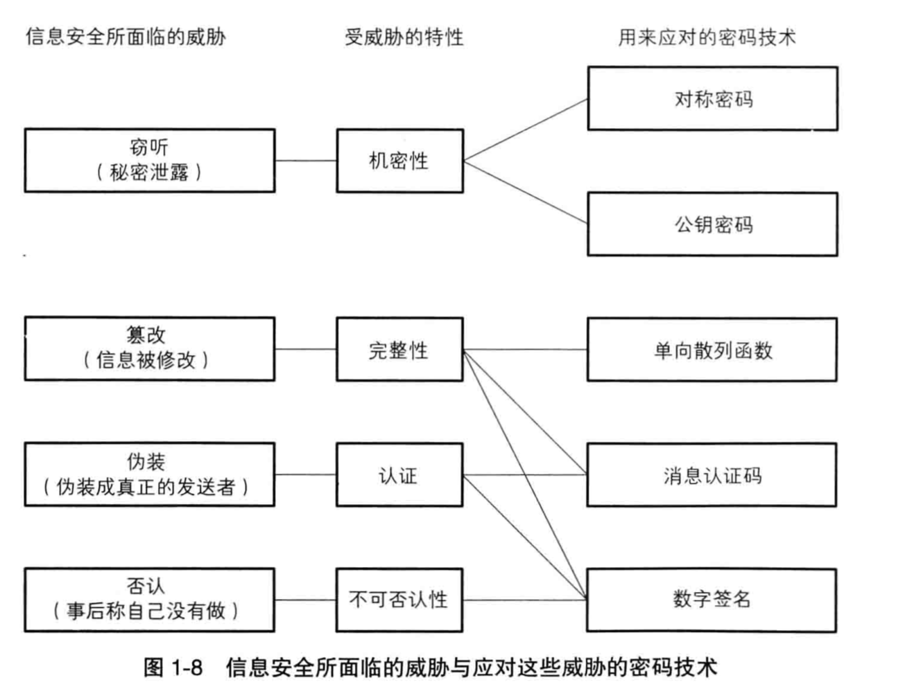
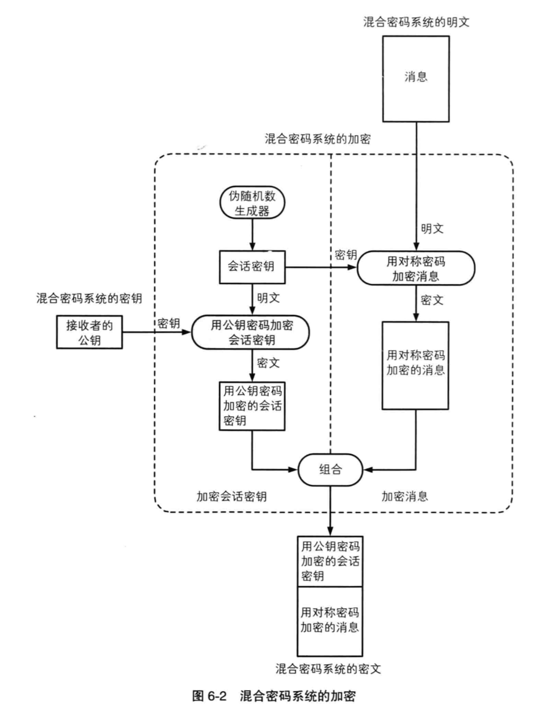
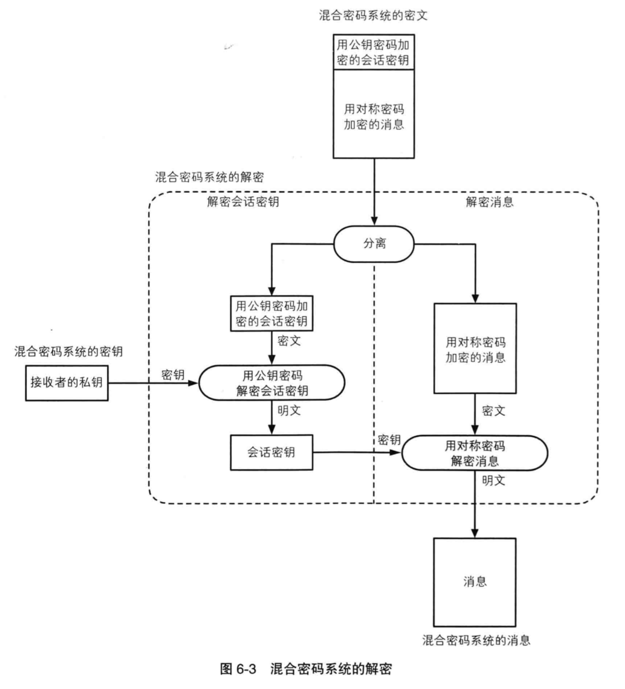
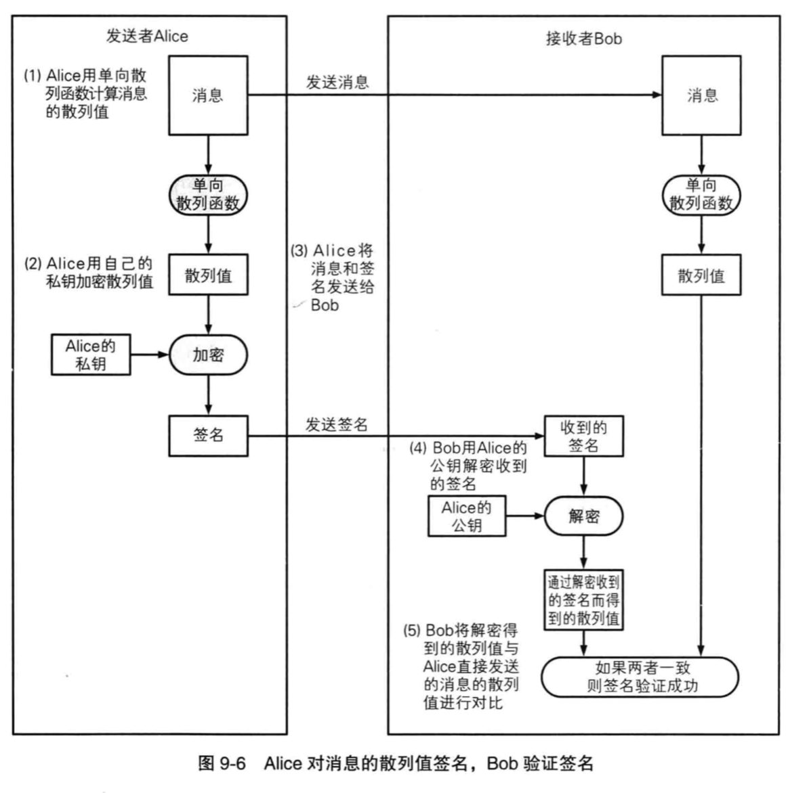
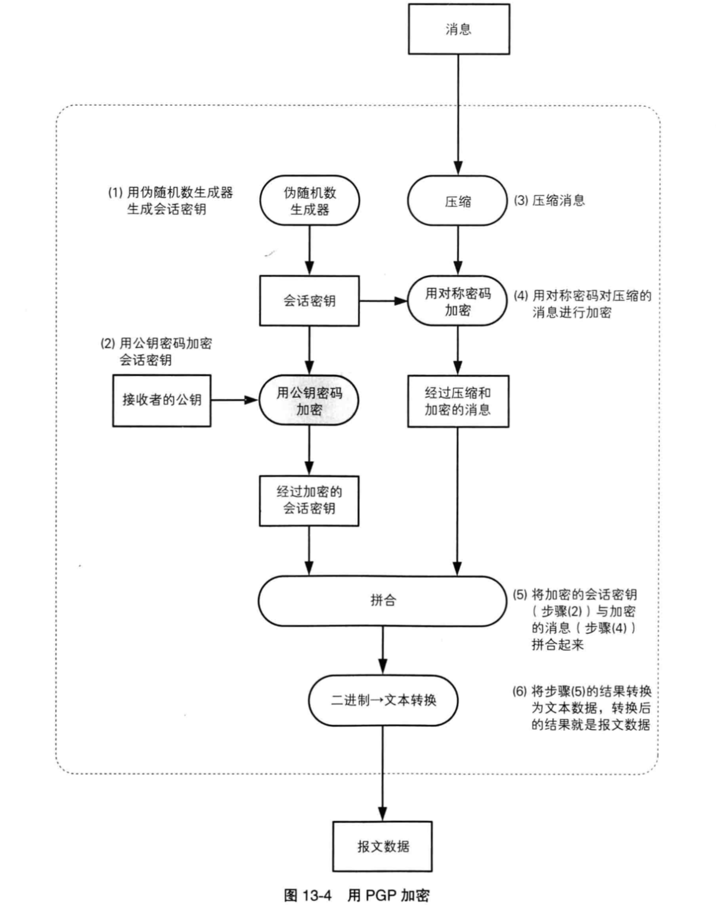
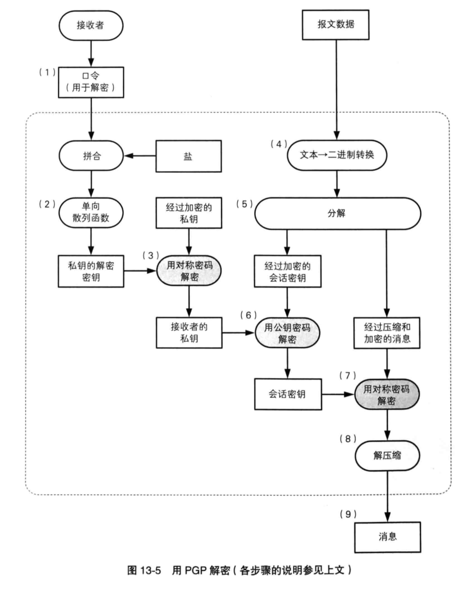

## 背景

自己对于密码技术相关的知识一直都是零散的，刚接触 k8s 的时候遇到了好多证书问题都是靠临时搜索解决的，不成体系。

[liqiang](https://liqiang.io/) 同学推荐了《图解密码技术》，趁着中秋假期看完了做了读书笔记，记录一下。

## 密码

### 环游密码世界

口令：password, passcode, pin
编码：encode
密码：cryptography

对称密码是指在加密和解密时使用同一密钥的方式。

公钥密码是指在加密和解密时使用不同密钥的方式，又称为非对称加密。

将对称密码和公钥密码结合起来的密码方式称为混合密码系统。

单项散列函数，用于保证完整性：“数据时正确的而不是伪造的”，没有被篡改过。

数字签名能够保证数据不会被篡改，也防止发送者的否认。

伪随机数生成器是一种能够模拟产生随机数列的算法，同时承担着密钥生成的重要职责。

隐写术隐藏的是消息本身，而密码隐藏的是内容，应用场景：数字水印。

密码与信息安全常识：
1. 不要使用保密的密码算法
2. 使用低强度的密码比不进行任何加密更危险
3. 任何密码总有一天都会被破解
4. 密码只是信息安全的一部分

### 历史上的密码

凯撒密码，通过平移字母顺序达到加密效果，平移字母个数为密钥。
简单替换密码，通过维护字母对照表达到加密效果。

密钥空间，所有可用密钥的总数就是密钥空间的大小，空间越大，暴力破解越困难。

频率分析破译：通过分析语言中高频使用字母及单词达到破译效果。

Enigma ：通过增加通信密码的方式保证安全性。
问题：
1. 通信密码连续输入2词并加密
2. 通信密码是认为设定的
3. 必须有每日密码本

### 对称密码

将显示世界中的东西映射为比特序列的操作称为编码。

XOR，异或，相同为0 ，不同为1。

比特序列的异或，将明文 A 用密钥 B 进行加密，得到密文 A XOR B，将密文 A XOR B 用密钥 B 进行解密，得到明文 A。

一次性密码本，又称为维纳没密码，通过生成随机比特序列与明文异或加密。

理论上无法破解的原因：无法判断暴力破解的结果是否是争取的明文。
无法使用的原因：
1. 密钥的发送
2. 密钥的保存，密钥长度与明文长度相等。
3. 密钥的重用
4. 密钥的同步
5. 密钥的生成，需要真正的随机数

DES（Data Encryption Standard），可被短时间破译，不推荐使用。

DES 将64 比特的明文加密成64比特的密文，密钥长度是56比特，从规格上说，DES 的密钥长度是64 比特，但由于每隔7 比特会设置一个用于错误校验的比特，因此实质上密钥长度是56比特。

DES 以每 64 比特的明文为最小单位进行加密，属于分组密钥的一种。

DES 结构，又称为 Feistel 网络，在很多密码算法中都有应用。

加密步骤：
1. 将输入的数据等分为左右两部分
2. 将输入的右侧直接发送到输出的右侧
3. 将输入的右侧发送到轮函数
4. 轮函数根据右侧数据和子密钥，计算出一串看上去是随机的比特序列
5. 将上一步得到的比特序列与左侧数据进行 XOR 运算，并将结果作为加密后的左侧
6. 因为上述使用将右侧数据作为密钥的一部分，因此需要指定规则（如每两轮）对输入数据的左右进行数据对调

DES 加密时无论使用任何函数作为轮函数都可以正确解密，也就是说，轮函数无需考虑解密的问题，可以被设计的任意复杂。

三重 DES，为了增加 DES 的强度，将DES 重复3次所得到的一种密码算法。

加密过程为：加密，解密，加密，这么做的目的是为了能够让三重DES 兼容普通的 DES。

AES（Advanced Encryption Standard）取代DES。通过评选，最终选择 Rijndael。

Rijndael 分组成都为 128 比特，密钥长度可以以32比特为单位在128 比特到256 比特的范围内进行选择，在AES 规格中，密钥长度只有 128，192，256 比特三种。

AES 使用 SPN 结构。
加密过程：
1. SubBytes 处理，输入分组为 128 比特，16 字节，首先逐个字节的对16字节的输入数据进行SubBytes 处理，可以简单的理解为“简单替换密码” 中的 256 个字母的版本
2. ShiftRows 处理，将 SubBytes 的输出以字节为单位进行打乱处理，注意，打乱处理是有规律的
3. MixColumns 处理，对一个4字节的值进行比特运算，将其变为另一个4字节的值
4. AddRoundKey 处理，将 MixColumns 的输出与轮密钥进行XOR
5. 重复上述4步，需要重复 10 - 14 轮计算。

相比 Feistel 网络，SPN 优势：
* 加密锁需要的轮数更少
* 所有处理均按照字节为单位进行，速度更快

劣势：
* 无法使用同一种结构实现加密和解密

### 分组密码的模式

分组密码是每次只能处理特定长度的一块数据的一类密码算法，一个分组的比特书就称为分组长度。

例如 DES 和三重 DES 的分组长度都是 64 比特，也就是会所一次只能加密64 比特的明文，并生成64 比特的密文。

当对一段很长的明文进行加密时，的呆的方法就称为分组密钥的模式。
主要模式有以下5种：
* ECB 模式，电子密码本模式
* CBC 模式，密码分组链接模式
* CFB 模式，密文反馈模式
* OFB 模式，输出反馈模式
* CTR 模式，计数器模式

ECB 模式，将明文分组加密之后的结果直接称为密文分组，若分组内容小于分组长度时，则自动向上填充。

弱点：可以在步破译密文的情况下操纵明文。

CBC 模式，首先将明文分组与前一个密文分组进行 XOR 运算，然后再进行加密。

CFB 模式，前一个密文分组会被送回到密码算法的输入端，即初始化向量通过加密算法与明文分组进行异或运算，得到密文分组。

OFB 模式，密码算法的输出会反馈到密码算法的输入中，通过将明文分组和密码算法的输出进行异或运算来产生密文分组。

CTR 模式，通过将逐次累加的计数器进行加密来生成密钥流的流密码。每个分组对应一个逐次累加的计数器，并通过对计数器进行加密来生成密钥流，也就是说，最终的密钥分组时通过将计数器加密得到的比特序列与明文分组进行异或运算得到的。

### 公钥密码

公钥密码是密码学历史上最伟大的发明，是数学史上最伟大的发现。

公钥密码解决的问题：密钥发送。

在公钥密码中，密钥氛围加密密钥和解密密钥两种，发送者用加密密钥对消息进行加密，接收者用解密密钥对密文进行解密。

注意：
1. 发送者只需要加密密钥
2. 接收者值需要解密密钥
3. 解密密钥步可以被窃听者窃取
4. 加密密钥被窃听者获取也没问题

RSA 是一种公钥密码算法，被用于公钥密码和数字签名。
加密公式：对代表明文的数字的 E 次方球 mod N 的结果，结果就是密文。其中 E 和 N 是 RSA 加密的密钥，也就是E 和 N 的组合就是公钥。

解密公式：对代表密文的数字的 D 次方球 mod N 就可以得到明文，其中 N 与加密算法中的N 是相同的。

生成密钥对流程：
1. 求 N
   1. 准备两个很大的质数，假设为 p 和 q，并将其相乘，结果为 N
2. 求 L
   1. L 是 p-1 和 q-1 的最小公倍数
3. 求 E
   1. E 是一个比 1 大，比 L 小的数，E 和 L 的最大公约数必须为 1
4. 求 D
   1. 1 < D < L
   2. E * D mod L = 1

### 混合密码系统

公钥密码劣势：
1. 公钥密钥处理速度远远低于对称密码
2. 公钥密码难以抵御中间人攻击

混合密码主要解决上述问题 1。有以下机制：
1. 用对称密码加密消息
2. 通过伪随机数生成器生成对称密码加密中使用的会话密钥
3. 用公钥密码加密会话密钥
4. 从混合密码系统外部赋予公钥密码加密时使用的密钥

## 认证

### 单向散列函数

单向散列函数有一个输入和一个输出，输入称为消息，输出称为散列值，函数可以根据消息的内容计算出散列值，可以根据散列值来检查消息的完整性。

特性：
1. 根据任意长度的消息计算出固定长度的散列值
2. 能够快速计算出散列值
3. 消息不同散列值也不同
4. 具备单向性

实际应用：
1. 检测软件是否被篡改
2. 基于口令的加密
3. 消息认证码
4. 数字签名
5. 伪随机数生成器
6. 一次性口令

具体例子：
1. MD4，MD5
2. SHA-1，SHA-256，SHA-384，SHA-512
3. RIPEMD-160
4. AHS，SHA-3

单向散列函数能够辨别出篡改，但是无法辨别出伪装。当我们想要确定文件的所有者时谁，需要进行认证。用于认证的技术包括消息验证码和数字签名。消息认证码能够想通信对象保证消息没有被篡改，而数字签名不仅能够向通信对象保证消息没有被篡改，还能够向所有第三方作出这样的保证。

### 消息认证码

在消息传递时，需要关注完整性和认证两个性质。

消息认证码是一种确认完整性并进行认证的技术，简称 MAC。消息认证码的输入包括任意长度的消息和一个发送者与接收者之间共享的密钥，它可以输出固定长度的数据，这个数据称为 MAC 值。简单理解：消息认证码是一种与密钥相关联的单向散列函数。

无法解决的问题：
1. 对第三方证明
2. 防止否认

### 数字签名

为什么要使用数字签名：
* 消息认证码的局限性
* 消息认证码无法防止否认，发送者与接收者共享同一个密钥，对第三方来说，无法确认消息是谁发送的

签名的生成和验证
* 生成消息签名的行为
  * 由消息的发送者完成，意味着“发送者认可该消息的内容”
  * 发送者使用签名密钥生成消息的签名
  * 签名密钥只能由签名人持有
* 验证消息签名的行为
  * 一般由消息的接收者完成，也可以由需要验证消息的第三方来完成
  * 接收者使用验证密钥进行密钥的验证
  * 验证密钥无法生成签名
  * 验证密钥可以是任何由需要验证签名的人持有

公钥密钥使用公钥加密，使用私钥解密；

数字签名使用私钥签发，使用公钥验证。

缺点：
* 无法判断公钥是否属于签发者

### 证书

公钥证书与驾照类似，记录着姓名、组织、邮箱地址等个人信息以及属于此人的公钥，并由认证机构施加数字签名，公钥证书简称证书。

典型使用流程：
1. 接收者生成密钥对
2. 接收者在认证结构 Trent 注册自己的公钥
3. 认证结构 Trent 用自己的私钥对 Bob 的公钥施加数字签名并生成证书
4. 发送者得到带有认证机构 Trent 的数字签名的接收者的公钥（证书）
5. 发送者使用认证机构 Trent 的公钥验证数字签名，确认接收者公钥的合法性
6. 发送者使用接收者的公钥加密消息并发送到接收者
7. 接收者使用自己的私钥解密密文得到发送者的消息

公钥基础设施是为了能够更有效的运用公钥而指定的一系列规范和规格的总称，简称 PKI。

组成要素：
1. 用户—使用 PKI 的人
2. 认证机构—颁发证书的人
3. 仓库—保存证书的数据库

## 密钥、随机数与应用技术

### 密钥

密钥就是一个巨大的数字，数字本身不重要，重要的是密钥空间的大小，空间越大，暴力破解就越困难，空间的大小是由密钥长度决定的。

密钥与明文是等价的，明文的价值就是密钥的价值。

密钥的用途：
* 在对称密码中，由于发送者和接收者之间需要共享密钥，因此对称密钥又称为共享密钥密码。
* 在公钥密码中，加密和解密使用的是不同的密钥，加密的是公钥，解密的是私钥，私钥也称为私密密钥，公钥与私钥也称为密钥对。
* 对称密码和公钥密钥的密钥都是用于确保机密性的密钥，相对的，消息认证码和数字签名所使用的密钥，则是用于认证的密钥。

密钥的管理：
* 生成密钥
  * 用随机数生成密钥
  * 用口令生成密钥
* 配送密钥
  * 事先共享密钥
  * 使用公钥密码
  * Diffie-Hellman 密钥交换
* 更新密钥
  * 用当前密钥的散列值作为下一个密钥
* 保存密钥
  * 人类无法记住密钥
  * 保存在保险柜等安全的地方
  * 将密钥加密后保存
  * 减少需要保管的密钥数量
* 作废密钥
  * 删除密钥的同时，需要将对应的加密后文件一同删除

如何生成安全的口令
* 使用只有自己才能知道的信息
  * 不要使用对自己重要的事物的名字
  * 不要使用关于自己的信息
  * 不要使用别人见过的信息
* 将多个不同的口令分开使用
* 有效利用笔记
* 理解口令的局限性

### 随机数

为了不让攻击者看穿而使用随机数。

应用场景：
* 生成密钥
  * 用于对称密码和消息认证码
* 生成密钥对
  * 用于公钥密码和数字签名
* 生成初始化向量
  * 用于分组密码的 CBC、CFB、OFB 模式
* 生成 nonce
  * 用于防御重放攻击以及分组密码的 CTR 模式等
* 生成盐
  * 用于基于口令的密码等

随机数的性质：
* 随机性—不存在统计学偏差，完全杂乱的数列
* 不可预测行—不能从过去的数列推测出下一个出现的数
* 不可重现性—除非将数列本身保存下来，否则不能重现相同的数列

### PGP

PGP（Pretty Good Privary）是一款密码软件，支持多平台。

功能列表：
1. 对称密码
2. 公钥密码
3. 数字签名
4. 单向散列函数
5. 证书
6. 压缩
7. 文本数据
8. 大文件的拆分和拼合
9. 钥匙串管理

加密流程：

解密流程：

### SSL/TLS

SSL(Secure Socket Layer)
TLS(Transport Layer Security)

当 Web 浏览器发送请求时，请求的数据会作为客户端请求发送给服务器，如果通信内容被窃听者所窃取，那么窃听者就会得到请求数据。可以使用 SSL/TLS 作为对通信进行加密的协议，然后再次智商承载 HTTP。通过将两种协议进行叠加，我们就可以对HTTP 的通信进行加密，防止窃听。通过 SSL/TLS 进行通信时，URL 以 https 开头。

解决问题：
* 机密性问题
  * 解决方式：对称密码、伪随机数生成器、公钥密码
* 完整性问题
  * 解决方式：消息认证码
* 认证问题
  * 解决方式：数字签名

SSL 与 TLS 区别：
SSL 是 1994年由王晶公司设计的一种协议，于1995年发布了3.0 版本。
TLS 设市 IETF 基于 SSL 3.0 版本的基础上设计的协议，在 1999年发布了 TLS 1.0 版本，实际上相当于 SSL 3.1。2006 年发布 TLS 1.1 版本，在对称密码算法中加入了 AES 支持。

SSL/TLS 使用到的密码技术：
* 公钥密码
  * 加密预备主密码
* 单向散列函数
  * 构成伪随机数生成器
* 数字签名
  * 验证服务器和客户端的证书
* 伪随机数生成器
  * 生成预备主密码
  * 根据主密码生成密钥
  * 生成初始化向量
* 对称密码
  * 确保片段的机密性
* 消息认证码
  * 确保片段的完整性并进行认证

### 密码技术与现实社会

密码的作用是为了确保机密性，将明文转换为密文。转换之后，密文不需要保护了，需要保护的是加密时使用的密钥。通过保护较短的密钥来保护较长的明文，称为机密性的压缩。

单向散列函数时用于确认完整性的，不必检查较长的明文的完整性，只要检查散列值就能确认，这种做法称为完整性的压缩。

消息认证码和数字签名都是用于认证的技术，通过较短的认证富豪来对较长的消息进行认证，称为认证的压缩。

只有完美的密码，没有完美的人。
