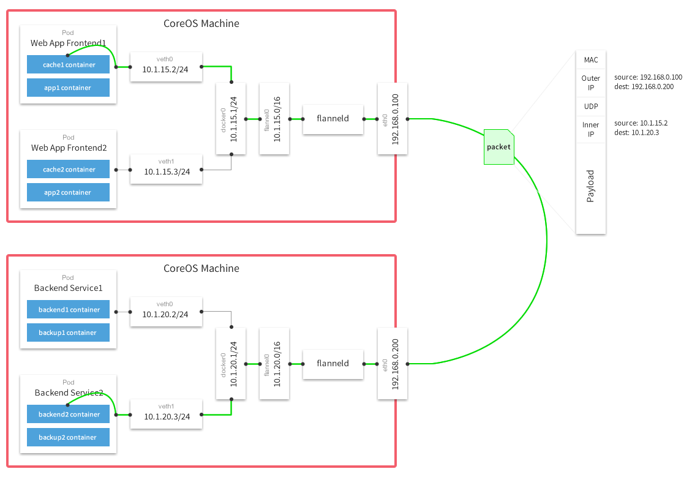

## 背景

在用 K8s 的同学应该多少都使用过 Flannel 作为自己的网络插件，不讨论性能稳定性，在复杂的网络环境配置中 Flannel 的要求应该是最低的，所以我通常使用 Flannel 作为 让 K8s Ready 的最后一步。

在使用过程中，遇到过多次 flannel.1 这个 link 消失的情况，查看官方 Issue 中有人提到过： [flannel.1 is deleted by `service network restart`, and never recreated again.](https://github.com/coreos/flannel/issues/869) ，但是这个 Issue 从 2017年创建一直到现在都处于 Open 状态，看上去社区也不打算去解决，其实不只是重启网络，如果没有特殊指定的话，找到默认网关所在的网卡，直接 ifdown ，flannel.1 也会丢失，并且不会重建，那为什么会出现这个问题，今天来看一看。

## CNI Flannel Plugin

我们常说的 Flannel 分为两部分：[CNI Flannel Plugin](https://github.com/containernetworking/plugins/tree/master/plugins/meta/flannel) 及 Flannel。

CNI Flannel Plugin 是 Flannel CNI 插件的具体接口实现， CNI 要求实现的 `cmdAdd` `cmdDel` `cmdCheck` 都是在这里实现的，来看看具体的调用流程：

```go
func cmdAdd(args *skel.CmdArgs) error {
    // 从标准输入加载配置
	n, err := loadFlannelNetConf(args.StdinData)
    ...
    // 加载子网配置：/run/flannel/subnet.env
	fenv, err := loadFlannelSubnetEnv(n.SubnetFile)
    ...
    // 执行添加动作
	return doCmdAdd(args, n, fenv)
}
```

```go
func doCmdAdd(args *skel.CmdArgs, n *NetConf, fenv *subnetEnv) error {
	n.Delegate["name"] = n.Name
	if !hasKey(n.Delegate, "type") {
		n.Delegate["type"] = "bridge"
	}
	...
	if n.CNIVersion != "" {
		n.Delegate["cniVersion"] = n.CNIVersion
	}
	n.Delegate["ipam"] = map[string]interface{}{
		"type":   "host-local",
		"subnet": fenv.sn.String(),
		"routes": []types.Route{
			{
				Dst: *fenv.nw,
			},
		},
	}
    // 进行配置解析及填充后，执行委托类型插件进行配置，默认是 bridge，创建过程中会将配置保存到 /var/lib/cni/flannel ，删除时会用到
	return delegateAdd(args.ContainerID, n.DataDir, n.Delegate)
}
```

到这里已经跟 Flannel Plugin 无关了，是调用的其他插件完成的具体动作，再来看看删除动作：

```go
func cmdDel(args *skel.CmdArgs) error {
	nc, err := loadFlannelNetConf(args.StdinData)
    ...
    // 执行删除动作
	return doCmdDel(args, nc)
}
```

```go
func doCmdDel(args *skel.CmdArgs, n *NetConf) error {
    // 从 /var/lib/cni/flannel 中根据 ContainerID 读取配置，并在读取后删除配置
    netconfBytes, err := consumeScratchNetConf(args.ContainerID, n.DataDir)
    ...
	nc := &types.NetConf{}
	if err = json.Unmarshal(netconfBytes, nc); err != nil {
		return fmt.Errorf("failed to parse netconf: %v", err)
	}
    // 委托其他插件执行删除动作，默认 bridge
	return invoke.DelegateDel(context.TODO(), nc.Type, netconfBytes, nil)
}
```

到这里我们来捋一捋整个流程：

1. kubelet 启动时查找可用 CNI 插件，并根据配置加载
2. kubelet 创建容器前，通过 CNI Interface 调用相应方法执行 cmdAdd/cmdDel 命令
3. CNI 根据配置信息调用对应的 Plugin 执行 cmdAdd/cmdDel

### 相应文件路径

#### /var/lib/cni/flannel

每个 Pod 的具体网络配置，配置内容如下

```shell
[root@install2 09:29:48 cni]$pwd
/var/lib/cni
[root@install2 09:29:51 cni]$cat flannel/d3f1220d58a72ebe5a92f8febbe6dd45d3bff65dce0ff6960f732f202026c24c |jq
{
  "cniVersion": "0.3.1",
  "hairpinMode": true,
  "ipMasq": false,
  "ipam": {
    "routes": [
      {
        "dst": "10.244.0.0/16"
      }
    ],
    "subnet": "10.244.1.0/24",
    "type": "host-local"
  },
  "isDefaultGateway": true,
  "isGateway": true,
  "mtu": 1450,
  "name": "cbr0",
  "type": "bridge"
}
```

#### /var/lib/cni/networks

IP 地址分配配置路径，默认 Flannel 使用的 ipam 是 host-local，bridge 是 cbr0 ，在这下面是已分配的 IP 地址：

```shell
[root@install2 09:31:48 cni]$pwd
/var/lib/cni
[root@install2 09:31:49 cni]$tree networks/
networks/
└── cbr0
    ├── 10.244.1.160
    ├── 10.244.1.161
    ├── 10.244.1.162
    ├── last_reserved_ip.0
    └── lock

1 directory, 5 files
[root@install2 09:31:53 cni]$cat networks/cbr0/10.244.1.162
d3f1220d58a72ebe5a92f8febbe6dd45d3bff65dce0ff6960f732f202026c24c
[root@install2 09:32:07 cni]$cat networks/cbr0/last_reserved_ip.0
10.244.1.162
```

#### /etc/cni/net.d

CNI 插件配置文件

```shell
[root@install2 09:34:47 net.d]$pwd
/etc/cni/net.d
[root@install2 09:34:48 net.d]$cat 10-flannel.conflist
{
  "name": "cbr0",
  "cniVersion": "0.3.1",
  "plugins": [
    {
      "type": "flannel",
      "delegate": {
        "hairpinMode": true,
        "isDefaultGateway": true
      }
    },
    {
      "type": "portmap",
      "capabilities": {
        "portMappings": true
      }
    }
  ]
}
```

大概了解了 CNI Flannel Plugin ，说好的 `flannel.1` 呢？既然确定了 `flannel.1` 不是 CNI Plugin 里面实现的，那肯定就是 Flannel 自己的行为了，接下来看 `Flannel` 代码就可以了。


## Flannel

提到 Flannel，就不得不拿出这张图：



### 目录结构

```shell
root@localhost:~/go/src/github.com/coreos/flannel
master ✗ $ tree . -L 1
├── backend # 后端实现：vxlan,udp,hostgw
├── main.go # 入口
├── network # IPtables 相关配置
├── pkg     # 辅助功能，如 IP，Namespace
├── README.md
├── subnet  # 子网管理，K8s 通信相关
```

### 使用方式

我们先来回想一下 K8s 集群部署，我们通过 kubeadm 指定了 Pod CIDR 为 `10.244.0.0/16` ：

```yaml
---
apiServer: {}
apiVersion: kubeadm.k8s.io/v1beta1
kind: ClusterConfiguration
kubernetesVersion: ""
networking:
  dnsDomain: ""
  podSubnet: 10.244.0.0/16
  serviceSubnet: ""
```

然后我们直接执行 `kubectl apply -f https://raw.githubusercontent.com/coreos/flannel/master/Documentation/kube-flannel.yml` 等待 Node Ready 即可，这样做的前提是因为我们指定的 Pod 子网是 Flannel 默认子网，两者必须相同才可以配置正确。

### 代码入口

```go
func main() {
  ...
	sm, err := newSubnetManager()
  ...
	// 从 K8s 中获取配置信息，主要是子网信息
	config, err := getConfig(ctx, sm)
  ...
  // 创建 backend manager 并创建用来创建 backend 和注册网络
	bm := backend.NewManager(ctx, sm, extIface)
	be, err := bm.GetBackend(config.BackendType)
  ...
	bn, err := be.RegisterNetwork(ctx, wg, config)
  ...
	// 运行 backend
	log.Info("Running backend.")
	wg.Add(1)
	go func() {
		bn.Run(ctx)
		wg.Done()
	}()
  ...
}
```

在 main.go 中获取配置的来源是 ConfigMap：

```yaml
[root@install1 11:00:39 ~]$kubectl get cm kube-flannel-cfg -n kube-system -o yaml
apiVersion: v1
data:
  cni-conf.json: |
    {
      "name": "cbr0",
      "cniVersion": "0.3.1",
      "plugins": [
        {
          "type": "flannel",
          "delegate": {
            "hairpinMode": true,
            "isDefaultGateway": true
          }
        },
        {
          "type": "portmap",
          "capabilities": {
            "portMappings": true
          }
        }
      ]
    }
  net-conf.json: |
    {
      "Network": "10.244.0.0/16",
      "Backend": {
        "Type": "vxlan"
      }
    }
kind: ConfigMap
metadata:
  annotations:
  creationTimestamp: "2019-12-30T02:37:21Z"
  labels:
    app: flannel
    tier: node
  name: kube-flannel-cfg
  namespace: kube-system
  resourceVersion: "235454"
  selfLink: /api/v1/namespaces/kube-system/configmaps/kube-flannel-cfg
  uid: fd9f67ee-ee1b-411d-8403-23ab05de56c8
```

可以看到默认的 Backend 是 vxlan，我们接着看 backend 和 vxlan 相关处理，在 backend/ 路径下放着些统一的接口定义，vxlan 是接口的具体实现：

```shell
root@localhost:~/go/src/github.com/coreos/flannel
master ✗ $ tree backend -L 1
backend
├── common.go
├── manager.go
├── route_network.go
├── route_network_test.go
├── route_network_windows.go
├── simple_network.go
├── udp
└── vxlan
    ├── device.go
    ├── device_windows.go
    ├── vxlan.go
    ├── vxlan_network.go
    ├── vxlan_network_windows.go
    └── vxlan_windows.go
```

如 `RegisterNetwork`：
```go
type Backend interface {
	// Called when the backend should create or begin managing a new network
	RegisterNetwork(ctx context.Context, wg sync.WaitGroup, config *subnet.Config) (Network, error)
}
```

看看 vxlan RegisterNetwork 做了什么：

```go
func (be *VXLANBackend) RegisterNetwork(ctx context.Context, wg sync.WaitGroup, config *subnet.Config) (backend.Network, error) {
	// 解析配置
	cfg := struct {
		VNI           int
		Port          int
		GBP           bool
		Learning      bool
		DirectRouting bool
	}{
		VNI: defaultVNI,
	}

  // vtep 配置信息
	devAttrs := vxlanDeviceAttrs{
		vni:       uint32(cfg.VNI),
		name:      fmt.Sprintf("flannel.%v", cfg.VNI),
		vtepIndex: be.extIface.Iface.Index,
		vtepAddr:  be.extIface.IfaceAddr,
		vtepPort:  cfg.Port,
		gbp:       cfg.GBP,
		learning:  cfg.Learning,
	}

  // 创建 vtep
	dev, err := newVXLANDevice(&devAttrs)
	if err != nil {
		return nil, err
	}
	dev.directRouting = cfg.DirectRouting
}
```

```go
func newVXLANDevice(devAttrs *vxlanDeviceAttrs) (*vxlanDevice, error) {
  // netlink 是 Golang 中操作网络相关的库，提供了创建 Vxlan 设备的接口
	link := &netlink.Vxlan{
		LinkAttrs: netlink.LinkAttrs{
			Name: devAttrs.name,
		},
		VxlanId:      int(devAttrs.vni),
		VtepDevIndex: devAttrs.vtepIndex,
		SrcAddr:      devAttrs.vtepAddr,
		Port:         devAttrs.vtepPort,
		Learning:     devAttrs.learning,
		GBP:          devAttrs.gbp,
	}

	link, err := ensureLink(link)
	if err != nil {
		return nil, err
	}
	return &vxlanDevice{
		link: link,
	}, nil
}
```

```go
func ensureLink(vxlan *netlink.Vxlan) (*netlink.Vxlan, error) {
	err := netlink.LinkAdd(vxlan)
	if err == syscall.EEXIST {
		// it's ok if the device already exists as long as config is similar
    log.V(1).Infof("VXLAN device already exists")
    ...
		// 如果存在，则娇艳 原有设备是否兼容，如果不兼容则删除并重新创建设备
		if err = netlink.LinkAdd(vxlan); err != nil {
			return nil, fmt.Errorf("failed to create vxlan interface: %v", err)
		}
	} else if err != nil {
		return nil, err
	}

  ...
	return vxlan, nil
}
```

到这里我们就知道了是 Flannel 在进行 backend 注册的时候创建的 `flannel.1` 设备，如果我们想要简单粗暴的去修改代码实现，我们可以在 `backend.Run()` 方法中加入 `ensureLink` 检测逻辑，保证当发现对应 vtep 设备消失时，重新创建。但是这种实现方式就比较侵入，而且破坏了 backend 通用逻辑，我理解正确的处理方式应该是通过 health 探针去检测，如果检测到 Pod 处于 unhealthy 状态，自动重建 Pod，会重新进行 `backend.RegisterNetwork` 逻辑，就不存在这个问题了。

来看下默认的 Flannel YAML 文件，发现其中并没有 health 探针配置，还是有点奇怪的，这么一个基础的服务，居然没有做任何的健康检查，听上去有些不合道理。

于是我又去 Github 上查找相关的 Issue，果然发现了很多人遇到这个问题，倒是最终都没有提出比较好的方案来解决，其中 Eduard Català 分别提交了 2 个 PR 用来增加 Health Check 机制，但是不知道因为什么最终都没有合并：
* https://github.com/coreos/flannel/pull/917
* https://github.com/coreos/flannel/pull/920

我们来看看他的对应实现，通过检测对应的设备是否存在，如果不存在则不健康：

backend/vxlan/vxlan.go
```go
func (be *VXLANBackend) CheckHealthz() error {
	_, err := net.InterfaceByName(be.extIface.Iface.Name)
	if err != nil {
		log.Errorf("Master interface %v disappeared. Waiting its return...", be.extIface.Iface.Name)
		for err != nil {
			time.Sleep(15 * time.Second)
			_, err = net.InterfaceByName(be.extIface.Iface.Name)
		}
		log.Errorf("Master interface: %v reappeared", be.extIface.Iface.Name)
	}

	_, err = net.InterfaceByName(be.network.dev.link.Name)
	if err != nil {
		log.Errorf("Flannel interface: %v not found - Requiring flannel restart ", be.network.dev.link.Name)
		return backend.FlannelRestart
	}
	return nil
}
```

## 总结

Flannel 社区活跃度不高，合并 PR 的速度更是慢的离谱，有很多存在很久的 Issue 也没有解决，感觉还是用着玩玩就好。


## 参考链接
* https://github.com/containernetworking/plugins.git
* https://github.com/Kevin-fqh/learning-k8s-source-code/blob/master/cni%20plugin/flannel%E6%BA%90%E7%A0%81%E8%A7%A3%E8%AF%BB.md
* https://cizixs.com/2016/07/16/flannel-source-code-insight/