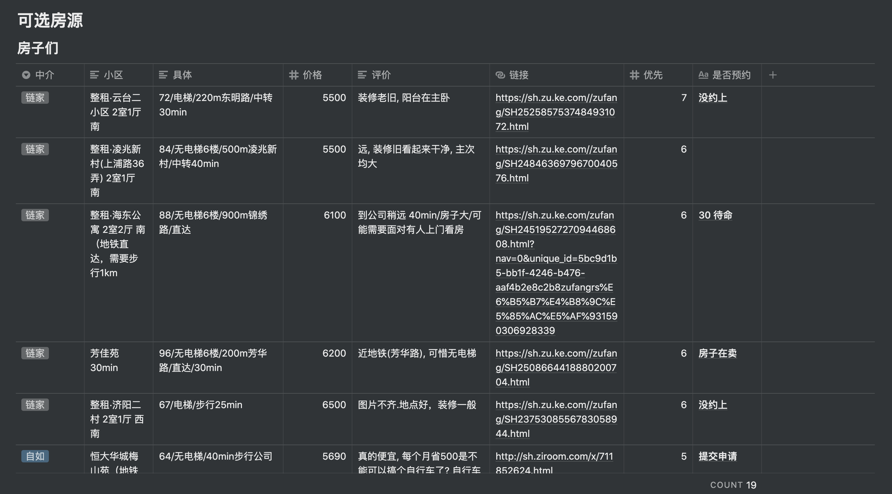

## 背景

最近一个月除了每天还刷刷题之外，没有更新其他播客，因为搬家到了上海（借口）。从毕业开始就在北京工作，算下来也4年多的时间了，想着趁着还能折腾，换个城市感受一下，正好公司在上海也有办公室，就直接转过来了，到今天已经工作了两周，写一下感受，扯一扯。


## 租房

### 需求

因为在5月份的时候疫情消停了一段时间，我就开始了远程看房的计划，因为有深圳同事也要转到上海，就计划一起合租，那么目标就是两居室。我们通过 Notion 协作写清楚需求（是的，还有猫的需求），然后各自开始了远程找房。

```
# yiran 的需求
- 步行 30min 可到达公司
- 民水民点
- 厨房可用
- 周围有商超
- 不临街

## 同事的需求
- 希望是有电梯的(骑车穿锁鞋很难下楼)
- 避免石膏墙
- 询问一下居住证的问题

## 猫的需求
- 最好是有防盗网的窗户
- 阳光
- 够大

# 避免
- 窗户有树
```

### 了解中介

如果个人在上海本地，那么还有可能通过豆瓣等平台找到房东直接签约没有中介费，但是像我这种时间紧任务重的，就放弃了这种方式选择中介。上海租房与北京租房最主要的不同就是中介费，北京是租客需要支付一个月的租金，而上海是租客与房东共支付一个月的租金作为中介费，所以租客只需要支付50% 的租金即可，这点比北京友好很多，所以我们开始也是倾向于通过中介与房东签约的房子。

中介主要是链家，我爱我家的房源很少，且质量不高，贝壳上还有些其他的小中介，因为担心有其他隐患，最后还是选择的链家。

### 看房

主要看了两天的时间，第一天看了很多公司周围的板楼，后来才知道这类房子叫“老公房”，房子质量很差，且隔音很是问题，无法接受，于是第二天开始看一些距离公司地铁20min 可达的房子，在看的时候发现我忽略了一个比较重要的点，就是猫，同事养了两只猫，但是我看房子时忽略了房东不让养宠物的可能，直到我看了一个各方面都符合要求的房子后，想要与房东签约，才想到这点，房东果断拒绝了，后续也看了几个房子各方面都很好，但是不让养宠物而错过的，也是没有办法。

### 自如

在看了两天之后，发现房子质量比较好的房东，都不同意租客养宠物，换位思考可以理解，因为时间比较紧张，把目光选择了自如，自如的收费与北京相同，没有差别，照片都是真实的，但是我还是线下去看了房子，确保没有问题，期间发现了一些在自如网站上无法发现的问题：
1. 隔音，部分房子隔音很差
2. 周围环境，发现部分房子周围存在基建施工情况，看形式不是几天可以完工的
3. 老旧小区改造，在北京吃过亏，租的房子是老房子，恰逢政府进行小区改造，两个月没有卫生间的日子还是太难过了

### 总结

1. 如果当地有朋友，还是通过朋友那里了解到租房坑是最直接的方式
2. 要确认好自己的需求，尤其是宠物这种可能会一票否决的事项更是要第一时间提出，否则白白浪费一个小时看房
3. 找中介看房基本上不会按照自己的计划来安排时间的，每个中介都会拉着你去看几个类似的房子，所以做时间规划的时候最好要留有余地
4. 实在没有选择就找自如吧，至少是有基本保证，但是要注意上海这边属于南方，宽带很可能没有联通选项

附一张 Notion 的看房列表：




## 搬家

### 计划
因为我在去上海前没有租好房子，所以不能先把行李快递走，当时有两个计划，优先计划 2：
1. 先去上海租房，回北京快递行李，再去上海
2. 出发前先打包好行李、去上海租房、找同事帮忙快递行李

### 实际
在出发前我已经将自己的行李打包好了，在淘宝买了质量还可以的纸箱子，然后找了北京同事帮忙寄快递，选择的是德邦物流，之前也问过几个朋友，貌似是比较稳妥的方式了，当时物流费用是 448，我进行了保价，一共花费了 488，还是可以接受的，毕竟也是200kg+ 的行李。

但是事实证明别人的稳妥只有实际体验才知道，德邦在我的纸箱子外套了层编织袋，当我打开行李的时候，发现里面的纸箱子已经接近散架的状态，全靠编织袋才坚持到了上海，不知道其他人是不是也是这样，还好我没有什么贵重的大件物品，否则感觉要完。

同事搬家选择的顺丰，并且选择了带托盘的方式，行李在出发前是什么样子，到达时就是什么样子，全程行李没有离开托盘，所以行李也没有任何的破损，体验非常好，当然价格也很好，1k+ 的快递费。

### 总结
如果普通物品选择德邦还是可以的，但是我之后应该会选择顺丰。

### 气候

### 梅雨期
在来上海前，好多朋友同事都说我作为东北人，会无法适应上海的气候，我觉得还是要感受一下才能知道是否真正适合，不试试是不知道的。

正好过来收拾的差不多就到了 6 月份，在上班的时候看到一个新闻： `气象局宣布，上海入梅了！上海昨天由此进入梅雨期，较常年提早9天。` ，这应该是整个夏天最闷最潮湿的时候了，我的感受是，北京我没有感觉到有多干燥，但是上海的潮湿是真的潮，洗完衣服晾干，我都怀疑我的感知能力，这衣服真的干了么？无论什么时间，走在室外都感觉随时会出汗，中午的时候甚至有一种水汽往脸上扑的感觉。因为我个人比较容易出汗，所以来到上海还是出汗，感受倒是没差，只是衣服不干比较愁人，也买了各种除湿袋，不知道是否真的有用，同时也在考虑除湿机。

### 下雨

我自己的鞋子都是网或者布料的，所以如果下大雨鞋子肯定会湿，于是特意买了一双皮质的鞋子想着防雨，但是我低估了上海的大雨，鞋子很快就湿了，又因为是皮质的，所以干的还慢。问了同事才知道，这时候需要拖鞋，于是我在公司和家里都放了拖鞋，如果下大雨就还是穿拖鞋吧。

### 总结

目前来看，需要多准备几件衣服防止没有晾干，多准备几双鞋子防止鞋子湿了没有更换，同时备着拖鞋。

## 交通

### 地下

平时上班做地铁，之前在北京搭乘地铁我有一个不好的习惯：倚靠安全门，来上海的第一天就被说了两次。。现在好多了。

上海地铁有一点不好，就是没有屏幕实时展示当前地铁行进状态，虽然有小屏幕滚动，但是不够及时，在地铁上玩手机就需要留意广播重的信息，防止坐过站。

### 地上

公司到家的距离是 5 公里，体验了一下骑车回家，上海的自行车道感受很好，首先很宽，其次没有机动车抢占的情况，整体体验要比北京好很多。发现上海的交通管控也要比北京严格一些，经常能在路口看到交警在指挥交通，毕竟很少看到闯红绿灯的情况。

## 总结

目前在上海两周，还没有什么不适，感觉不错，目前还有待确定的：1. 没有暖气的冬天；2. 除湿机是否需要。之后如果有了感受再更新上来吧。