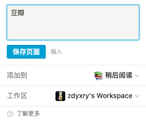
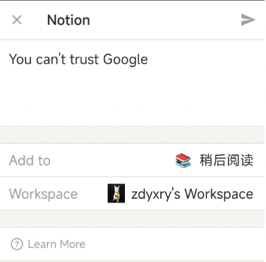
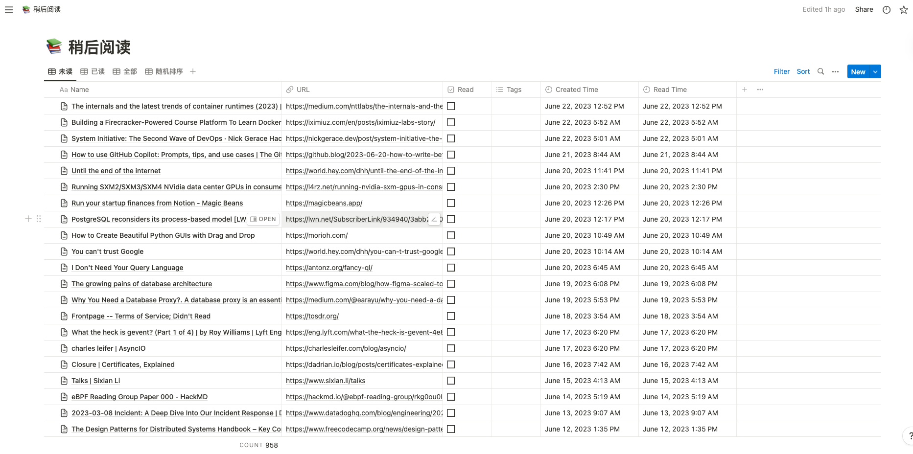
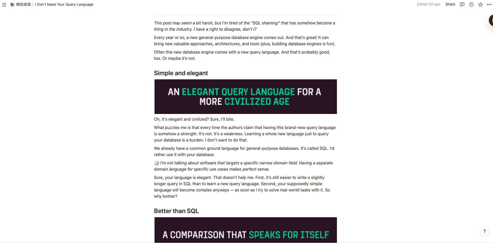
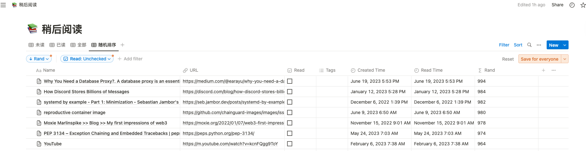
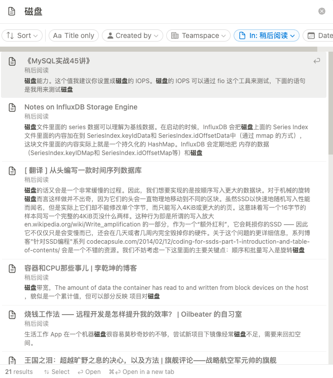

## Notion

在 [Pocket 数据分析和总结](https://zdyxry.github.io/2022/07/05/Pocket-%E6%95%B0%E6%8D%AE%E5%88%86%E6%9E%90%E5%92%8C%E6%80%BB%E7%BB%93/) 中提到，我的稍后阅读工具从 Pocket 迁移到了 Notion，正好今天解决了一个之前没有解决的问题（随机阅读），觉得现在已经很符合我的需求了，分享一下。 

使用 Notion Database 存储所有的文章，每篇文章的基本属性设置：
- URL # 对应链接地址
- Created Time # 创建时间
- Read Time # 阅读时间
- Read  # checkbox 类型，用于标记是否阅读
- Tags # Multi-select 类型，用于标记文章关联 tag
- Rand # 根据文章信息生成随机数

### 添加

Notion 官方提供了浏览器插件：Notion Web Clipper，当使用浏览器时，可以直接点击插件，会要求设置标题，所属 Workspace，所属 Page/Database。其中标题会自动提取当前链接的标题，所属 Workspace 和 Page/Database 设置一次即可，后续会自动填充上一次配置。



如果使用手机浏览信息，可以通过对应应用的“分享”功能，iOS/Android 都可以，选择文章，分享，选择 Notion ，所需填写的内容与浏览器插件一致，使用默认设置填充的内容即可。




### 展示

Notion Database 可以自定义属性是否需要展示，可以选择性的在不同的 View 中展示需要的属性，便于后续阅读和编辑。

我自己设置了4个 View：
- 未读
- 已读
- 全部
- 随机未读

统一展示的属性有：
- Title # 用于查看链接标题
- URL # 可以直接点击链接跳转
- Read(checkbox) # 可以快速标记是否已读
- Created Time # 查看收藏时间
- Tags # 查看当前链接关联 Tag，可以根据 Tag 快速过滤



通常在列表模式下就够用了，在阅读的时候跳转都链接阅读（理论阅读体验最佳），阅读完成后标记已读。但是稍后阅读中存在一种情况，即原链接已经失效了，这个时候就需要在 Notion 中查看原链接内容，Notion 抓取的内容目前可以保证的有文字和部分图片，抓取后的格式没有保证，但基本的可读性是可以做到的，日常使用场景：博客、微信公众号、PDF 链接都是可以的。




### 随机阅读

在使用稍后阅读类似功能的工具时，总会面临最近收藏的文章是需要静下心来仔细阅读的，而此时自己的时间适合快速了解一些 News/Tips ，就会导致文章越积越多，之前使用 Pocket 时候它们提供了 `getpocket.com/random` 用于随机从你的未读列表中选取一篇，在切换到 Notion 中，我也想实现类似的功能。

在上面的类型定义中，有一个 Rand 随机数的属性，这个属性的类型是 Formula ，其中具体的公式如下：

```
slice(
    format(
        toNumber(
            slice(format(timestamp(now())), 8, 9) + 
            slice(format(timestamp(now())), 1, 2) + 
            slice(format(timestamp(now())), 7, 8)
        ) * toNumber(prop("Created Time"))
    ), 8, 11
)
```

公式使用到的函数：

- timestamp  
Returns an integer number from a Unix millisecond timestamp, corresponding to the number of milliseconds since January 1, 1970.

- format  
Formats its argument as a string.

- slice  
Extracts a substring from a string from the start index (inclusively) to the end index (optional and exclusively).

- toNumber  
Parses a number from text.


根据这个公式得到的 Rand 数值，我们可以使用独立的 View 来根据 Rand 排序，保证每次得到的随机文章排序，来进行阅读。



### 搜索

Notion 自带的搜索现在对于中文的支持还不是特别的友好，聊胜于无，可以使用 `In` 来过滤搜索指定的 Page .



## 总结

目前已经使用 Notion 作为稍后阅读工具一年了，感觉很不错，当然稍后阅读不是收藏夹，还是要阅读才是。


