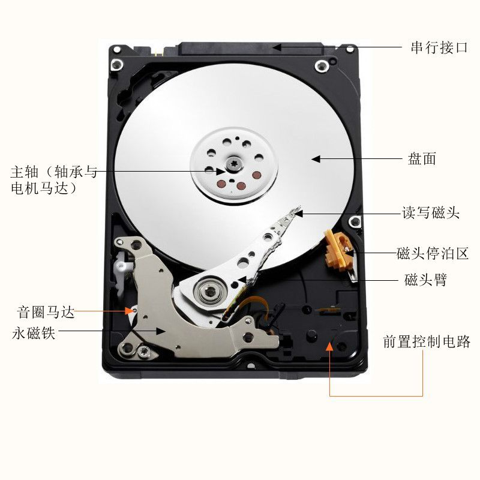
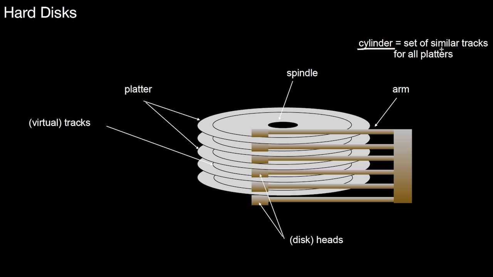
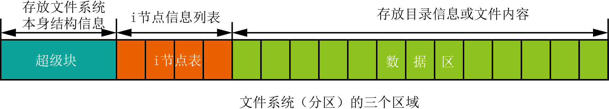
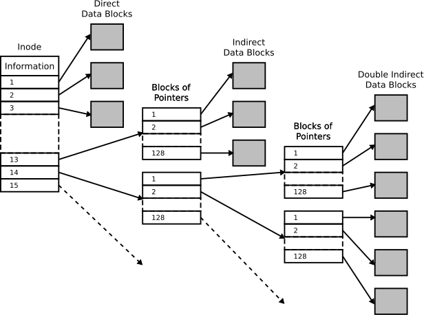

## 背景

前段时间一个朋友问我删除文件和格式化有什么区别，最近正好在读《Unix Linux 编程实践教程》这本书，其中第4章是来讲文件系统相关的，本文是对其中内容进行部分摘要来解释。

## Unix 文件系统的内部结构

从用户角度看，Unix 系统中的硬盘上的文件组成一棵目录树，每个目录能包含文件或其他目录，目录树的深度几乎没有限制，子目录下可以包含其他文件和子目录（套娃）。文件内容放置在对应的目录中，对应的目录内容放置在上层目录中。

文件系统是对硬盘设备的一种多层次的抽象，主要包含以下三层。

### 第一层：从硬盘到分区

一个硬盘能够存储大量的数据，硬盘可以被划分为多个区域，也就是硬盘分区，每个分区在系统中都可以看作是独立的硬盘。

### 第二层：从磁盘到块序列

一个硬盘由许多磁性盘片组成，每个盘片的表面都被划分为很多同心圆，这些同心圆被成为磁道，每个磁道有进一步被划分为扇区，每个扇区可以存储一定字节数的数据，例如每个扇区有 512字节空间。扇区是磁盘上的基本存储单元，磁盘都包含大量的扇区。

为磁盘块编号是一种很重要的方法，给每个磁盘块分配连续的编号使得操作系统能够计算磁盘上的每个块，可以一个磁盘接一个磁盘的从上到下给所有的块编号，还可以一个磁道接一个磁道的从外向里给所有的块编号，一个将磁盘扇区编号的系统使得我们可以把磁盘视为一系列块的组合。

### 第三层：从块序列到三个区域的划分

文件系统可以用来存储文件内容、文件属性（文件所有者、日期等）和目录，这些不同类型的数据是如何存储在编号的磁盘块上的呢?

## 文件系统区域划分

一部分成为数据区，用来存放文件真正的内容。另一部分成为 i-node 表，用来存放文件属性。第三部分成为超级块（superblock），用来存放文件系统自身的信息。文件系统由这 3 部分组合而成，其中任一部分都是由很多有序磁盘块组成的。

### 超级块

文件系统的第一个块被成为超级块。这个块中存放文件系统自身的结构信息，比如记录了每个区域的大小。超级块也存放未被使用的磁盘块信息，不同的文件系统的超级块信息不同，可以通过 `debugfs` 等类似命令查看。

### i-node 表

文件系统的下一个部分被成为 i-node 表，每个文件都有一些属性，如大小、文件所有者和最近修改时间等等，这些属性被记录在一个被成为 i-node 的结构中，所有的 i-node 都有相同的大小，并且 i-node 表是这些 i-node 结构组成的一个列表。文件系统中每个文件都有一个 i-node。

### 数据区

文件系统的第 3 个部分是数据区。文件的真正内容保存在这个区域。磁盘上所有块的大小都是一样的。如果文件包含了超过一个块的内容，则文件内容会存放在多个磁盘块中。一个较大的文件很容易分布在上千个独立的磁盘块中。

## 常见操作过程解释

### 创建文件

当我们创建一个文件的时候，主要操作有以下 4个：

* 存储属性
  * 文件属性的存储：内核先找到一个空的 i-node，把文件的信息记录到 i-node 中。
* 存储数据
  * 文件内容的存储：内核从未被使用的数据块列表中找出足够的数据块，然后将数据从缓冲区复制到对应的数据块中。
* 记录分配情况
  * 文件内容按照顺序存放在数据块中。内核在 i-node 的磁盘分布区记录了上述的块序列。磁盘分布区是一个磁盘块序号的列表。
* 添加文件名到目录
  * 内核将文件 i-node 编号和对应的文件名添加到目录文件。文件名和 i-node 编号之间的对应关系将文件名和文件内容及文件属性进行了关联。

如果创建一个大文件该如何做？一个大文件需要多个磁盘块，在 i-node 中存放磁盘块分配列表，但是长度是固定的，也就是文件大小是有上限的，如何尽可能的支持更大的文件？

如果一个文件需要 14个数据块存储内容，但是 i-node 只包含一个含有 13 个项的分配列表，这是将分配列表中的前 10 个编号放到 i-node 中，将最后的 4个编号放到一个数据块中，然后在 i-node 的第 11 项中作为指向存放 4个数据块编号的数据块。最终这个文件一共使用了15个数据块，额外使用的数据块成为间接块。

### 查看文件

* 在目录中寻找文件名
  * 文件名存储在目录文件中，内核在目录文件中寻找包含文件名的记录，然后找到对应的 i-node 编号
* 定位 i-node 编号并读取内容
  * 内核在文件系统的 i-node 区域找到对应的 i-node。定位 i-node 需要简单的计算，所有的 i-node 大小相同，每个磁盘块都包含相同数量的 i-node。内核会将 i-node 置为缓冲区，i-node 包含数据块编号的列表。
* 访问存储文件内容的数据块
  * 通过 i-node 信息，内核已经知道文件真正的内容存放在哪些数据块上，以及它们的顺序，将字节从磁盘复制到内核缓冲区，然后到达用户空间。

### 创建目录

目录是一种包含了文件名字列表的特殊文件，不同版本的 Unix 目录内部结构不同，但是抽象模型是一致的---一个包含 i-node 编号和文件名的列表。

当一个文件想要被多种方式共享且保证他们是一个文件，有多个有效的路径名，系统引入了链接机制：硬链接和软链接。其中硬链接与文件的 i-node 一致。一个文件内容自身的硬链接数刚创建时为1，之后通过其他方式创建了硬链接，那么引用计数对应增加。

“文件在目录中”从系统的角度看，是目录中有一个包含文件名和对应 i-node 编号的入口，“文件 x 在目录 a 中”意味着在目录 a 中有一个指向对应 i-node 的链接，这个链接所附加的文件名为 `x`。简单来说，目录包含的是文件的引用，每个引用被成为链接，文件的内容存储在数据块中，文件的属性被记录在 i-node 中，i-node编号和文件名存储在目录中。

## 删除文件

删除文件是从一个目录中删除一个对应文件的引用记录，减少对应的 i-node 的链接数，如果 i-node 的链接数减为0，则 i-node 和 i-node 对应的数据块被释放，这里的释放指的是删除 i-node 信息，这样我们就没办法通过 i-node 信息找到文件数据块信息的对应关系，但是文件真正的内容还是存在数据块中的，没有被删除，如果发现误删之后立即停止所有操作，是有可能通过一些方式来达到数据恢复的目的。

## 参考链接
* https://book.douban.com/subject/1219329/
* https://www.youtube.com/watch?v=Cj8-WNjaGuM
* https://zhuanlan.zhihu.com/p/34883885