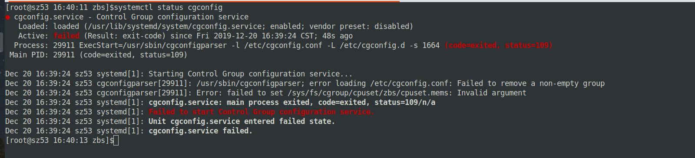

## 背景

前几天同事找到我，说有一台服务器上的 cgroup 没有创建出来，导致其他程序出现了问题，记录一下。

## 现象

在我们的服务器上，通常会通过 libcgconfig 来进行 cgroup 的配置，供其他服务使用。结果发现对应的 cgroup 没有创建出来，于是查看 cgconfig.service 的状态，发现是异常退出的：




报错信息比较重要的是这一条：

`failed to set /sys/fs/cgroup/cpuset/zbs/cpuset.mems: Invalid argument`。

## 调查

检查下 /etc/cgconfig.conf 中的配置是否正确：

```shell
group . {
    cpuset {
        cpuset.memory_pressure_enabled = "1";
    }
}

group zbs {
    cpu {
        cpu.rt_runtime_us = "950000";
        cpu.rt_period_us = "1000000";
    }
    cpuset {
        cpuset.cpus = "0,1,2,3,4,5";
        cpuset.mems = "0-1";
        cpuset.cpu_exclusive = "1";
        cpuset.mem_hardwall = "1";
    }
}

...
```

配置看上去没啥问题，这里的 `cpuset.mems` 指定的是 NUMA Node ID。

那么我们就来看看 NUMA 状态，使用 `numactl` 查看节点 NUMA 信息：

```shell
[root@node 21:53:25 ~]$numactl -H
available: 2 nodes (0-1)
node 0 cpus: 0 1 2 3 4 5 6 7 16 17 18 19 20 21 22 23
node 0 size: 0 MB
node 0 free: 0 MB
node 1 cpus: 8 9 10 11 12 13 14 15 24 25 26 27 28 29 30 31
node 1 size: 32654 MB
node 1 free: 10234 MB
node distances:
node   0   1
  0:  10  20
  1:  20  10
```

发现问题了，这个节点上有2个 CPU，但是其中的一个 CPU 上对应的节点内存出现了故障，导致 node0 对应的内存是 0MB。

## 解决

所以我们正确的姿势是将 `cpuset.mems` 从 `0-1` 改为 `1` ，然后重启 cgconfig。

```shell
[root@node 22:09:43 ~]$systemctl status cgconfig
● cgconfig.service - Control Group configuration service
   Loaded: loaded (/usr/lib/systemd/system/cgconfig.service; enabled; vendor preset: disabled)
   Active: active (exited) since Fri 2019-12-20 16:41:24 CST; 5 days ago
 Main PID: 913 (code=exited, status=0/SUCCESS)
    Tasks: 0
   Memory: 0B
   CGroup: /system.slice/cgconfig.service

Dec 20 16:41:24 node systemd[1]: Starting Control Group configuration service...
Dec 20 16:41:24 node systemd[1]: Started Control Group configuration service.
```