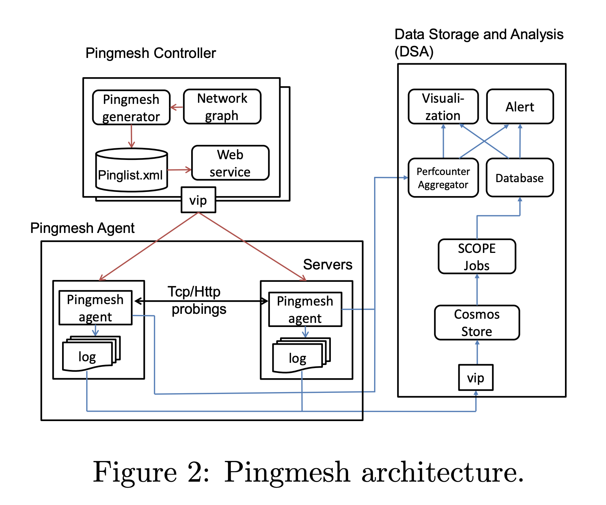

## 背景

在我们内部产品中，一直有关于网络性能数据监控需求，我们之前是直接使用 `ping` 命令收集结果，每台服务器去 ping (N-1) 台，也就是 N^2 的复杂度，稳定性和性能都存在一些问题，最近打算对这部分进行重写，在重新调研期间看到了 Pingmesh 这篇论文，Pingmesh 是微软用来监控数据中心网络情况而开发的软件，通过阅读这篇论文来学习下他们是怎么做的。

数据中心自身是极为复杂的，其中网络涉及到的设备很多就显得更为复杂，一个大型数据中心都有成百上千的节点、网卡、交换机、路由器以及无数的网线、光纤。在这些硬件设备基础上构建了很多软件，比如搜索引擎、分布式文件系统、分布式存储等等。在这些系统运行过程中，面临一些问题：如何判断一个故障是网络故障？如何定义和追踪网络的 SLA？出了故障如何去排查？

基于这几点问题，微软设计开发了 Pingmesh，用来记录和分析数据中心的网络情况。在微软内部 Pingmesh 每天会记录 24TB 数据，进行 2k 亿次 ping 探测，通过这些数据，微软可以很好的进行网络故障判定和及时的修复。

## 数据中心网络

常见的数据中心网络拓扑：

网络延时计算方式：server A 发送消息到 server B 接受消息的时间。最终使用 RTT 时间，RTT 一个好处是绝对时间，与时钟不相关。

在大多数情况下，大家不会去关心延时具体是什么导致的，都是直接归结于网络原因，让网络团队去排查，实际上是浪费了很多人力成本。延时变高有很多原因：CPU 繁忙、服务自身 Bug、网络原因等等。往往丢包会伴随着延时升高，因为丢包意味着会发生重传，所以丢包也是需要观察的重点。

因为 Pingmesh 运行在微软内部，所以依托于微软自己的基础架构，有自动化管理系统 Autopilot，有大数据系统 Cosmos，也有类似于 SQL 的脚本语言 SCOPE。

## 设计

根据上面的需求，Pingmesh 先评估了现有的开源工具，不符合的原因有很多，大多数工具都是以命令行形式呈现，一般是出现故障了去使用工具排查，而且工具提供的数据也不全面，有可能正在运行工具问题已经解决了。当然这并不是说已有的工具没有用，只能说不适合 Pingmesh。

Pingmesh 是松耦合设计，每个组件都是可以独立运行的，分为 3 个组件。在设计的时候需要考虑几点：
* 因为要运行在所有的 server 上，所以不能占用太多的计算资源或网络资源
* 需要是灵活配置的且高可用的的
* 记录的数据需要进行合理的汇总分析

Pingmesh 架构设计：

### Controller

Controller 主要负责生成 pinglist 文件，这个文件是 XML 格式的，pinglist 的生成是很重要的，需要根据实际的数据中心网络拓扑进行及时更新。

在生成 pinglist 时， Controller 为了避免开销，分为3 个级别：
1. 在机架内部，让所有的 server 互相 ping，每个 server ping （N-1） 个 server
2. 在机架之间，则每个机架选几个 server ping 其他机架的 server，保证 server 所属的 ToR 不同
3. 在数据中心之间，则选择不同的数据中心的几个不同机架的 server 来ping

Controller 在生成 pinglist 文件后，通过 HTTP 提供出去，Agent 会定期获取 pinglist 来更新 agent 自己的配置，也就是我们说的“拉”模式。Controller 需要保证高可用，因此需要在 VIP 后面配置多个实例，每个实例的算法一致，pinglist 文件内容也一致，保证可用性。

### Agent

微软数据中心的每个 server 都会运行 Agent，用来真正做 ping 动作的服务。为了保证获取结果与真实的服务一致，Pingmesh 没有采用 ICMP ping，而是采用的 TCP/HTTP ping。所以每个 Agent 即是 Server 也是 Client。每个 ping 动作都开启一个新的连接，主要为了减少 Pingmesh 造成的 TCP 并发。

Agent 要保证自己是可靠的，不会造成一些严重的后果，其次要保证自己使用的资源要足够的少，毕竟要运行在每个 server 上。两个server ping 的周期最小是 10s，Packet 大小最大 64kb。针对灵活配置的需求，Agent 会定期去 Controller 上拉取 pinglist，如果 3 次拉取不到，那么就会删除本地已有 pinglist，停止 ping 动作。

在进行 ping 动作后，会将结果保存在内存中，当保存结果超过一定阈值或者到达了超时时间，就将结果上传到 Cosmos 中用于分析，如果上传失败，会有重试，超过重试次数则将数据丢弃，保证 Agent 的内存使用。

### Analysis

拿到了数据就要进行分析，Pingmesh 会以 10min，1hour，1天的粒度进行统计汇总，数据的实时性最快也就是 10min ，Pingmesh 还借助内部的基础设施能够拿到 5min 级别的数据结果，算是一种“实时”监控吧。

## 网络状况

根据论文中提到的，不同负载的数据中心的数据是有很大差异的，在 P99.9 时延时大概在 10-20ms，在 P99.99 延时大概在100+ms 。关于丢包率的计算，因为没有用 ICMP ping 的方式，所以这里是一种新的计算方式，（一次失败 + 二次失败）次数/（成功次数）= 丢包率。这里是每次 ping 的 timeout 是 3s，windows 重传机制等待时间是 3s，下一次 ping 的 timeout 时间是 3s，加一起也就是 9s。所以这里跟 Agent 最小探测周期 10s 是有关联的。二次失败的时间就是 （2 * RTT）+ RTO 时间。

Pingmesh 的判断依据有两个，如果超过就报警：
* 延时超过 5ms
* 丢包率超过 10^(-3)

在论文中还提到了其他的网络故障场景，交换机的静默丢包。有可能是 A 可以连通 B，但是不能连通 C。还有可能是 A 的 i 端口可以连通 B 的 j 端口，但是 A 的 m 端口不能连通 B 的 j 端口，这些都属于交换机的静默丢包的范畴。Pingmesh 通过统计这种数据，然后给交换机进行打分，当超过一定阈值时就会通过 Autopilot 来自动重启交换机，恢复交换机的能力。

## 经验学习

1. 找到可信数据，只有数据来源可信，那么分析才是有效的
2. 让服务作为 daemon 运行，保证持续的收集数据
3. 松耦合设计，每个组件都可以独立工作

## 总结

其实我们自己的系统是有 Prometheus 这样的监控系统的，但是当遇到交换机级别的间歇性故障时，Prometheus 也是故障的状态，所以也就不会收集 exporter 汇报的数据，也就更没办法产生告警了。所以如果遇到那种长时间持续的故障反而是好事，至少我们有一个足够的状态去排查哪里出了问题，否则真的是间歇性故障仅仅依靠 ping, traceroute, iperf, netstat 之类的工具去排查是没什么效果的，只有我们知道过去一段时间的网络情况，才能去排查。

## 参考链接

* https://conferences.sigcomm.org/sigcomm/2015/pdf/papers/p139.pdf
* http://ninjadq.com/2017/04/01/linux-rto
* https://yi-ran.github.io/2019/03/27/Pingmesh-SIGCOMM-2015/
